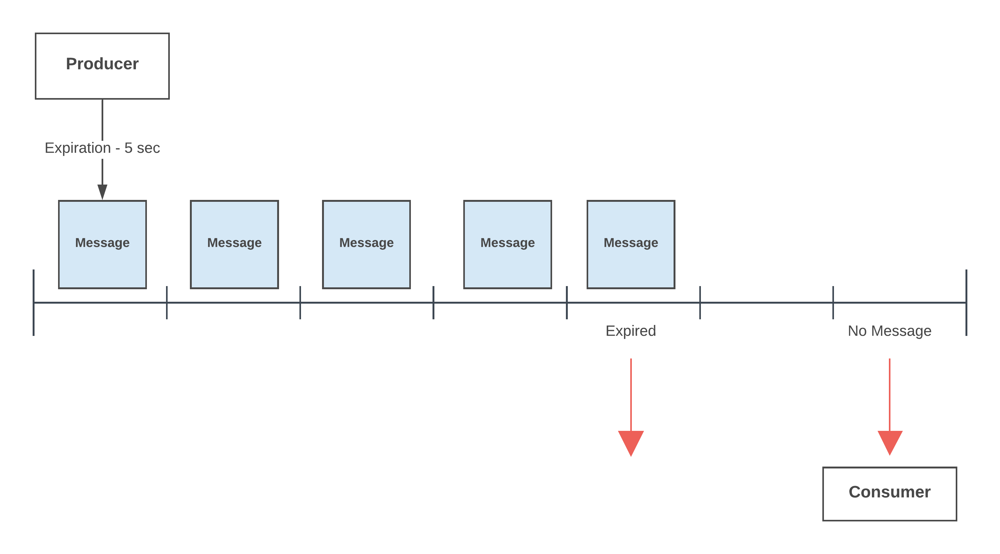
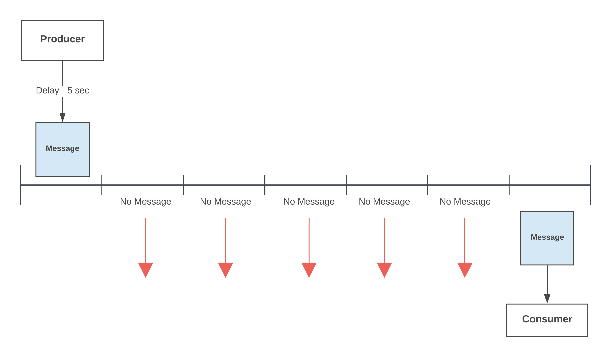
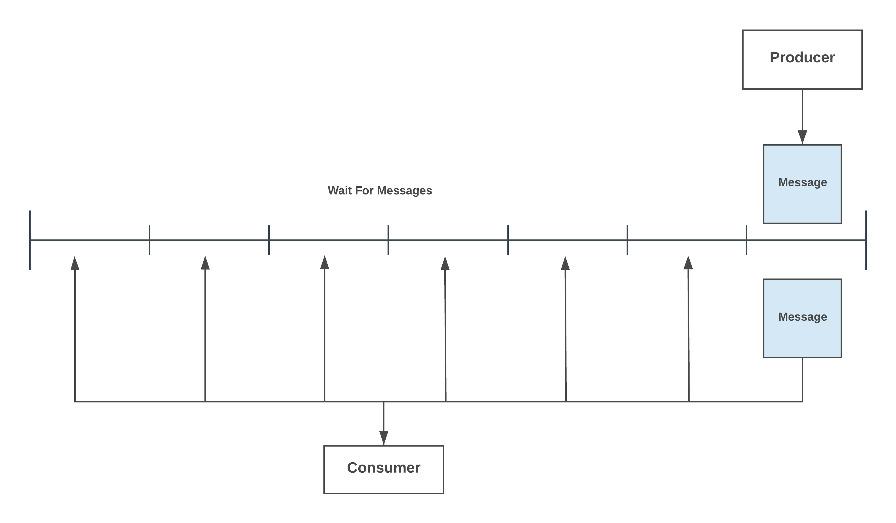
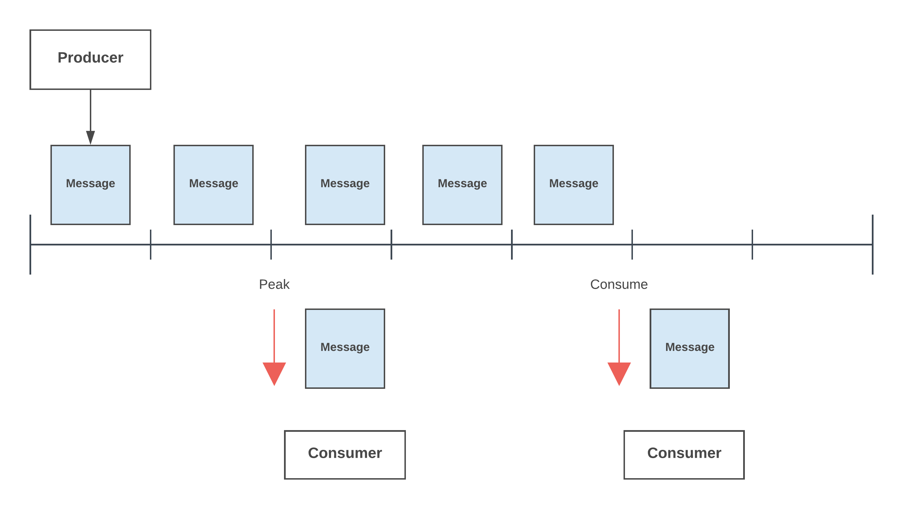
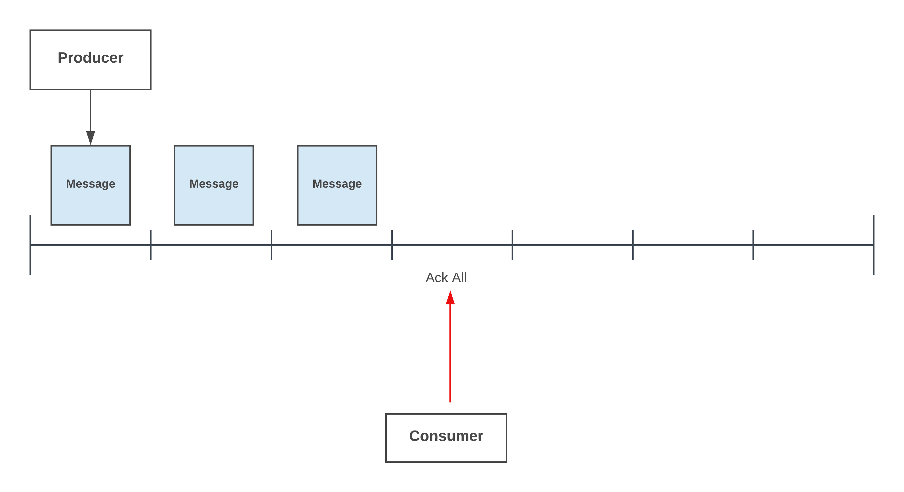
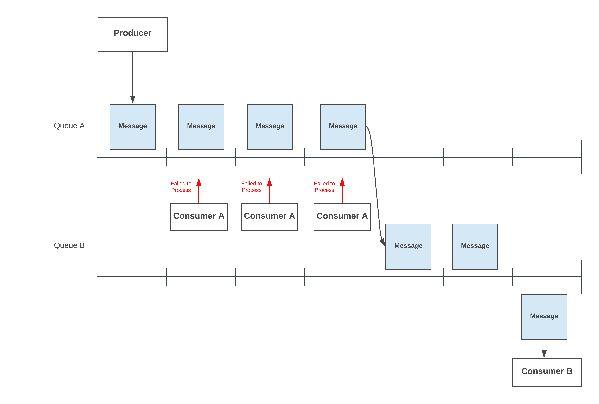
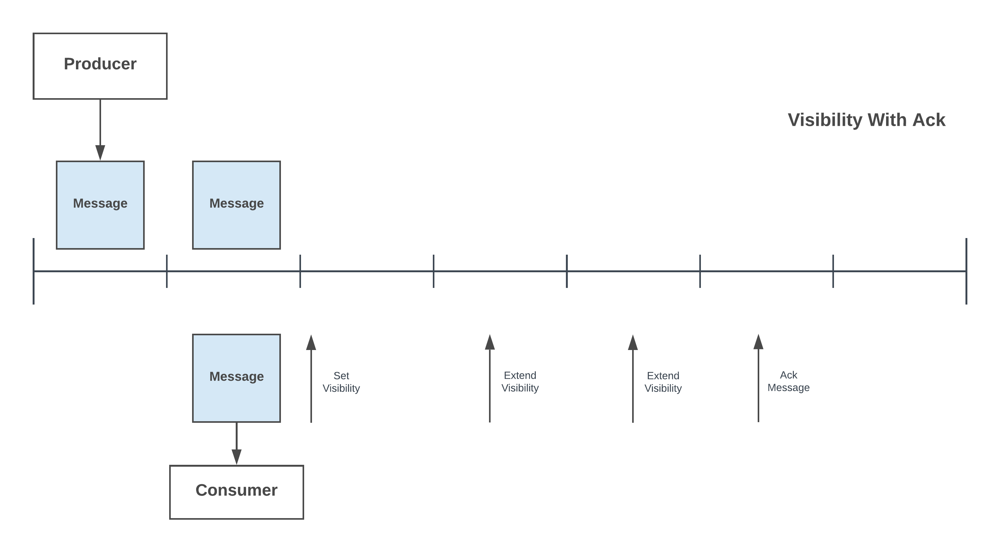
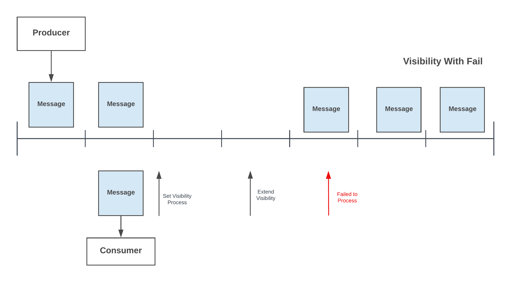

# Queue

## Definition
Message queues provide an asynchronous communications protocol, meaning that the sender and receiver of the message do not need to interact with the message queue at the same time. Messages placed onto the queue are stored until the recipient retrieves them.

Message queues have implicit or explicit limits on the size of data that may be transmitted in a single message and the number of messages that may remain outstanding on the queue.

## Core Features
KubeMQ supports distributed durable FIFO based queues with the following core features:

- **Exactly One Delivery** - Only one message guarantee will deliver to subscriber
- **Single and Batch Messages Send and Receive** - Single and multiple
- **Long Polling** -
- **Peak Messages** -
- **Ack All Queue Messages** -
- **Visibility timers** -

- **Message Delivery Delay** -
- **Dead-Letter Queue** - Each message can be configured
- **Transactional (Stream) Flow** -

### Message Expiration
Each message can be configured to be expired in specified n seconds from the sending time. After this time the message will not be longer available to consume by a receiver.

### Message Delivery Delay
Each message can be configured to be available in the queue in specified n seconds delay from the sending time. Until this time the message will not be available to consume by a receiver.

### Long Polling
Long Polling allows the consumer to connect to KubeMQ and wait for specified time until a message is available in the queue to consume.

### Peak Queue Messages

KubeMQ allows a consumer to peak one or many messages in the queue without removing them from the queue.

### Ack All Queue Messages

KubeMQ allows a consumer to ack all messages in the queue (clean-up) therefore existing messages in the queue will not be available anymore to consume.

 

### Dead-Letter Queue
KubeMQ allows a producer to set per each message a dead-letter queue which the message will be moved in case of a consumer will fail to ack the message (such a poison message).

 

 ### Message Visibility

 KubeMQ allows the consumer to set a visibility time which during this time the message will not be available to any other consumer. During the visibility time priode the consumner can extend the visibility time window any time. Once the consumer completed the message processing, he sends ack notification to the queue. If the consumer failed to ack the message during the visibility time, the message will be available back in the queue to consume by others.

#### Visibility With Ack
  

#### Visibility With Failure
  

