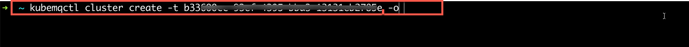
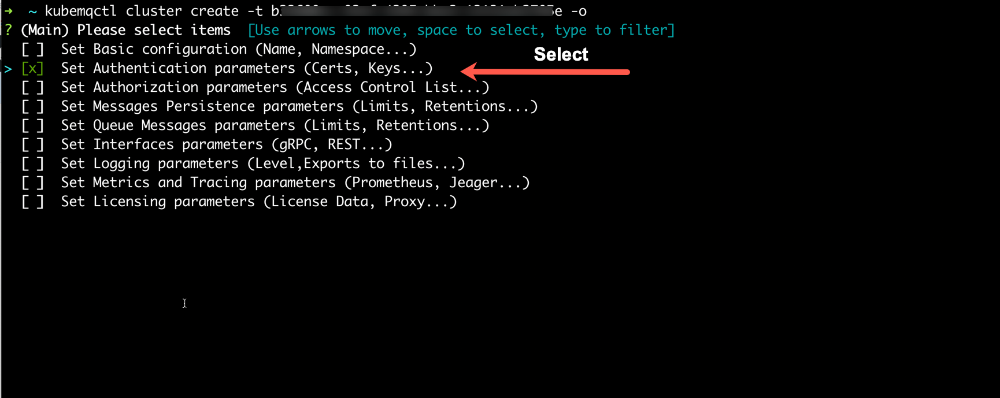
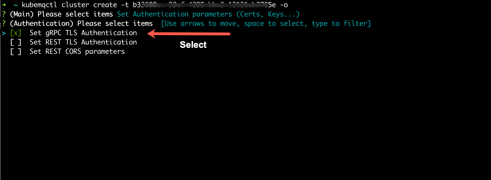
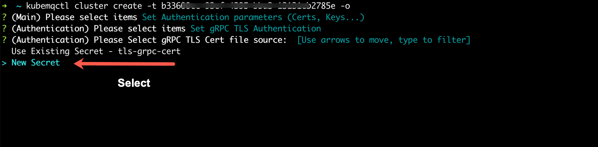
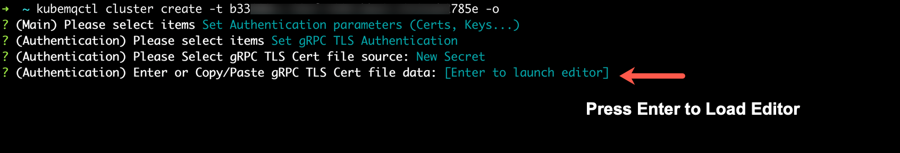
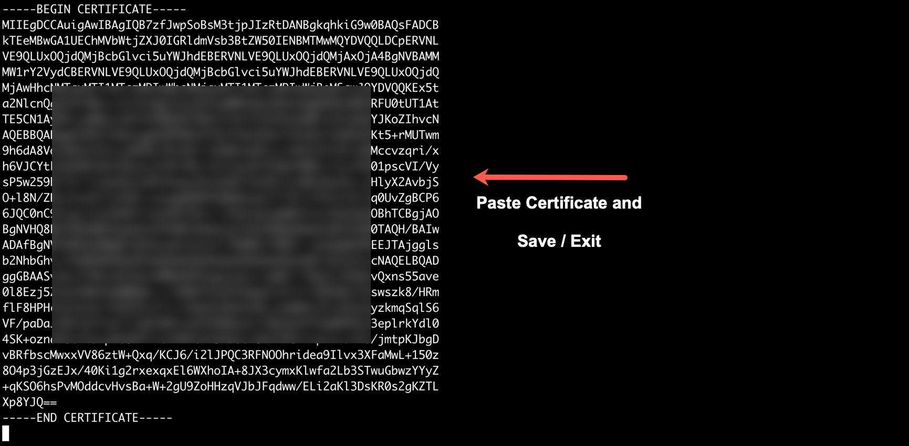
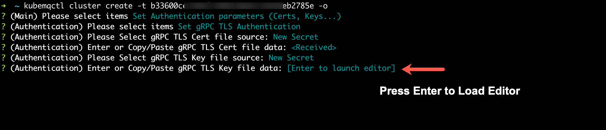
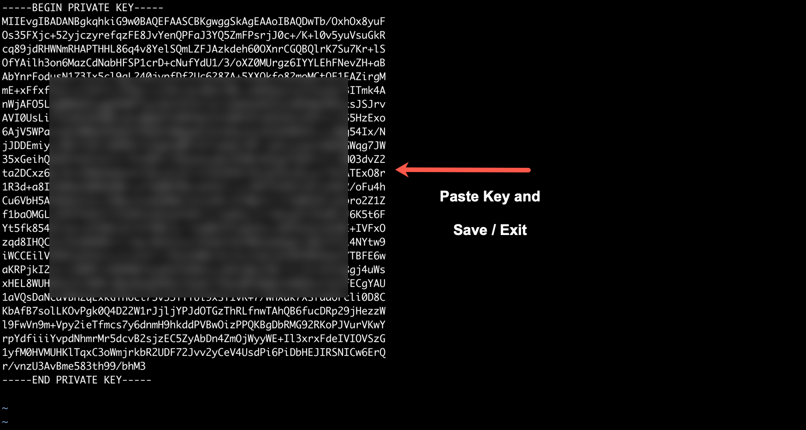
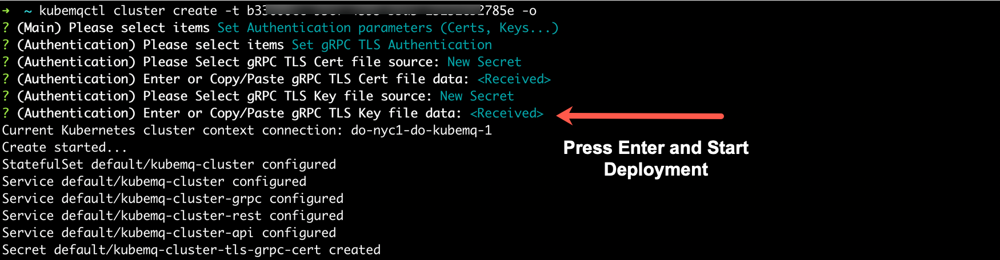

## Set Cluster Authentication

KubeMQ supports the setting of TLS Authentication certifications and keys for both gRPC and REST interfaces.

### Use kubemqctl tool to set TLS certificates for KubeMQ interfaces
Run the following commands

- Create KubeMQ cluster with options configuration (-o flag)

```bash
kubemqctl cluster create -t 1b124xxxxx6-4fra-49e9-94e1-aa29b7be70d6 -o
```



- Select 'Set Authentication Parameters'



- Select the desired configurations interfaces (you can set for each one of the interfaces or a specific one)



- Set Certificate :
    - Select 'New Secret' if you wish to upload a new secret
    - Select 'Use Existing Secret' if you want to use already loaded secret
    


- Press Enter to load default OS editor for upload a certificate data



- Copy/Paste certificate data, save and quit the editor.



- Press Enter to load default OS editor for upload a key data



- Copy/Paste key data, save and quit the editor.



- Press Enter and start deploying KubeMQ




If you have selected more than one interface, the above process will be repeated.
