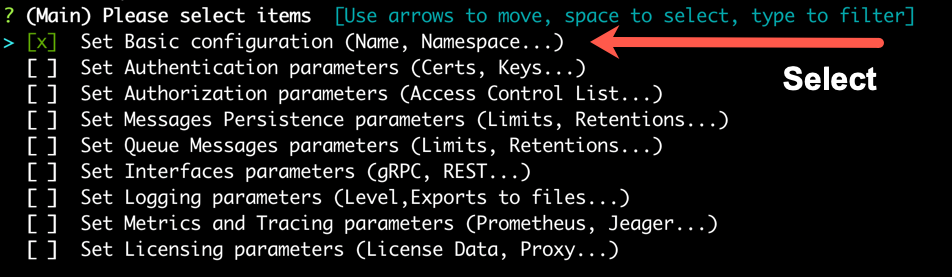
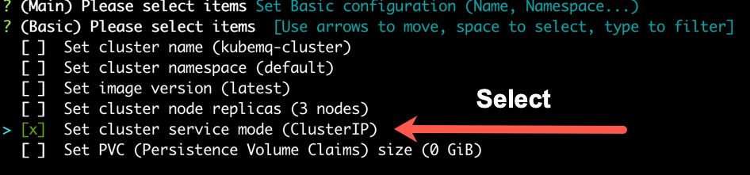
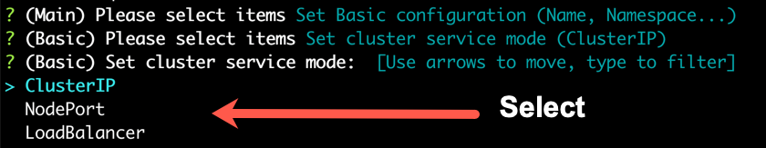
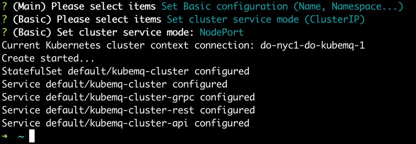

## Expose Cluster Ports

KubeMQ supports the setting of exposing gRPC, REST, and API services in 3 modes:
 - ClusterIP - Ports are exposed only to internal cluster services.
 - NodePort - Ports are exposed to random ports on each cluster Node.
 - LoadBalancer - Ports are exposed externally with Load Balancer

### Use kubemqctl tool to set Cluster Service Mode
Run the following commands:

- Create a KubeMQ cluster with options configuration (-o flag).

```bash
kubemqctl cluster create -t 1b124xxxxx6-4fra-49e9-94e1-aa29b7be70d6 -o
```


- Select 'Set Basic Configuration' .




- Select 'Set cluster service mode' .



- Select the requested mode.




- Press 'Enter' and deploy KubeMQ.


