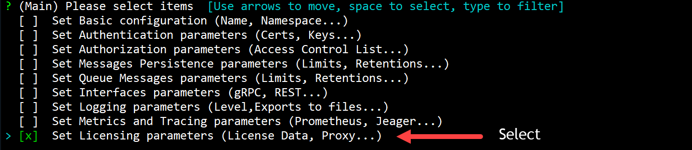
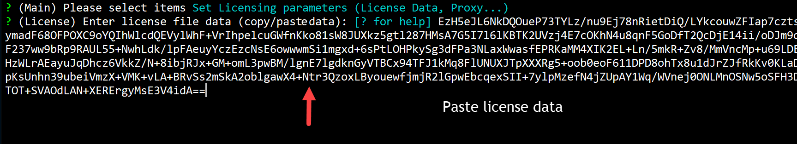
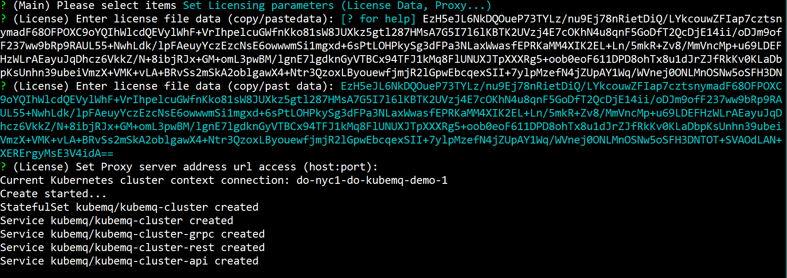

## Set License Data

In case when there is a need to create a KubeMQ cluster with license data (i.e no Internet connection to Kubernetes cluster), please follow the steps below:

### Use kubemqctl tool to set license data
Run the following commands:

- Contact [KubeMQ Support team](mailto://support.kubemq.io) with your registered email address and ask for license data.

- Create a KubeMQ cluster with options configuration (-o flag).

```bash
kubemqctl cluster create -t 1b124xxxxx6-4fra-49e9-94e1-aa29b7be70d6 -o
```


- Select 'Set Licensing Parameters'.



- Copy and Paste the license data you received.



- Press 'Enter' to skip proxy settings.


- Press 'Enter' and deploy KubeMQ.


