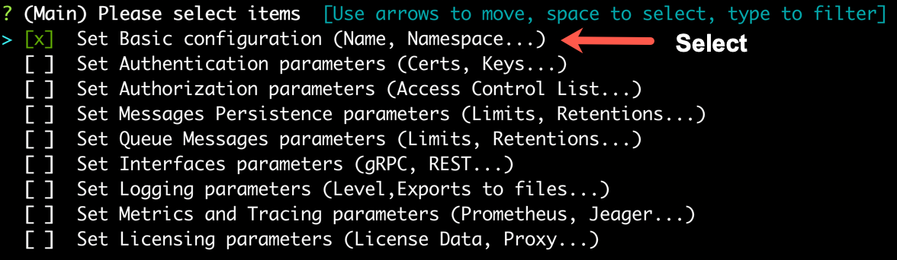

## Set Cluster Name

KubeMQ default cluster name is 'kubemq-cluster'. If you want to set a different name, please follow the steps below:

### Use kubemqctl tool to set the Cluster name
Run the following commands:

- Create a KubeMQ cluster with options configuration (-o flag).

```bash
kubemqctl cluster create -t 1b124xxxxx6-4fra-49e9-94e1-aa29b7be70d6 -o
```


- Select 'Set basic configuration'.



- Select 'Set cluster name' .


- Set the requested cluster name.


- Press 'Enter' and deploy KubeMQ.


