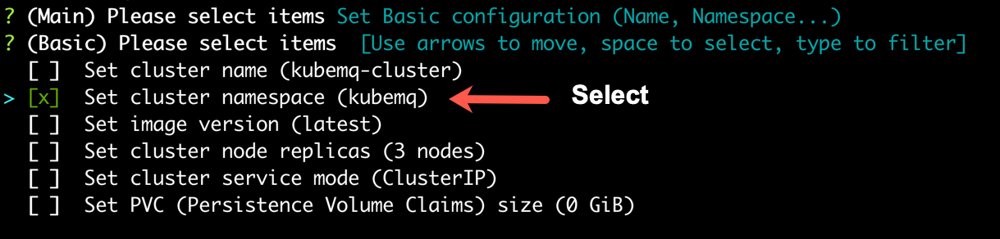
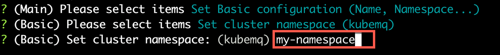
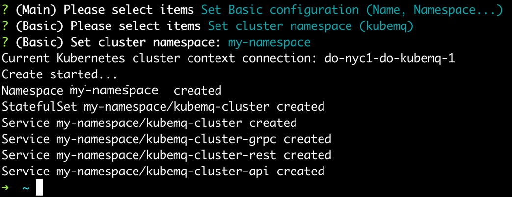

## Set Cluster Namespace

KubeMQ default cluster namespace is 'kubemq'. If you want to set a different namespace, please follow the steps below:

### Use kubemqctl tool to set Cluster namespace
Run the following commands

- Create a KubeMQ cluster with options configuration (-o flag).

```bash
kubemqctl cluster create -t 1b124xxxxx6-4fra-49e9-94e1-aa29b7be70d6 -o
```


- Select 'Set basic configuration'.


- Select 'Set cluster namespace' .




- Set the requested cluster namespace.




- Press 'Enter' and deploy KubeMQ.


