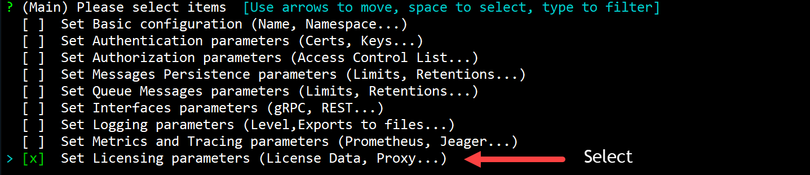
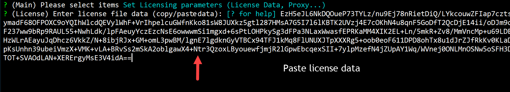
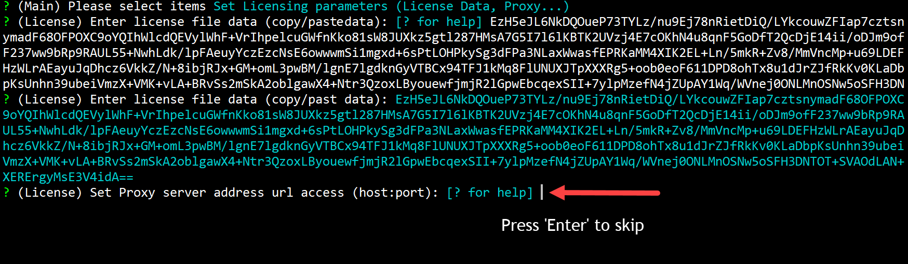
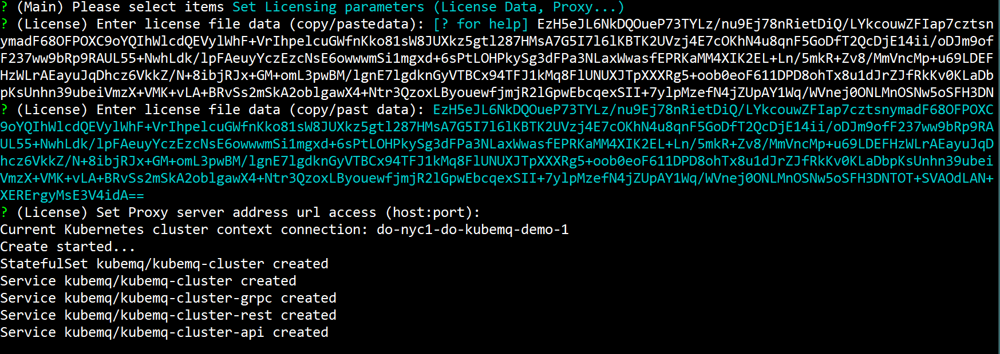

## Set Offline Mode

In case when there is a need to create a KubeMQ cluster in offline mode (i.e. no Internet connection to Kubernetes cluster), please follow the steps below:

### Use kubemqctl tool to set KubeMQ in offline mode
Run the following commands:

- Get license file data.

```bash
kubemqctl config get_license -t 1b124xxxxx6-4fra-49e9-94e1-aa29b7be70d6
```

- Copy license data output to your clipboard

- Create a KubeMQ cluster with options configuration (-o flag).

```bash
kubemqctl cluster create -t 1b124xxxxx6-4fra-49e9-94e1-aa29b7be70d6 -o
```


- Select 'Set Licensing Parameters'.



- Copy and Paste the license data you received.



- Press 'Enter' to skip proxy settings.



- Press 'Enter' and deploy KubeMQ.


