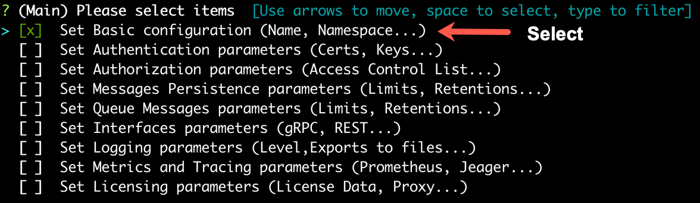
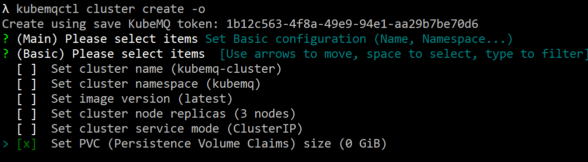
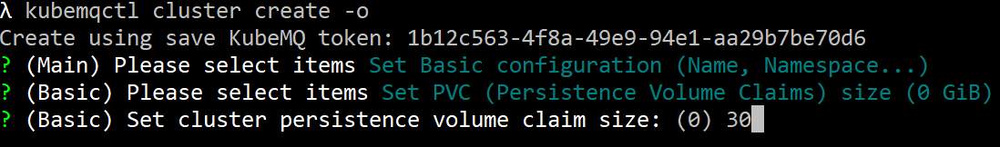
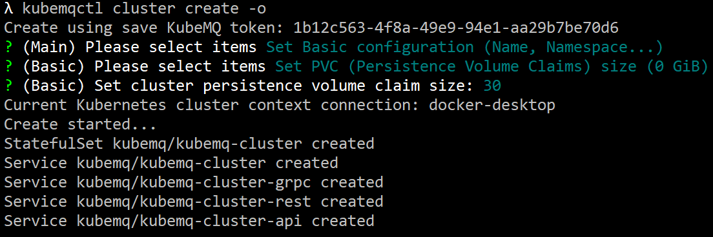

## Set Persistence Volume

KubeMQ default presistency is without PVC usage. If you want to set PVC for KubeMQ, please follow the steps below:

### Use kubemqctl tool to set Persistence Volume
Run the following commands:

- Create a KubeMQ cluster with options configuration (-o flag).

```bash
kubemqctl cluster create -t 1b124xxxxx6-4fra-49e9-94e1-aa29b7be70d6 -o
```


- Select 'Set basic configuration'.



- Select 'Set PVC' .



- Set PVC size.



- Press 'Enter' and deploy KubeMQ.
- 

