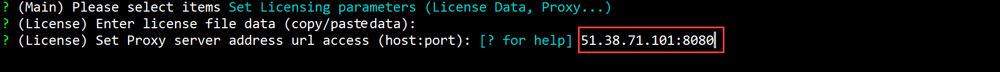
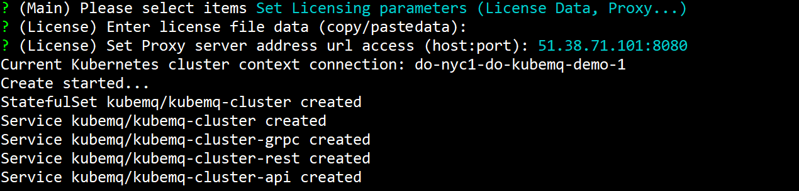

## Set Proxy

In case when Kubernetes cluster is behind a Proxy server, you will need to provide the Proxy server settings to validate your API token during cluster boot. Please follow the steps below:

### Use kubemqctl tool to set proxy data
Run the following commands:

- Create a KubeMQ cluster with options configuration (-o flag).

```bash
kubemqctl cluster create -t 1b124xxxxx6-4fra-49e9-94e1-aa29b7be70d6 -o
```


- Select 'Set Licensing Parameters.'


- Press 'Enter' to skip 'License Data' .

- Enter Proxy settings (host:port format)



- Press 'Enter' and deploy KubeMQ.


