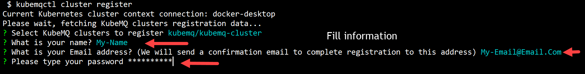
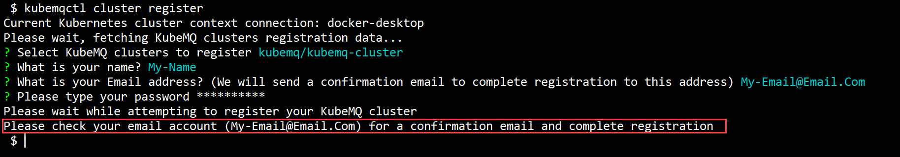

## Register KubeMQ Cluster

In case KubeMQ cluster was deployed with a trial kay, you can register this KubeMQ cluster with the steps below:

### Use kubemqctl tool to register KubeMQ  cluster

Run the following commands:

- Execute cluster registration.

```bash
kubemqctl cluster register
```


- Select the KubeMQ cluster to register.


- Fill the required information .



- Check your email and activate your registration.




