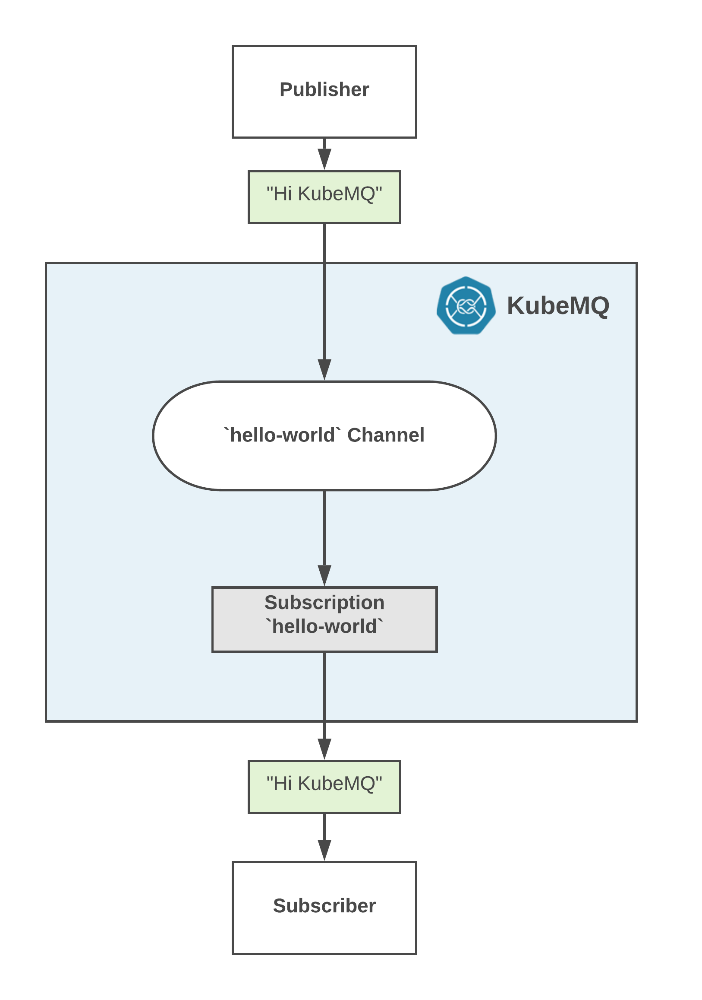

## General
To start using KubeMQ with Pub/Sub, we first need to run a KubeMQ docker container either locally or on a remote node.

You can select one of the methods below:
1. [Docker Container](./installation-docker.md)
2. [Kubernetes CLuster](./installation-kubernetes.md)

Now that you have KubeMQ installed and running, we will do the following steps:

1. Subscribe a consumer to `hello-world` channel
2. Publish "Hi KubeMQ" message in the the channel
3. Display the received message in the console.

As showed in the following diagram:




## Subscribe

A consumer can subscribe to the "hello-world" channel with one of the following methods.


### CLI
```
$ ./kubetools pubsub rec event hello-world
```

::: tip KubeTools
KubeTools is KubeMQ CLI tool.
You can download KubeTools binaries [here](https://github.com/kubemq-io/kubetools/tree/master/bin).
:::

### .Net
```

using KubeMQ.SDK.csharp.Events;
using KubeMQ.SDK.csharp.Subscription;
using System;

namespace kubemqreceiverExm
{
    class Program
    {
        private static Subscriber subscriber;
        static void Main(string[] args)
        {
            SubcribeToEventsWithoutStore();
        }

        private static void SubcribeToEventsWithoutStore()
        {
            subscriber = new Subscriber("localhost:50000");
            SubscribeRequest subscribeRequest = CreateSubscribeRequest(SubscribeType.Events);
            try
            {
                subscriber.SubscribeToEvents(subscribeRequest, HandleIncomingEvents);
            }
            catch (Exception ex)
            {
                Console.WriteLine($"failed to sub on ex :{ex.Message}");
            }
            Console.ReadLine();

        }

        private static SubscribeRequest CreateSubscribeRequest(SubscribeType subscriptionType = SubscribeType.SubscribeTypeUndefined,
        EventsStoreType eventsStoreType = EventsStoreType.Undefined,
        int TypeValue = 0, string group = "")
        {
            Random random = new Random();
            SubscribeRequest subscribeRequest = new SubscribeRequest()
            {
                Channel = "myChannel",
                ClientID = "mySubID",
                EventsStoreType = eventsStoreType,
                EventsStoreTypeValue = TypeValue,
                Group = group,
                SubscribeType = subscriptionType
            };
            return subscribeRequest;
        }

        private static void HandleIncomingEvents(EventReceive @event)
        {
            if (@event != null)
            {
                string strMsg = string.Empty;
                object body = KubeMQ.SDK.csharp.Tools.Converter.FromByteArray(@event.Body);

                Console.WriteLine($"Subscriber Received Event: Metadata:'{@event.Metadata}', Channel:'{@event.Channel}', Body:'{strMsg}'");
            }
        }
    }
}

    
```

### Java
```

import io.kubemq.sdk.basic.ServerAddressNotSuppliedException;
import io.kubemq.sdk.event.lowlevel.Event;
import io.kubemq.sdk.event.lowlevel.Sender;

import javax.net.ssl.SSLException;

class EventSubscriber extends BaseExample {

    private Subscriber subscriber;

    EventSubscriber() throws ServerAddressNotSuppliedException, SSLException {
        super("EventSubscriber");
        Subscriber subscriber = new Subscriber("localhost:50000");
        SubcribeToEventsWithoutStore();
        SubcribeToEventsWithStore();

    }

    private void SubcribeToEventsWithStore() throws ServerAddressNotSuppliedException, SSLException {
        subscriber = new Subscriber();
        SubscribeRequest subscribeRequest = CreateSubscribeRequest(SubscribeType.EventsStore, EventsStoreType.StartAtSequence, 2);
        EventReceive eventReceive = subscriber.SubscribeToEvents(subscribeRequest);
        HandleIncomingEvents(eventReceive);
    }

    private void SubcribeToEventsWithoutStore() throws ServerAddressNotSuppliedException, SSLException {
        subscriber = new Subscriber();
        SubscribeRequest subscribeRequest = CreateSubscribeRequest(SubscribeType.Events);
        EventReceive eventReceive = subscriber.SubscribeToEvents(subscribeRequest);
        HandleIncomingEvents(eventReceive);
    }

    private void HandleIncomingEvents(EventReceive message) {
        String body = new String(message.getBody());

        System.out.println(MessageFormat.format(
                "Subscriber Received Event: Metadata:''{0}'', Channel:''{1}'', Body:''{2}''",
                message.getMetadata(),
                message.getChannel(),
                body
        ));
    }
}

public class BaseExample {
      protected Logger logger;
      private String channelName;
      private String clientID;
      private int timeout;

      public BaseExample(String _ClientId) {
         clientID = _ClientId;
         timeout = 111000;
         channelName = "MyTestChannelName";
         logger = LoggerFactory.getLogger(BaseExample.class);
      }
       protected SubscribeRequest CreateSubscribeRequest(
            SubscribeType subscriptionType,
            EventsStoreType eventsStoreType,
            int TypeValue,
            String group
      )

      {
        SubscribeRequest subscribeRequest = new SubscribeRequest();

        subscribeRequest.setChannel(channelName);
        subscribeRequest.setClientID(generateRandomClientID());
        subscribeRequest.setEventsStoreType(eventsStoreType);
        subscribeRequest.setEventsStoreTypeValue(TypeValue);
        subscribeRequest.setGroup(group);
        subscribeRequest.setSubscribeType(subscriptionType);

        return subscribeRequest;
    }

    protected SubscribeRequest CreateSubscribeRequest(SubscribeType subscriptionType) {
        return CreateSubscribeRequest(subscriptionType, EventsStoreType.Undefined, 0, "");
    }

    protected SubscribeRequest CreateSubscribeRequest(SubscribeType subscriptionType, EventsStoreType eventsStoreType, int TypeValue) {
        return CreateSubscribeRequest(subscriptionType, eventsStoreType, TypeValue, "");
    }

    private String generateRandomClientID() {
        Random random = new Random();
        int low = 9;
        int high = 19999;
        return Integer.toString(random.nextInt(high - low) + low);
    }

    protected int getTimeout() {
        return timeout;
    }

    protected void setTimeout(int timeout) {
        this.timeout = timeout;
    }

    protected String getChannelName() {
        return channelName;
    }

    protected void setChannelName(String channelName) {
        this.channelName = channelName;
    }

    protected String getClientID() {
        return clientID;
    }

    protected void setClientID(String clientID) {
        this.clientID = clientID;
    }
}
    
```

### Go
```
package main

import (
   "context"
   "fmt"
   "github.com/kubemq-io/kubemq-go"
   "log"
)

func main() {
   ctx, cancel := context.WithCancel(context.Background())
   defer cancel()
   client, err := kubemq.NewClient(ctx,
      kubemq.WithAddress("localhost", 50000),
      kubemq.WithClientId("hello-world-subscriber"),
      kubemq.WithTransportType(kubemq.TransportTypeGRPC))
   if err != nil {
      log.Fatal(err)
   }
   defer client.Close()
   channelName := "hello-world"
   errCh := make(chan error)
   eventsCh, err := client.SubscribeToEvents(ctx, channelName, "", errCh)
   if err != nil {
      log.Fatal(err)
      return

   }
   for {
      select {
      case err := <-errCh:
         log.Fatal(err)
         return
      case event, more := <-eventsCh:
         if !more {
            fmt.Println("Event Received, done")
            return
         }
         log.Printf("Event Received:\nEventID: %s\nChannel: %s\nMetadata: %s\nBody: %s\n", event.Id, event.Channel, event.Metadata, event.Body)
      case <-ctx.Done():
         return
      }
   }
}
```


### Python
```
from builtins import input

from kubemq.events.subscriber import Subscriber
from kubemq.subscription.events_store_type import EventsStoreType
from kubemq.subscription.subscribe_request import SubscribeRequest
from kubemq.subscription.subscribe_type import SubscribeType


def create_subscribe_request(
        subscribe_type=SubscribeType.SubscribeTypeUndefined,
        events_store_type=EventsStoreType.Undefined,
        events_store_type_value=0):
    return SubscribeRequest(
        channel="TestChannelName",
        client_id="someID",
        events_store_type=events_store_type,
        events_store_type_value=events_store_type_value,
        group="",
        subscribe_type=subscribe_type
    )


def handle_incoming_events(event):
    if event:
        print("Subscriber Received Event: Metadata:'%s', Channel:'%s', Body:'%s'" % (
            event.metadata,
            event.channel,
            event.body
        ))


if __name__ == "__main__":
    print("Subscribing to event on channel example")

    # Subscribe to events without store
    subscriber = Subscriber("localhost:50000")
    subscribe_request = create_subscribe_request(SubscribeType.Events)
    subscriber.subscribe_to_events(subscribe_request, handle_incoming_events)

    input("Press 'Enter' to stop the application...
")
    
```


## Publish

After you have subscribed to a hello-world channel, you can send your message to it.

### CLI
```
$ ./kubetools pubsub send event hello-world "Hi KubeMQ"
```

::: tip KubeTools
KubeTools is KubeMQ CLI tool.
You can download KubeTools binaries [here](https://github.com/kubemq-io/kubetools/tree/master/bin).
:::

### .Net
```

using KubeMQ.SDK.csharp.Events.LowLevel;
using System;

namespace kubemqsenderExm
{
    class Program
    {
        private static Sender sender;
        static void Main(string[] args)
        {
            SendLowLevelEvents();
        }
        private static void SendLowLevelEvents()
        {
            sender = new Sender("localhost:50000");
            Event @event = CreateLowLevelEventWithoutStore();
            try
            {
                sender.SendEvent(@event);
            }
            catch (Exception ex)
            {
                Console.WriteLine($"failed to send on ex :{ex.Message}");
            }

        }
        private static Event CreateLowLevelEventWithoutStore()
        {
            Console.WriteLine("Start Creating Event");
            KubeMQ.SDK.csharp.Events.LowLevel.Event @event = new KubeMQ.SDK.csharp.Events.LowLevel.Event()
            {
                Metadata = "EventMetaData",
                Body = KubeMQ.SDK.csharp.Tools.Converter.ToByteArray($"hello world"),
                Store = false,
                Channel = "myChannel",
                ClientID = "myID",
                ReturnResult = false
            };
            return @event;
        }
    }
}

    
```

### Java
```

import io.kubemq.sdk.basic.ServerAddressNotSuppliedException;
import io.kubemq.sdk.event.lowlevel.Event;
import io.kubemq.sdk.event.lowlevel.Sender;

import javax.net.ssl.SSLException;

class EventSender extends BaseExample {

    EventSender() throws ServerAddressNotSuppliedException, SSLException {
        super("EventSender");
        SendLowLevelMessages();
    }

    private void SendLowLevelMessages() throws ServerAddressNotSuppliedException, SSLException {
        Sender sender = new Sender("localhost:50000");
        Event event = CreateLowLevelEventWithoutStore();
        sender.SendEvent(event);
    }
}

public class BaseExample {

    protected Logger logger;
    private String channelName;
    private String clientID;
    private int timeout;

    public BaseExample(String _ClientId) {
        clientID = _ClientId;
        timeout = 111000;
        channelName = "MyTestChannelName";
        logger = LoggerFactory.getLogger(BaseExample.class);
    }

    private Event CreateNewEvent() {
        logger.debug("Start Creating Event");
        Event message = new Event();
        message.setMetadata("MessageMetaData");
        message.setBody(MessageFormat.format("Event Created on time {0}", Instant.now()).getBytes());
        return message;
    }

    protected Event CreateLowLevelEventWithoutStore() {
        Event message = CreateNewEvent();
        message.setStore(false);
        message.setChannel(channelName);
        message.setClientID(clientID);
        message.setReturnResult(false);
        return message;
    }
       private String generateRandomClientID() {
        Random random = new Random();
        int low = 9;
        int high = 19999;
        return Integer.toString(random.nextInt(high - low) + low);
    }

    protected int getTimeout() {
        return timeout;
    }

    protected void setTimeout(int timeout) {
        this.timeout = timeout;
    }

    protected String getChannelName() {
        return channelName;
    }

    protected void setChannelName(String channelName) {
        this.channelName = channelName;
    }

    protected String getClientID() {
        return clientID;
    }

    protected void setClientID(String clientID) {
        this.clientID = clientID;
    }
}
    
```

### Go
```
package main

import (
   "context"
   "github.com/kubemq-io/kubemq-go"
   "log"
)

func main() {
   ctx, cancel := context.WithCancel(context.Background())
   defer cancel()
   client, err := kubemq.NewClient(ctx,
      kubemq.WithAddress("localhost", 50000),
      kubemq.WithClientId("hello-world-sender"),
      kubemq.WithTransportType(kubemq.TransportTypeGRPC))
   if err != nil {
      log.Fatal(err)
   }
   defer client.Close()
   channelName := "testing_event_channel"
   err = client.E().
      SetId("some-id").
      SetChannel(channelName).
      SetMetadata("some-metadata").
      SetBody([]byte("hello kubemq - sending single event")).
      Send(ctx)
   if err != nil {
      log.Fatal(err)
   }

}

```


### Python
```

from kubemq.events.lowlevel.event import Event
from kubemq.events.lowlevel.sender import Sender

if __name__ == "__main__":
    print("Sending event using sender example")

    sender = Sender("localhost:50000")
    event = Event(
        metadata="some-meta-data",
        body=("hello world").encode('UTF-8'),
        store=False,
        channel="TestChannelName",
        client_id="EventSender",
    )
    sender.send_event(event)
    
```
