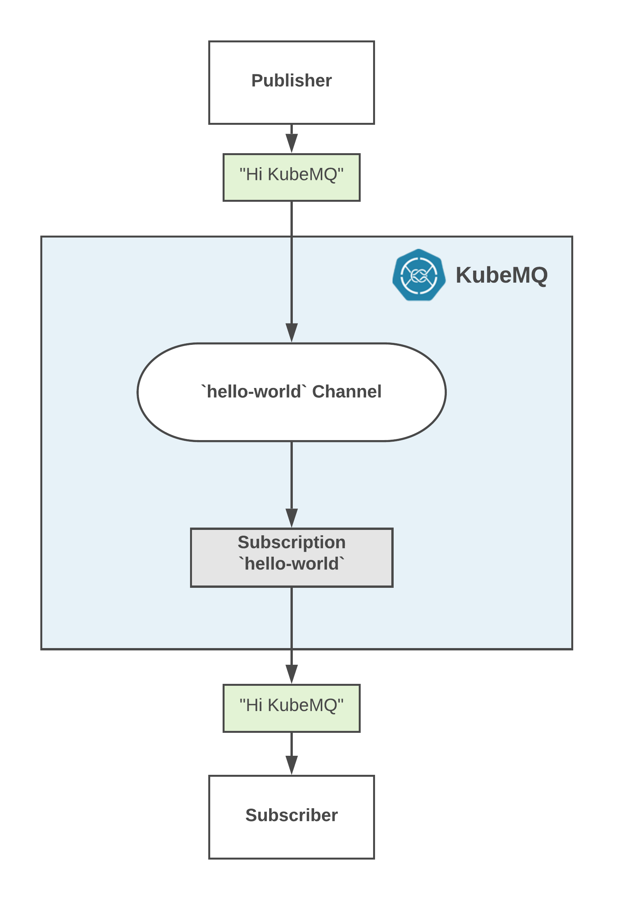

# Get Started With Pub/Sub

## Table of Content
[[toc]]

## Deploy a KubeMQ
To start using KubeMQ with Pub/Sub, we first need to run a KubeMQ docker container either locally or on a remote node.

::: tip Kubetools
Kubetools is KubeMQ Command-Line-Interface tool.
You can download Kubetools binaries [here](https://github.com/kubemq-io/kubetools/tree/master/bin).
:::

You can select one of the methods below:

<CodeSwitcher :languages="{docker:'docker',kubernetes:'kubernetes',helm:`helm`,docker_compose:'docker-compose'}" :isolated="true">

<template v-slot:docker>

### Docker
Pull and run KubeMQ Docker container:
``` bash
docker run -d -p 8080:8080 -p 50000:50000 -p 9090:9090 \
-v kubemq-vol:/store -e KUBEMQ_TOKEN=<YOUR_KUBEMQ_TOKEN> kubemq/kubemq

```

</template>

<template v-slot:kubernetes>

### Kubernetes Deployment
Copy and deploy the following yaml file:

``` yaml
apiVersion: v1
kind: List
items:
  - apiVersion: apps/v1beta2
    kind: StatefulSet
    metadata:
      name: kubemq-cluster
    spec:
      selector:
        matchLabels:
          app: kubemq-cluster
      replicas: 3
      serviceName: kubemq-cluster
      template:
        metadata:
          labels:
            app: kubemq-cluster
        spec:
          containers:
            - env:
                - name: KUBEMQ_TOKEN
                  value: <YOUR_KUBEMQ_TOKEN>
                - name: CLUSTER_ROUTES
                  value: 'kubemq-cluster:5228'
                - name: CLUSTER_PORT
                  value: '5228'
                - name: CLUSTER_ENABLE
                  value: 'true'
                - name: GRPC_PORT
                  value: '50000'
                - name: REST_PORT
                  value: '9090'
                - name: KUBEMQ_PORT
                  value: '8080'
              image: 'kubemq/kubemq:latest'
              imagePullPolicy: IfNotPresent
              name: kubemq-cluster
              ports:
                - containerPort: 50000
                  name: grpc-port
                  protocol: TCP
                - containerPort: 8080
                  name: metrics-port
                  protocol: TCP
                - containerPort: 9090
                  name: rest-port
                  protocol: TCP
                - containerPort: 5228
                  name: cluster-port
                  protocol: TCP
          restartPolicy: Always
  - apiVersion: v1
    kind: Service
    metadata:
      name: kubemq-cluster
    spec:
      ports:
        - name: metrics-port
          port: 8080
          protocol: TCP
          targetPort: 8080
        - name: grpc-port
          port: 50000
          protocol: TCP
          targetPort: 50000
        - name: cluster-port
          port: 5228
          protocol: TCP
          targetPort: 5228
        - name: rest-port
          port: 9090
          protocol: TCP
          targetPort: 9090
      sessionAffinity: None
      type: NodePort
      selector:
        app: kubemq-cluster

```

</template>


<template v-slot:helm>

### Helm Installation
Add KubeMQ Helm Repository:

``` bash
helm repo add kubemq-charts https://kubemq-io.github.io/charts
```

Verify KubeMQ helm repository charts is correctly configured by:
``` bash
helm repo list
```

Install KubeMQ Chart:

``` bash
helm install --name kubemq-cluster --set token=<YOUR_KUBEMQ_TOKEN> \
kubemq-charts/kubemq
```

</template>


<template v-slot:docker_compose>

### Docker-Compose Deployment
Run :

``` bash
docker-compose -d up
```

With the following yaml file named docker-compose.yaml:

``` yaml
version: '3.7'
services:
  kubemq:
    image: kubemq/kubemq
    container_name: kubemq
    ports:
      - "8080:8080"
      - "9090:9090"
      - "50000:50000"
    environment:
      - KUBEMQ_HOST=kubemq
      - KUBEMQ_TOKEN=<YOUR_KUBEMQ_TOKEN>
    networks:
      - backend
      - frontend
    volumes:
      - kubemq_vol:/store
networks:
  backend:
volumes:
  kubemq_vol:
```

</template>
</CodeSwitcher>


::: warning PROXY
If KubeMQ fails to load, probably there is a proxy server which prevents the validation of KubeMQ token.
In order to fix this, you can add -e KUBEMQ_PROXY="your-proxy-url" as an environment variable.
:::

## Verify Deployment

Browse to KubeMQ's API end-point with GET request to `/health` path and get a json response like below:

For Example:
``` bash
curl --location --request GET "http://localhost:8080/health" \
  --header "Content-Type: application/json"
```

We received:

``` json
[
    {
        "host": "DESKTOP-LNB7P20",
        "utc_time": "2019-07-23T06:59:26.9534018Z",
        "grpc": {
            "connections": {
                "total": 0,
                "events_senders": 0,
                "events_stream_senders": 0,
                "events_receivers": 0,
                "events_store_receivers": 0,
                "requests_senders": 0,
                "responses_senders": 0,
                "commands_receivers": 0,
                "queries_receivers": 0,
                "queue_senders": 0,
                "queue_receivers": 0
            },
            "traffic": {
                "sent_events": 0,
                "received_events": 0,
                "sent_requests": 0,
                "sent_error": 0,
                "sent_responses": 0,
                "received_requests": 0,
                "sent_events_vol": 0,
                "received_events_vol": 0,
                "sent_requests_vol": 0,
                "sent_errors_vol": 0,
                "sent_responses_vol": 0,
                "received_requests_vol": 0,
                "send_queue_messages_vol": 0,
                "receive_queue_messages_vol": 0,
                "send_queue_messages": 0,
                "receive_queue_messages": 0,
                "total_messages": 0,
                "total_volume": 0
            }
        },
        "rest": {
            "connections": {
                "total": 0,
                "events_senders": 0,
                "events_stream_senders": 0,
                "events_receivers": 0,
                "events_store_receivers": 0,
                "requests_senders": 0,
                "responses_senders": 0,
                "commands_receivers": 0,
                "queries_receivers": 0,
                "queue_senders": 0,
                "queue_receivers": 0
            },
            "traffic": {
                "sent_events": 0,
                "received_events": 0,
                "sent_requests": 0,
                "sent_error": 0,
                "sent_responses": 0,
                "received_requests": 0,
                "sent_events_vol": 0,
                "received_events_vol": 0,
                "sent_requests_vol": 0,
                "sent_errors_vol": 0,
                "sent_responses_vol": 0,
                "received_requests_vol": 0,
                "send_queue_messages_vol": 0,
                "receive_queue_messages_vol": 0,
                "send_queue_messages": 0,
                "receive_queue_messages": 0,
                "total_messages": 0,
                "total_volume": 0
            }
        }
    }
]

```

## Next Steps

Now that you have KubeMQ installed and running, we will do the following steps:

1. Subscribe a consumer to `hello-world` channel
2. Publish "Hi KubeMQ" message in the the channel
3. Display the received message in the console.

As showed in the following diagram:




## Subscribe to a Channel

A consumer can subscribe to the "hello-world" channel with one of the following methods.

<CodeSwitcher :languages="{bash:'kubetools',curl:'cURL',csharp:'.Net',java:`Java`,go:`Go`,py:`Python`,node:`Node`,php:`PHP`,ruby:`Ruby`,jquery:`jQuery`}" :isolated="true">
<template v-slot:bash>

Run the following Kubetools command:
``` bash
kubetools pubsub rec events hello-world
```

When connected, a stream of events messages will be shown in the console.

::: tip Kubetools
Kubetools is KubeMQ Command-Line-Interface tool.
You can download Kubetools binaries [here](https://github.com/kubemq-io/kubetools/tree/master/bin).
:::

</template>

<template v-slot:curl>

The following cURL command is using KubeMQ's REST interface:

``` bash
curl --location --request GET "https://playground.kubemq.io/subscribe/events?client_id=some_client_id&channel=some_channel&group=some_group&subscribe_type=events" \
  --header "Content-Type: application/json" \
  --data ""
```

::: warning
Subscribe to Events in REST interface is using WebSocket for streaming (Push) events to the consumer. You will need to implement a WebSocket receiver accordingly.
:::
</template>


<template v-slot:csharp>

The following .NET code snippet is using KubeMQ's .NET SDK with gRPC interface:

``` csharp
using KubeMQ.SDK.csharp.Events;
using KubeMQ.SDK.csharp.Subscription;
using System;

namespace kubemqreceiverExm
{
    class Program
    {
        private static Subscriber subscriber;
        static void Main(string[] args)
        {
            SubcribeToEventsWithoutStore();
        }

        private static void SubcribeToEventsWithoutStore()
        {
            subscriber = new Subscriber("localhost:50000");
            SubscribeRequest subscribeRequest = CreateSubscribeRequest(SubscribeType.Events);
            try
            {
                subscriber.SubscribeToEvents(subscribeRequest, HandleIncomingEvents);
            }
            catch (Exception ex)
            {
                Console.WriteLine($"failed to sub on ex :{ex.Message}");
            }
            Console.ReadLine();

        }

        private static SubscribeRequest CreateSubscribeRequest(SubscribeType subscriptionType = SubscribeType.SubscribeTypeUndefined,
        EventsStoreType eventsStoreType = EventsStoreType.Undefined,
        int TypeValue = 0, string group = "")
        {
            Random random = new Random();
            SubscribeRequest subscribeRequest = new SubscribeRequest()
            {
                Channel = "myChannel",
                ClientID = "mySubID",
                EventsStoreType = eventsStoreType,
                EventsStoreTypeValue = TypeValue,
                Group = group,
                SubscribeType = subscriptionType
            };
            return subscribeRequest;
        }

        private static void HandleIncomingEvents(EventReceive @event)
        {
            if (@event != null)
            {
                string strMsg = string.Empty;
                object body = KubeMQ.SDK.csharp.Tools.Converter.FromByteArray(@event.Body);

                Console.WriteLine($"Subscriber Received Event: Metadata:'{@event.Metadata}', Channel:'{@event.Channel}', Body:'{strMsg}'");
            }
        }
    }
}

    
```

When executed, a stream of events messages will be shown in the console.

</template>
<template v-slot:java>

The following Java code snippet is using KubeMQ's Java SDK with gRPC interface:

``` java
import io.kubemq.sdk.basic.ServerAddressNotSuppliedException;
import io.kubemq.sdk.event.lowlevel.Event;
import io.kubemq.sdk.event.lowlevel.Sender;
import javax.net.ssl.SSLException;

class EventSubscriber extends BaseExample {

    private Subscriber subscriber;

    EventSubscriber() throws ServerAddressNotSuppliedException, SSLException {
        super("EventSubscriber");
        Subscriber subscriber = new Subscriber("localhost:50000");
        SubcribeToEventsWithoutStore();
        SubcribeToEventsWithStore();

    }

    private void SubcribeToEventsWithStore() throws ServerAddressNotSuppliedException, SSLException {
        subscriber = new Subscriber();
        SubscribeRequest subscribeRequest = CreateSubscribeRequest(SubscribeType.EventsStore, EventsStoreType.StartAtSequence, 2);
        EventReceive eventReceive = subscriber.SubscribeToEvents(subscribeRequest);
        HandleIncomingEvents(eventReceive);
    }

    private void SubcribeToEventsWithoutStore() throws ServerAddressNotSuppliedException, SSLException {
        subscriber = new Subscriber();
        SubscribeRequest subscribeRequest = CreateSubscribeRequest(SubscribeType.Events);
        EventReceive eventReceive = subscriber.SubscribeToEvents(subscribeRequest);
        HandleIncomingEvents(eventReceive);
    }

    private void HandleIncomingEvents(EventReceive message) {
        String body = new String(message.getBody());

        System.out.println(MessageFormat.format(
                "Subscriber Received Event: Metadata:''{0}'', Channel:''{1}'', Body:''{2}''",
                message.getMetadata(),
                message.getChannel(),
                body
        ));
    }
}

public class BaseExample {
      protected Logger logger;
      private String channelName;
      private String clientID;
      private int timeout;

      public BaseExample(String _ClientId) {
         clientID = _ClientId;
         timeout = 111000;
         channelName = "MyTestChannelName";
         logger = LoggerFactory.getLogger(BaseExample.class);
      }
       protected SubscribeRequest CreateSubscribeRequest(
            SubscribeType subscriptionType,
            EventsStoreType eventsStoreType,
            int TypeValue,
            String group
      )

      {
        SubscribeRequest subscribeRequest = new SubscribeRequest();

        subscribeRequest.setChannel(channelName);
        subscribeRequest.setClientID(generateRandomClientID());
        subscribeRequest.setEventsStoreType(eventsStoreType);
        subscribeRequest.setEventsStoreTypeValue(TypeValue);
        subscribeRequest.setGroup(group);
        subscribeRequest.setSubscribeType(subscriptionType);

        return subscribeRequest;
    }

    protected SubscribeRequest CreateSubscribeRequest(SubscribeType subscriptionType) {
        return CreateSubscribeRequest(subscriptionType, EventsStoreType.Undefined, 0, "");
    }

    protected SubscribeRequest CreateSubscribeRequest(SubscribeType subscriptionType, EventsStoreType eventsStoreType, int TypeValue) {
        return CreateSubscribeRequest(subscriptionType, eventsStoreType, TypeValue, "");
    }

    private String generateRandomClientID() {
        Random random = new Random();
        int low = 9;
        int high = 19999;
        return Integer.toString(random.nextInt(high - low) + low);
    }

    protected int getTimeout() {
        return timeout;
    }

    protected void setTimeout(int timeout) {
        this.timeout = timeout;
    }

    protected String getChannelName() {
        return channelName;
    }

    protected void setChannelName(String channelName) {
        this.channelName = channelName;
    }

    protected String getClientID() {
        return clientID;
    }

    protected void setClientID(String clientID) {
        this.clientID = clientID;
    }
}
    
```
When executed, a stream of events messages will be shown in the console.

</template>
<template v-slot:go>

The following Go code snippet is using KubeMQ's Go SDK with gRPC interface:
``` go
package main
import (
   "context"
   "fmt"
   "github.com/kubemq-io/kubemq-go"
   "log"
)

func main() {
   ctx, cancel := context.WithCancel(context.Background())
   defer cancel()
   client, err := kubemq.NewClient(ctx,
      kubemq.WithAddress("localhost", 50000),
      kubemq.WithClientId("hello-world-subscriber"),
      kubemq.WithTransportType(kubemq.TransportTypeGRPC))
   if err != nil {
      log.Fatal(err)
   }
   defer client.Close()
   channelName := "hello-world"
   errCh := make(chan error)
   eventsCh, err := client.SubscribeToEvents(ctx, channelName, "", errCh)
   if err != nil {
      log.Fatal(err)
      return

   }
   for {
      select {
      case err := <-errCh:
         log.Fatal(err)
         return
      case event, more := <-eventsCh:
         if !more {
            fmt.Println("Event Received, done")
            return
         }
         log.Printf("Event Received:\nEventID: %s\nChannel: %s\nMetadata: %s\nBody: %s\n", event.Id, event.Channel, event.Metadata, event.Body)
      case <-ctx.Done():
         return
      }
   }
}
```
When executed, a stream of events messages will be shown in the console.

</template>
<template v-slot:py>

The following Python code snippet is using KubeMQ's Python SDK with gRPC interface:

``` py
from builtins import input
from kubemq.events.subscriber import Subscriber
from kubemq.subscription.events_store_type import EventsStoreType
from kubemq.subscription.subscribe_request import SubscribeRequest
from kubemq.subscription.subscribe_type import SubscribeType


def create_subscribe_request(
        subscribe_type=SubscribeType.SubscribeTypeUndefined,
        events_store_type=EventsStoreType.Undefined,
        events_store_type_value=0):
    return SubscribeRequest(
        channel="TestChannelName",
        client_id="someID",
        events_store_type=events_store_type,
        events_store_type_value=events_store_type_value,
        group="",
        subscribe_type=subscribe_type
    )


def handle_incoming_events(event):
    if event:
        print("Subscriber Received Event: Metadata:'%s', Channel:'%s', Body:'%s'" % (
            event.metadata,
            event.channel,
            event.body
        ))


if __name__ == "__main__":
    print("Subscribing to event on channel example")

    # Subscribe to events without store
    subscriber = Subscriber("localhost:50000")
    subscribe_request = create_subscribe_request(SubscribeType.Events)
    subscriber.subscribe_to_events(subscribe_request, handle_incoming_events)

    input("Press 'Enter' to stop the application...
")
    
```
When executed, a stream of events messages will be shown in the console.

</template>

<template v-slot:node>

The following Node code snippet is using KubeMQ's REST interface:

``` js
var https = require('https');

var options = {
  'method': 'GET',
  'hostname': 'https://playground.kubemq.io',
  'path': '/subscribe/events?client_id=some_client_id&channel=some_channel&group=some_group&subscribe_type=events',
  'headers': {
    'Content-Type': 'application/json',
  }
};

var req = https.request(options, function (res) {
  var chunks = [];

  res.on("data", function (chunk) {
    chunks.push(chunk);
  });

  res.on("end", function (chunk) {
    var body = Buffer.concat(chunks);
    console.log(body.toString());
  });

  res.on("error", function (error) {
    console.error(error);
  });
});

req.end();
```


::: warning
Subscribe to Events in REST interface is using WebSocket for streaming (Push) events to the consumer. You will need to implement a WebSocket receiver accordingly.
:::

</template>

<template v-slot:php>

The following PHP code snippet is using KubeMQ's REST interface:

``` php
<?php

$curl = curl_init();

curl_setopt_array($curl, array(
  CURLOPT_URL => "https://playground.kubemq.io/subscribe/events?client_id=some_client_id&channel=some_channel&group=some_group&subscribe_type=events",
  CURLOPT_RETURNTRANSFER => true,
  CURLOPT_ENCODING => "",
  CURLOPT_MAXREDIRS => 10,
  CURLOPT_TIMEOUT => 0,
  CURLOPT_FOLLOWLOCATION => false,
  CURLOPT_HTTP_VERSION => CURL_HTTP_VERSION_1_1,
  CURLOPT_CUSTOMREQUEST => "GET",
  CURLOPT_HTTPHEADER => array(
    "Content-Type: application/json"
  ),
));

$response = curl_exec($curl);
$err = curl_error($curl);

curl_close($curl);

if ($err) {
  echo "cURL Error #:" . $err;
} else {
  echo $response;
} ?>
```


::: warning
Subscribe to Events in REST interface is using WebSocket for streaming (Push) events to the consumer. You will need to implement a WebSocket receiver accordingly.
:::

</template>


<template v-slot:ruby>

The following Ruby code snippet is using KubeMQ's REST interface:

``` ruby
require "uri"
require "net/http"

url = URI("https://playground.kubemq.io/subscribe/events?client_id=some_client_id&channel=some_channel&group=some_group&subscribe_type=events")

http = Net::HTTP.new(url.host, url.port)

request = Net::HTTP::Get.new(url)
request["Content-Type"] = "application/json"

response = http.request(request)
puts response.read_body
```


::: warning
Subscribe to Events in REST interface is using WebSocket for streaming (Push) events to the consumer. You will need to implement a WebSocket receiver accordingly.
:::

</template>


<template v-slot:jquery>

The following jQuery code snippet is using KubeMQ's REST interface:

``` js
var settings = {
  "url": "https://playground.kubemq.io/subscribe/events?client_id=some_client_id&channel=some_channel&group=some_group&subscribe_type=events",
  "method": "GET",
  "timeout": 0,
  "headers": {
    "Content-Type": "application/json",
  },
};

$.ajax(settings).done(function (response) {
  console.log(response);
});
```


::: warning
Subscribe to Events in REST interface is using WebSocket for streaming (Push) events to the consumer. You will need to implement a WebSocket receiver accordingly.
:::

</template>


</CodeSwitcher>


## Publish to a Channel

After you have subscribed to a hello-world channel, you can send your message to it.


<CodeSwitcher :languages="{bash:'kubetools',curl:'cURL',csharp:'.Net',java:`Java`,go:`Go`,py:`Python`,node:`Node`,php:`PHP`,ruby:`Ruby`,jquery:`jQuery`}" :isolated="true">


<template v-slot:bash>

Run the following Kubetools command:

``` bash
kubetools pubsub send events hello-world "Hi KubeMQ"
```


::: tip Kubetools
Kubetools is KubeMQ Command-Line-Interface tool.
You can download Kubetools binaries [here](https://github.com/kubemq-io/kubetools/tree/master/bin).
:::

</template>


<template v-slot:curl>

The following cURL command is using KubeMQ's REST interface:

``` bash
curl --location --request POST "https://playground.kubemq.io/send/event" \
  --header "Content-Type: application/json" \
  --data "{
    \"EventID\": \"1234-5678-90\",
    \"ClientID\": \"events-client-id\",
    \"Channel\": \"events-channel\",
    \"Metadata\": \"some-metadata\",
    \"Body\": \"c29tZSBlbmNvZGVkIGJvZHk=\",
    \"Store\": false
}"
```

A response for a successful command will look like this:

``` bash
{
  "is_error": false,
  "message": "OK",
  "data": {
    "EventID": "1234-5678-90",
    "Sent": true
  }
}
```
</template>

<template v-slot:csharp>

The following .NET code snippet is using KubeMQ's .NET SDK with gRPC interface:

``` csharp
using KubeMQ.SDK.csharp.Events.LowLevel;
using System;

namespace kubemqsenderExm
{
    class Program
    {
        private static Sender sender;
        static void Main(string[] args)
        {
            SendLowLevelEvents();
        }
        private static void SendLowLevelEvents()
        {
            sender = new Sender("localhost:50000");
            Event @event = CreateLowLevelEventWithoutStore();
            try
            {
                sender.SendEvent(@event);
            }
            catch (Exception ex)
            {
                Console.WriteLine($"failed to send on ex :{ex.Message}");
            }

        }
        private static Event CreateLowLevelEventWithoutStore()
        {
            Console.WriteLine("Start Creating Event");
            KubeMQ.SDK.csharp.Events.LowLevel.Event @event = new KubeMQ.SDK.csharp.Events.LowLevel.Event()
            {
                Metadata = "EventMetaData",
                Body = KubeMQ.SDK.csharp.Tools.Converter.ToByteArray($"hello world"),
                Store = false,
                Channel = "myChannel",
                ClientID = "myID",
                ReturnResult = false
            };
            return @event;
        }
    }
}

    
```

</template>
<template v-slot:java>

The following Java code snippet is using KubeMQ's Java SDK with gRPC interface:

``` java
import io.kubemq.sdk.basic.ServerAddressNotSuppliedException;
import io.kubemq.sdk.event.lowlevel.Event;
import io.kubemq.sdk.event.lowlevel.Sender;
import javax.net.ssl.SSLException;

class EventSender extends BaseExample {

    EventSender() throws ServerAddressNotSuppliedException, SSLException {
        super("EventSender");
        SendLowLevelMessages();
    }

    private void SendLowLevelMessages() throws ServerAddressNotSuppliedException, SSLException {
        Sender sender = new Sender("localhost:50000");
        Event event = CreateLowLevelEventWithoutStore();
        sender.SendEvent(event);
    }
}

public class BaseExample {

    protected Logger logger;
    private String channelName;
    private String clientID;
    private int timeout;

    public BaseExample(String _ClientId) {
        clientID = _ClientId;
        timeout = 111000;
        channelName = "MyTestChannelName";
        logger = LoggerFactory.getLogger(BaseExample.class);
    }

    private Event CreateNewEvent() {
        logger.debug("Start Creating Event");
        Event message = new Event();
        message.setMetadata("MessageMetaData");
        message.setBody(MessageFormat.format("Event Created on time {0}", Instant.now()).getBytes());
        return message;
    }

    protected Event CreateLowLevelEventWithoutStore() {
        Event message = CreateNewEvent();
        message.setStore(false);
        message.setChannel(channelName);
        message.setClientID(clientID);
        message.setReturnResult(false);
        return message;
    }
       private String generateRandomClientID() {
        Random random = new Random();
        int low = 9;
        int high = 19999;
        return Integer.toString(random.nextInt(high - low) + low);
    }

    protected int getTimeout() {
        return timeout;
    }

    protected void setTimeout(int timeout) {
        this.timeout = timeout;
    }

    protected String getChannelName() {
        return channelName;
    }

    protected void setChannelName(String channelName) {
        this.channelName = channelName;
    }

    protected String getClientID() {
        return clientID;
    }

    protected void setClientID(String clientID) {
        this.clientID = clientID;
    }
}
    
```

</template>
<template v-slot:go>

The following Go code snippet is using KubeMQ's Go SDK with gRPC interface:

``` go
package main
import (
   "context"
   "github.com/kubemq-io/kubemq-go"
   "log"
)

func main() {
   ctx, cancel := context.WithCancel(context.Background())
   defer cancel()
   client, err := kubemq.NewClient(ctx,
      kubemq.WithAddress("localhost", 50000),
      kubemq.WithClientId("hello-world-sender"),
      kubemq.WithTransportType(kubemq.TransportTypeGRPC))
   if err != nil {
      log.Fatal(err)
   }
   defer client.Close()
   channelName := "testing_event_channel"
   err = client.E().
      SetId("some-id").
      SetChannel(channelName).
      SetMetadata("some-metadata").
      SetBody([]byte("hello kubemq - sending single event")).
      Send(ctx)
   if err != nil {
      log.Fatal(err)
   }

}

```

</template>
<template v-slot:py>

The following Python code snippet is using KubeMQ's Python SDK with gRPC interface:

``` py
from kubemq.events.lowlevel.event import Event
from kubemq.events.lowlevel.sender import Sender

if __name__ == "__main__":
    print("Sending event using sender example")

    sender = Sender("localhost:50000")
    event = Event(
        metadata="some-meta-data",
        body=("hello world").encode('UTF-8'),
        store=False,
        channel="TestChannelName",
        client_id="EventSender",
    )
    sender.send_event(event)
    
```


</template>


<template v-slot:node>

The following node code snippet is using KubeMQ's REST interface:

``` js
var https = require('https');

var options = {
  'method': 'POST',
  'hostname': 'playground.kubemq.io',
  'path': '/send/event',
  'headers': {
    'Content-Type': 'application/json',
  }
};

var req = https.request(options, function (res) {
  var chunks = [];

  res.on("data", function (chunk) {
    chunks.push(chunk);
  });

  res.on("end", function (chunk) {
    var body = Buffer.concat(chunks);
    console.log(body.toString());
  });

  res.on("error", function (error) {
    console.error(error);
  });
});

var postData =  "{\n    \"EventID\": \"1234-5678-90\",\n    \"ClientID\": \"events-client-id\",\n    \"Channel\": \"events-channel\",\n    \"Metadata\": \"some-metadata\",\n    \"Body\": \"c29tZSBlbmNvZGVkIGJvZHk=\",\n    \"Store\": false\n}";

req.write(postData);

req.end();
```

A response for a successful command will look like this:

``` bash
{
  "is_error": false,
  "message": "OK",
  "data": {
    "EventID": "1234-5678-90",
    "Sent": true
  }
}
```
</template>

<template v-slot:php>

The following PHP code snippet is using KubeMQ's REST interface:

``` php
<?php

$curl = curl_init();

curl_setopt_array($curl, array(
  CURLOPT_URL => "https://playground.kubemq.io/send/event",
  CURLOPT_RETURNTRANSFER => true,
  CURLOPT_ENCODING => "",
  CURLOPT_MAXREDIRS => 10,
  CURLOPT_TIMEOUT => 0,
  CURLOPT_FOLLOWLOCATION => false,
  CURLOPT_HTTP_VERSION => CURL_HTTP_VERSION_1_1,
  CURLOPT_CUSTOMREQUEST => "POST",
  CURLOPT_POSTFIELDS =>"{\n    \"EventID\": \"1234-5678-90\",\n    \"ClientID\": \"events-client-id\",\n    \"Channel\": \"events-channel\",\n    \"Metadata\": \"some-metadata\",\n    \"Body\": \"c29tZSBlbmNvZGVkIGJvZHk=\",\n    \"Store\": false\n}",
  CURLOPT_HTTPHEADER => array(
    "Content-Type: application/json"
  ),
));

$response = curl_exec($curl);
$err = curl_error($curl);

curl_close($curl);

if ($err) {
  echo "cURL Error #:" . $err;
} else {
  echo $response;
} ?>
```

A response for a successful command will look like this:

``` bash
{
  "is_error": false,
  "message": "OK",
  "data": {
    "EventID": "1234-5678-90",
    "Sent": true
  }
}
```
</template>


<template v-slot:ruby>

The following Ruby code snippet is using KubeMQ's REST interface:

``` ruby
require "uri"
require "net/http"

url = URI("https://playground.kubemq.io/send/event")

https = Net::HTTP.new(url.host, url.port)
https.use_ssl = true

request = Net::HTTP::Post.new(url)
request["Content-Type"] = "application/json"
request.body = "{\n    \"EventID\": \"1234-5678-90\",\n    \"ClientID\": \"events-client-id\",\n    \"Channel\": \"events-channel\",\n    \"Metadata\": \"some-metadata\",\n    \"Body\": \"c29tZSBlbmNvZGVkIGJvZHk=\",\n    \"Store\": false\n}"
response = https.request(request)
puts response.read_body
```

A response for a successful command will look like this:

``` bash
{
  "is_error": false,
  "message": "OK",
  "data": {
    "EventID": "1234-5678-90",
    "Sent": true
  }
}
```
</template>


<template v-slot:jquery>

The following jQuery code snippet is using KubeMQ's REST interface:

``` js
var settings = {
  "url": "https://playground.kubemq.io/send/event",
  "method": "POST",
  "timeout": 0,
  "headers": {
    "Content-Type": "application/json",
  },
  "data": "{\n    \"EventID\": \"1234-5678-90\",\n    \"ClientID\": \"events-client-id\",\n    \"Channel\": \"events-channel\",\n    \"Metadata\": \"some-metadata\",\n    \"Body\": \"c29tZSBlbmNvZGVkIGJvZHk=\",\n    \"Store\": false\n}",
};

$.ajax(settings).done(function (response) {
  console.log(response);
});
```

A response for a successful command will look like this:

``` bash
{
  "is_error": false,
  "message": "OK",
  "data": {
    "EventID": "1234-5678-90",
    "Sent": true
  }
}
```
</template>


</CodeSwitcher>

