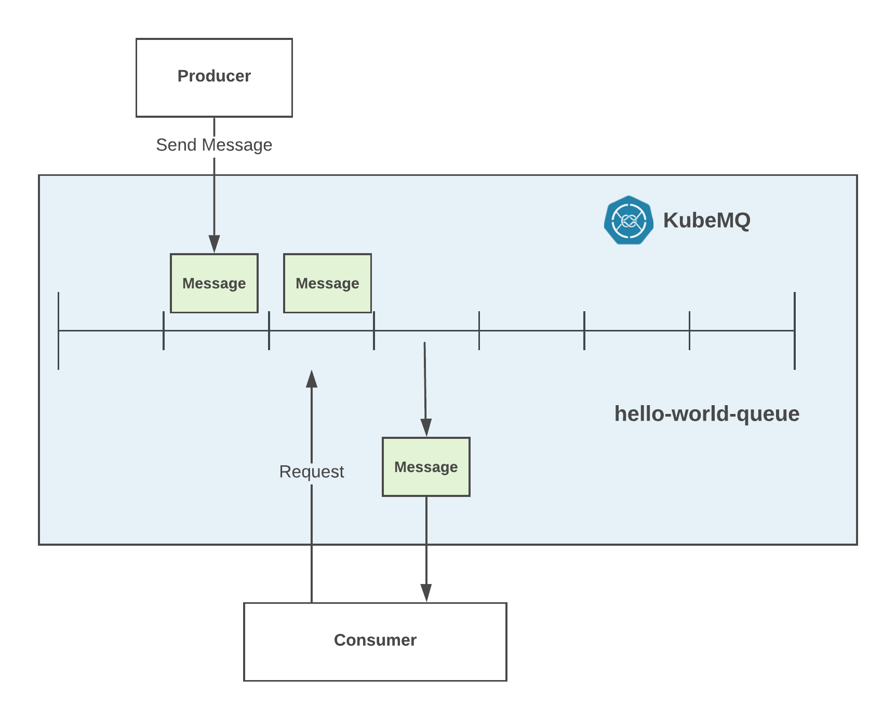

# Get Started with Queues

## Table of Content
[[toc]]

## Deploy a KubeMQ
To start using KubeMQ with Pub/Sub, we first need to run a KubeMQ docker container either locally or on a remote node.

You can select one of the methods below:

<CodeSwitcher :languages="{docker:'docker',kubernetes:'kubernetes',helm:`helm`,docker_compose:'docker-compose'}" :isolated="true">

<template v-slot:docker>


Pull and run KubeMQ Docker container:

``` bash
docker run -d -p 8080:8080 -p 50000:50000 -p 9090:9090 \
-v $PWD:/store -e KUBEMQ_TOKEN=<YOUR_KUBEMQ_TOKEN> kubemq/kubemq

```

</template>

<template v-slot:kubernetes>

Execute the flowing command:

``` bash
kubectl apply -f https://get.kubemq.io/deploy?token="YOUR_KUBEMQ_TOKEN"
```


</template>

<template v-slot:helm>

Add KubeMQ Helm Repository:

``` bash
helm repo add kubemq-charts https://kubemq-io.github.io/charts
```

Verify KubeMQ helm repository charts is correctly configured by:
``` bash
helm repo list
```

Install KubeMQ Chart:

``` bash
helm install --name kubemq-cluster --set token=<YOUR_KUBEMQ_TOKEN> \
kubemq-charts/kubemq
```

</template>


<template v-slot:docker_compose>


Execute the flowing command:

``` bash
docker-compose -d up
```

With the following yaml file named docker-compose.yaml:

``` yaml
version: '3.7'
services:
  kubemq:
    image: kubemq/kubemq
    container_name: kubemq
    ports:
      - "8080:8080"
      - "9090:9090"
      - "50000:50000"
    environment:
      - KUBEMQ_HOST=kubemq
      - KUBEMQ_TOKEN="YOUR_KUBEMQ_TOKEN"
    networks:
      - backend
      - frontend
    volumes:
      - kubemq_vol:/store
networks:
  backend:
volumes:
  kubemq_vol:
```

</template>
</CodeSwitcher>


## Verify Deployment

Browse to KubeMQ's API end-point with GET request to `/health` path and get a json response like below:

For Example:
``` bash
curl --location --request GET "http://localhost:8080/health" \
  --header "Content-Type: application/json"
```

We received:

``` json
[
    {
        "host": "some-host",
        "utc_time": "2019-07-23T06:59:26.9534018Z",
        "grpc": {
            "connections": {
                "total": 0,
                "events_senders": 0,
                "events_stream_senders": 0,
                "events_receivers": 0,
                "events_store_receivers": 0,
                "requests_senders": 0,
                "responses_senders": 0,
                "commands_receivers": 0,
                "queries_receivers": 0,
                "queue_senders": 0,
                "queue_receivers": 0
            },
            "traffic": {
                "sent_events": 0,
                "received_events": 0,
                "sent_requests": 0,
                "sent_error": 0,
                "sent_responses": 0,
                "received_requests": 0,
                "sent_events_vol": 0,
                "received_events_vol": 0,
                "sent_requests_vol": 0,
                "sent_errors_vol": 0,
                "sent_responses_vol": 0,
                "received_requests_vol": 0,
                "send_queue_messages_vol": 0,
                "receive_queue_messages_vol": 0,
                "send_queue_messages": 0,
                "receive_queue_messages": 0,
                "total_messages": 0,
                "total_volume": 0
            }
        },
        "rest": {
            "connections": {
                "total": 0,
                "events_senders": 0,
                "events_stream_senders": 0,
                "events_receivers": 0,
                "events_store_receivers": 0,
                "requests_senders": 0,
                "responses_senders": 0,
                "commands_receivers": 0,
                "queries_receivers": 0,
                "queue_senders": 0,
                "queue_receivers": 0
            },
            "traffic": {
                "sent_events": 0,
                "received_events": 0,
                "sent_requests": 0,
                "sent_error": 0,
                "sent_responses": 0,
                "received_requests": 0,
                "sent_events_vol": 0,
                "received_events_vol": 0,
                "sent_requests_vol": 0,
                "sent_errors_vol": 0,
                "sent_responses_vol": 0,
                "received_requests_vol": 0,
                "send_queue_messages_vol": 0,
                "receive_queue_messages_vol": 0,
                "send_queue_messages": 0,
                "receive_queue_messages": 0,
                "total_messages": 0,
                "total_volume": 0
            }
        }
    }
]

```


::: warning PROXY
If KubeMQ fails to load, probably there is a proxy server which prevents the validation of KubeMQ token.
In order to fix this, you can add -e KUBEMQ_PROXY="your-proxy-url" as an environment variable.
:::

## Next Steps

Now that you have KubeMQ installed and running, we will do the following steps:

1. Send a message to `hello-world-queue` channel.
2. Request a message from `hello-world-queue` channel and receive a message.
3. Display the received message in the console.

As showed in the following diagram:




## Send a Message


The producer can send a message to the "hello-world-queue" channel with one of the following methods.

<CodeSwitcher :languages="{bash:'kubetools',curl:'cURL',csharp:'.Net',java:`Java`,go:`Go`,py:`Python`,node:`Node`,php:`PHP`,ruby:`Ruby`,jquery:`jQuery`}" :isolated="true">
<template v-slot:bash>

Run the following Kubetools command:
``` bash
kubetools queue send "hello-world-queue" "this is a queue message"
```

A result message will be display with indication of sending time of the message

::: tip Kubetools
Kubetools is KubeMQ Command-Line-Interface tool.
You can download Kubetools binaries [here](https://github.com/kubemq-io/kubetools/tree/master/bin).
:::

</template>

<template v-slot:curl>

The following cURL command is using KubeMQ's REST interface:

``` bash
curl --location --request POST "{{host}}/queue/send" \
  --header "Content-Type: application/json" \
  --data "{
         \"Id\":\"\",
         \"ClientId\":\"send-message-client-id\",
         \"Channel\":\"hello-world-queue\",
         \"Metadata\":\"\",
         \"Body\":\"QmF0Y2ggTWVzc2FnZSAw\",
         \"Tags\":{
            \"message\":\"0\"
         },
         \"Attributes\":null,
         \"Policy\":{
            \"ExpirationSeconds\":0,
            \"DelaySeconds\":0,
            \"MaxReceiveCount\":0,
            \"MaxReceiveQueue\":\"\"
         }
}"
```


</template>


<template v-slot:csharp>

The following .NET code snippet is using KubeMQ's .NET SDK with gRPC interface:

``` csharp
Code snippet will available soon
```

When executed, a stream of events messages will be shown in the console.

</template>
<template v-slot:java>

The following Java code snippet is using KubeMQ's Java SDK with gRPC interface:

``` java
Code snippet will available soon
```
When executed, a stream of events messages will be shown in the console.

</template>
<template v-slot:go>

The following Go code snippet is using KubeMQ's Go SDK with gRPC interface:
``` go
package main

import (
	"context"
	"github.com/kubemq-io/kubemq-go"
	"log"
	"time"
)

func main() {
	ctx, cancel := context.WithCancel(context.Background())
	defer cancel()
	client, err := kubemq.NewClient(ctx,
		kubemq.WithAddress("localhost", 50000),
		kubemq.WithClientId("test-command-client-id"),
		kubemq.WithTransportType(kubemq.TransportTypeGRPC))
	if err != nil {
		log.Fatal(err)
	}
	defer client.Close()
	channel := "hello-world-queue"

	sendResult, err := client.NewQueueMessage().
		SetChannel(channel).
		SetBody([]byte("some-simple_queue-queue-message")).
		Send(ctx)
	if err != nil {
		log.Fatal(err)
	}
	log.Printf("Send to Queue Result: MessageID:%s,Sent At: %s\n", sendResult.MessageID, time.Unix(0, sendResult.SentAt).String())
}
```
When executed, a stream of events messages will be shown in the console.

</template>
<template v-slot:py>

The following Python code snippet is using KubeMQ's Python SDK with gRPC interface:

``` py
Code snippet will available soon
```
When executed, a stream of events messages will be shown in the console.

</template>

<template v-slot:node>

The following Node code snippet is using KubeMQ's REST interface:

``` js
var https = require('https');

var options = {
  'method': 'POST',
  'hostname': '{{host}}',
  'path': '/queue/send',
  'headers': {
    'Content-Type': 'application/json'
  }
};

var req = https.request(options, function (res) {
  var chunks = [];

  res.on("data", function (chunk) {
    chunks.push(chunk);
  });

  res.on("end", function (chunk) {
    var body = Buffer.concat(chunks);
    console.log(body.toString());
  });

  res.on("error", function (error) {
    console.error(error);
  });
});

var postData =  "{\r\n         \"Id\":\"\",\r\n         \"ClientId\":\"send-message-client-id\",\r\n         \"Channel\":\"hello-world-queue\",\r\n         \"Metadata\":\"\",\r\n         \"Body\":\"QmF0Y2ggTWVzc2FnZSAw\",\r\n         \"Tags\":{\r\n            \"message\":\"0\"\r\n         },\r\n         \"Attributes\":null,\r\n         \"Policy\":{\r\n            \"ExpirationSeconds\":5,\r\n            \"DelaySeconds\":5,\r\n            \"MaxReceiveCount\":0,\r\n            \"MaxReceiveQueue\":\"\"\r\n         }\r\n}";

req.write(postData);

req.end();
```


</template>

<template v-slot:php>

The following PHP code snippet is using KubeMQ's REST interface:

``` php
<?php

$curl = curl_init();

curl_setopt_array($curl, array(
  CURLOPT_URL => "{{host}}/queue/send",
  CURLOPT_RETURNTRANSFER => true,
  CURLOPT_ENCODING => "",
  CURLOPT_MAXREDIRS => 10,
  CURLOPT_TIMEOUT => 0,
  CURLOPT_FOLLOWLOCATION => false,
  CURLOPT_HTTP_VERSION => CURL_HTTP_VERSION_1_1,
  CURLOPT_CUSTOMREQUEST => "POST",
  CURLOPT_POSTFIELDS =>"{\r\n         \"Id\":\"\",\r\n         \"ClientId\":\"send-message-client-id\",\r\n         \"Channel\":\"hello-world-queue\",\r\n         \"Metadata\":\"\",\r\n         \"Body\":\"QmF0Y2ggTWVzc2FnZSAw\",\r\n         \"Tags\":{\r\n            \"message\":\"0\"\r\n         },\r\n         \"Attributes\":null,\r\n         \"Policy\":{\r\n            \"ExpirationSeconds\":5,\r\n            \"DelaySeconds\":5,\r\n            \"MaxReceiveCount\":0,\r\n            \"MaxReceiveQueue\":\"\"\r\n         }\r\n}",
  CURLOPT_HTTPHEADER => array(
    "Content-Type: application/json"),
));

$response = curl_exec($curl);
$err = curl_error($curl);

curl_close($curl);

if ($err) {
  echo "cURL Error #:" . $err;
} else {
  echo $response;
} ?>
```


</template>


<template v-slot:ruby>

The following Ruby code snippet is using KubeMQ's REST interface:

``` ruby
require "uri"
require "net/http"

url = URI("{{host}}/queue/send")

http = Net::HTTP.new(url.host, url.port)

request = Net::HTTP::Post.new(url)
request["Content-Type"] = "application/json"
request.body = "{\r\n         \"Id\":\"\",\r\n         \"ClientId\":\"send-message-client-id\",\r\n         \"Channel\":\"hello-world-queue\",\r\n         \"Metadata\":\"\",\r\n         \"Body\":\"QmF0Y2ggTWVzc2FnZSAw\",\r\n         \"Tags\":{\r\n            \"message\":\"0\"\r\n         },\r\n         \"Attributes\":null,\r\n         \"Policy\":{\r\n            \"ExpirationSeconds\":5,\r\n            \"DelaySeconds\":5,\r\n            \"MaxReceiveCount\":0,\r\n            \"MaxReceiveQueue\":\"\"\r\n         }\r\n}"

response = http.request(request)
puts response.read_body
```


</template>


<template v-slot:jquery>

The following jQuery code snippet is using KubeMQ's REST interface:

``` js
var settings = {
  "url": "{{host}}/queue/send",
  "method": "POST",
  "timeout": 0,
  "headers": {
    "Content-Type": "application/json"
  },
  "data": "{\r\n         \"Id\":\"\",\r\n         \"ClientId\":\"send-message-client-id\",\r\n         \"Channel\":\"hello-world-queue\",\r\n         \"Metadata\":\"\",\r\n         \"Body\":\"QmF0Y2ggTWVzc2FnZSAw\",\r\n         \"Tags\":{\r\n            \"message\":\"0\"\r\n         },\r\n         \"Attributes\":null,\r\n         \"Policy\":{\r\n            \"ExpirationSeconds\":5,\r\n            \"DelaySeconds\":5,\r\n            \"MaxReceiveCount\":0,\r\n            \"MaxReceiveQueue\":\"\"\r\n         }\r\n}",
};

$.ajax(settings).done(function (response) {
  console.log(response);
});
```


</template>


</CodeSwitcher>


## Receive a Message

After you have send a message to a queue, you can request the message from a queue.


<CodeSwitcher :languages="{bash:'kubetools',curl:'cURL',csharp:'.Net',java:`Java`,go:`Go`,py:`Python`,node:`Node`,php:`PHP`,ruby:`Ruby`,jquery:`jQuery`}" :isolated="true">


<template v-slot:bash>

Run the following Kubetools command:

``` bash
kubetools queue receive "hello-world-queue"
```


::: tip Kubetools
Kubetools is KubeMQ Command-Line-Interface tool.
You can download Kubetools binaries [here](https://github.com/kubemq-io/kubetools/tree/master/bin).
:::

</template>


<template v-slot:curl>

The following cURL command is using KubeMQ's REST interface:

``` bash
curl --location --request POST "{{host}}/queue/receive" \
  --header "Content-Type: application/json" \
  --data "{
   \"RequestID\":\"some-request-id\",
   \"ClientID\":\"receive-message-client-id\",
   \"Channel\":\"hello-world-queue\",
   \"MaxNumberOfMessages\":1,
   \"WaitTimeSeconds\":5,
   \"IsPeak\":false
}"

```


</template>

<template v-slot:csharp>

The following c# code snippet is using KubeMQ's Java SDK with gRPC interface:

``` csharp
Code snippet will available soon
```

</template>

<template v-slot:java>

The following Java code snippet is using KubeMQ's Java SDK with gRPC interface:

``` java
Code snippet will available soon
```

</template>
<template v-slot:go>

The following Go code snippet is using KubeMQ's Go SDK with gRPC interface:

``` go
package main

import (
	"context"
	"github.com/kubemq-io/kubemq-go"
	"log"
	"time"
)

func main() {
	ctx, cancel := context.WithCancel(context.Background())
	defer cancel()
	client, err := kubemq.NewClient(ctx,
		kubemq.WithAddress("localhost", 50000),
		kubemq.WithClientId("test-command-client-id"),
		kubemq.WithTransportType(kubemq.TransportTypeGRPC))
	if err != nil {
		log.Fatal(err)
	}
	defer client.Close()
	channel := "hello-world-queue"

	receiveResult, err := client.NewReceiveQueueMessagesRequest().
		SetChannel(channel).
		SetMaxNumberOfMessages(1).
		SetWaitTimeSeconds(5).
		Send(ctx)
	if err != nil {
		log.Fatal(err)
	}
	log.Printf("Received %d Messages:\n", receiveResult.MessagesReceived)
	for _, msg := range receiveResult.Messages {
		log.Printf("MessageID: %s, Body: %s", msg.Id, string(msg.Body))
	}
}

```

</template>
<template v-slot:py>

The following Python code snippet is using KubeMQ's Python SDK with gRPC interface:

``` py
Code snippet will available soon
```


</template>


<template v-slot:node>

The following node code snippet is using KubeMQ's REST interface:

``` js
var https = require('https');

var options = {
  'method': 'POST',
  'hostname': '{{host}}',
  'path': '/queue/receive',
  'headers': {
    'Content-Type': 'application/json'
  }
};

var req = https.request(options, function (res) {
  var chunks = [];

  res.on("data", function (chunk) {
    chunks.push(chunk);
  });

  res.on("end", function (chunk) {
    var body = Buffer.concat(chunks);
    console.log(body.toString());
  });

  res.on("error", function (error) {
    console.error(error);
  });
});

var postData =  "{\r\n   \"RequestID\":\"some-request-id\",\r\n   \"ClientID\":\"receive-message-client-id\",\r\n   \"Channel\":\"hello-world-queue\",\r\n   \"MaxNumberOfMessages\":10,\r\n   \"WaitTimeSeconds\":5,\r\n   \"IsPeak\":false\r\n}";

req.write(postData);

req.end();
```

</template>

<template v-slot:php>

The following PHP code snippet is using KubeMQ's REST interface:

``` php
<?php

$curl = curl_init();

curl_setopt_array($curl, array(
  CURLOPT_URL => "{{host}}/queue/receive",
  CURLOPT_RETURNTRANSFER => true,
  CURLOPT_ENCODING => "",
  CURLOPT_MAXREDIRS => 10,
  CURLOPT_TIMEOUT => 0,
  CURLOPT_FOLLOWLOCATION => false,
  CURLOPT_HTTP_VERSION => CURL_HTTP_VERSION_1_1,
  CURLOPT_CUSTOMREQUEST => "POST",
  CURLOPT_POSTFIELDS =>"{\r\n   \"RequestID\":\"some-request-id\",\r\n   \"ClientID\":\"receive-message-client-id\",\r\n   \"Channel\":\"hello-world-queue\",\r\n   \"MaxNumberOfMessages\":10,\r\n   \"WaitTimeSeconds\":5,\r\n   \"IsPeak\":false\r\n}",
  CURLOPT_HTTPHEADER => array(
    "Content-Type: application/json"),
));

$response = curl_exec($curl);
$err = curl_error($curl);

curl_close($curl);

if ($err) {
  echo "cURL Error #:" . $err;
} else {
  echo $response;
} ?>
```

</template>


<template v-slot:ruby>

The following Ruby code snippet is using KubeMQ's REST interface:

``` ruby
require "uri"
require "net/http"

url = URI("{{host}}/queue/receive")

http = Net::HTTP.new(url.host, url.port)

request = Net::HTTP::Post.new(url)
request["Content-Type"] = "application/json"
request.body = "{\r\n   \"RequestID\":\"some-request-id\",\r\n   \"ClientID\":\"receive-message-client-id\",\r\n   \"Channel\":\"hello-world-queue\",\r\n   \"MaxNumberOfMessages\":10,\r\n   \"WaitTimeSeconds\":5,\r\n   \"IsPeak\":false\r\n}"

response = http.request(request)
puts response.read_body
```

</template>


<template v-slot:jquery>

The following jQuery code snippet is using KubeMQ's REST interface:

``` js
var settings = {
  "url": "{{host}}/queue/receive",
  "method": "POST",
  "timeout": 0,
  "headers": {
    "Content-Type": "application/json"
  },
  "data": "{\r\n   \"RequestID\":\"some-request-id\",\r\n   \"ClientID\":\"receive-message-client-id\",\r\n   \"Channel\":\"hello-world-queue\",\r\n   \"MaxNumberOfMessages\":10,\r\n   \"WaitTimeSeconds\":5,\r\n   \"IsPeak\":false\r\n}",
};

$.ajax(settings).done(function (response) {
  console.log(response);
});
```

</template>


</CodeSwitcher>

