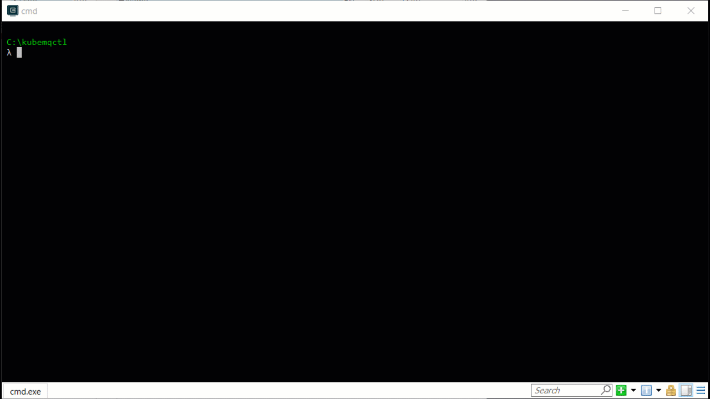

# Get Started with Queues <Badge text="v1.6.0+"/> <Badge text="stable"/>

## Table of Content
[[toc]]

## Get KubeMQ Token
Every installation method requires a KubeMQ token.

Please [register](https://account.kubemq.io/login/register?destination=docker) to obtain your KubeMQ token.


## Get KubeMQ CLI - kubemqctl

### macOS / Linux

```bash
curl -sL https://get.kubemq.io/install | sh 
```

### Windows

#### Option 1:

- [Download the latest kubemqctl.exe](https://github.com/kubemq-io/kubemqctl/releases/download/latest/kubemqctl.exe).
- Place the file under e.g. `C:\Program Files\kubemqctl\kubemqctl.exe`
- Add that directory to your system path to access it from any command prompt

#### Option 2:
Run in PowerShell as administrator:

```powershell
New-Item -ItemType Directory 'C:\Program Files\kubemqctl'
Invoke-WebRequest https://github.com/kubemq-io/kubemqctl/releases/download/latest/kubemqctl.exe -OutFile 'C:\Program Files\kubemqctl\kubemqctl.exe'
[Environment]::SetEnvironmentVariable('Path', [Environment]::GetEnvironmentVariable('Path', [EnvironmentVariableTarget]::Machine) + ';C:\Program Files\kubemqctl', [EnvironmentVariableTarget]::Machine)
$env:Path += ';C:\Program Files\kubemqctl'
```


## Create KubeMQ Cluster

Run kubemqctl create cluster command:

``` bash
kubemqctl cluster create -t <YOUR_KUBEMQ_TOKEN>
```

For Example:



## Connect Your KubeMQ Cluster

To be able to communicate with KubeMQ interface ports running in Kubernetes cluster, a Port Forward of KubeMQ's ports is needed.

kubemqctl has a handy command that will do it for you:

``` bash
kubemqctl cluster proxy
```


## Send a Queue Message

The producer can send a message to the "hello-world-queue" channel with one of the following methods.

<CodeSwitcher :languages="{bash:'kubemqctl',curl:'cURL',csharp:'.Net',java:`Java`,go:`Go`,py:`Python`,node:`NodeJS`,php:`PHP`,ruby:`Ruby`,jquery:`jQuery`}" :isolated="true">
<template v-slot:bash>

Run the following kubemqctl command:
``` bash
kubemqctl queues send "hello-world-queue" "this is a queue message"
```

A result message will be shown with an indication of the sending time of the message.

</template>

<template v-slot:curl>

The following cURL command is using KubeMQ's REST interface:

``` bash
curl -H 'Content-Type: application/json'  \
    --request POST "http://localhost:9090/queue/send" \
    --data '{"Id":"","ClientId":"send-message-client-id","Channel":"hello-world-queue","Metadata":"","Body":"QmF0Y2ggTWVzc2FnZSAw","Tags":{"message":"0"}}'
```


</template>


<template v-slot:csharp>

The following .NET code snippet is using KubeMQ's .NET SDK with gRPC interface:

``` csharp
using System;

namespace Queue_Send_a_Message
{
    class Program
    {
        static void Main(string[] args)
        {
            var QueueName = "hello-world-queue";
            var ClientID = "test-queue-client-id2";
            var KubeMQServerAddress = "localhost:50000";


            KubeMQ.SDK.csharp.Queue.Queue queue = null;
            try
            {
                queue = new KubeMQ.SDK.csharp.Queue.Queue(QueueName, ClientID, KubeMQServerAddress);
            }
            catch (Exception ex)
            {
                Console.WriteLine(ex.Message);
            }

            try
            {
                var res = queue.SendQueueMessage(new KubeMQ.SDK.csharp.Queue.Message
                {
                    Body = KubeMQ.SDK.csharp.Tools.Converter.ToByteArray("some-simple_queue-queue-message"),
                    Metadata = "emptyMeta"
                });
                if (res.IsError)
                {
                    Console.WriteLine($"message enqueue error, error:{res.Error}");
                }
                else
                {
                    Console.WriteLine($"message sent at, {res.SentAt}");
                }
            }
            catch (Exception ex)
            {
                Console.WriteLine(ex.Message);
            }
           
        }
    }
}

```

When executed, a stream of events messages will be shown in the console.

</template>
<template v-slot:java>

The following Java code snippet is using KubeMQ's Java SDK with gRPC interface:

``` java
package io.kubemq.sdk.examples.get_Started.queue_Send_a_Message;

import io.kubemq.sdk.queue.Message;
import io.kubemq.sdk.queue.Queue;
import io.kubemq.sdk.queue.SendMessageResult;
import io.kubemq.sdk.basic.ServerAddressNotSuppliedException;
import io.kubemq.sdk.grpc.Kubemq;
import io.kubemq.sdk.tools.Converter;

import javax.net.ssl.SSLException;
import java.io.IOException;

public class Program {

    public static void main(String[] args) throws ServerAddressNotSuppliedException {
        
        
        String queueName = "hello-world-queue", clientID = "test-queue-client-id2", kubeMQServerAddress = "localhost:50000";

        Queue queue = null;
        try{
            queue = new io.kubemq.sdk.queue.Queue(queueName,clientID,1,2,kubeMQServerAddress);
        } catch (ServerAddressNotSuppliedException e) {
            System.out.println("Error: Can not determine KubeMQ server address.");
        } catch (io.grpc.StatusRuntimeException e) {
            System.out.println("Error: KubeMQ is unreachable.");
        } catch (SSLException e) {
            System.out.println("Error: error detected by an SSL subsystem");
        }

        try {
            
            Message msg = new Message()
            .setBody(Converter.ToByteArray("some-simple_queue-queue-message"))
            .setMetadata("empty");
            SendMessageResult res=  queue.SendQueueMessage(msg);
          if(res.getIsError()  )       {
            System.out.println("message enqueue error, error:{res.Error}");
          } else{
            System.out.println("message sent at, {res.SentAt}");
          }
        } catch (IOException e) {
            System.out.println("Error:  I/O error occurred.");
        }
    }
}
```
When executed, a stream of events messages will be shown in the console.

</template>
<template v-slot:go>

The following Go code snippet is using KubeMQ's Go SDK with gRPC interface:
``` go
package main

import (
   "context"
   "github.com/kubemq-io/kubemq-go"
   "log"
   "time"
)

func main() {
   ctx, cancel := context.WithCancel(context.Background())
   defer cancel()
   client, err := kubemq.NewClient(ctx,
      kubemq.WithAddress("localhost", 50000),
      kubemq.WithClientId("test-command-client-id"),
      kubemq.WithTransportType(kubemq.TransportTypeGRPC))
   if err != nil {
      log.Fatal(err)
   }
   defer client.Close()
   channel := "hello-world-queue"

   sendResult, err := client.NewQueueMessage().
      SetChannel(channel).
      SetBody([]byte("some-simple_queue-queue-message")).
      Send(ctx)
   if err != nil {
      log.Fatal(err)
   }
   log.Printf("Send to Queue Result: MessageID:%s,Sent At: %s\n", sendResult.MessageID, time.Unix(0, sendResult.SentAt).String())
}
```
When executed, a stream of events messages will be shown in the console.

</template>
<template v-slot:py>

The following Python code snippet is using KubeMQ's Python SDK with gRPC interface:

``` py
from kubemq.queue.message_queue import MessageQueue

from kubemq.queue.message import Message


if __name__ == "__main__":

    queue = MessageQueue("hello-world-queue", "test-queue-client-id2", "localhost:50000")
    message = Message()
    message.metadata = 'metadata'
    message.body = "some-simple_queue-queue-message".encode('UTF-8')
    message.attributes = None
    try:
        sent  = queue.send_queue_message(message)
        if sent.error:
            print('message enqueue error, error:' + sent.error)
        else:
            print('message sent at: %d' % (
                sent.sent_at
                        ))
    except Exception as err:
        print('message enqueue error, error:%s'  % (
                err
                        ))

```
When executed, a stream of events messages will be shown in the console.

</template>

<template v-slot:node>

The following JS code snippet is using KubeMQ's NodeJS SDK with gRPC interface:

``` js
const kubemq = require('kubemq-nodejs');

let queueName = 'hello-world-queue', clientID = 'test-queue-client-id2',
    kubeMQAddress = 'localhost:50000';


let queue = new kubemq.Queue(kubeMQAddress, queueName, clientID);

queue.sendQueueMessage(
    new kubemq.Message('metadata', kubemq.stringToByte('some-simple_queue-queue-message')))
    .then(sent => {
        if (sent.Error) {
            console.log('message enqueue error, error:' + err);
        } else {
            console.log('"message sent at:' + sent.SentAt);
        }
    }).catch(err => {
        console.log('message enqueue error, error:' + err);
    });
```


</template>

<template v-slot:php>

The following PHP code snippet is using KubeMQ's REST interface:

``` php
<?php

$curl = curl_init();

curl_setopt_array($curl, array(
  CURLOPT_URL => "http://localhost:9090/queue/send",
  CURLOPT_RETURNTRANSFER => true,
  CURLOPT_ENCODING => "",
  CURLOPT_MAXREDIRS => 10,
  CURLOPT_TIMEOUT => 0,
  CURLOPT_FOLLOWLOCATION => false,
  CURLOPT_HTTP_VERSION => CURL_HTTP_VERSION_1_1,
  CURLOPT_CUSTOMREQUEST => "POST",
  CURLOPT_POSTFIELDS =>"{\r\n         \"Id\":\"\",\r\n         \"ClientId\":\"send-message-client-id\",\r\n         \"Channel\":\"hello-world-queue\",\r\n         \"Metadata\":\"\",\r\n         \"Body\":\"QmF0Y2ggTWVzc2FnZSAw\",\r\n         \"Tags\":{\r\n            \"message\":\"0\"\r\n         },\r\n         \"Attributes\":null,\r\n         \"Policy\":{\r\n            \"ExpirationSeconds\":5,\r\n            \"DelaySeconds\":5,\r\n            \"MaxReceiveCount\":0,\r\n            \"MaxReceiveQueue\":\"\"\r\n         }\r\n}",
  CURLOPT_HTTPHEADER => array(
    "Content-Type: application/json"),
));

$response = curl_exec($curl);
$err = curl_error($curl);

curl_close($curl);

if ($err) {
  echo "cURL Error #:" . $err;
} else {
  echo $response;
} ?>
```


</template>


<template v-slot:ruby>

The following Ruby code snippet is using KubeMQ's REST interface:

``` ruby
require "uri"
require "net/http"

url = URI("http://localhost:9090/queue/send")

http = Net::HTTP.new(url.host, url.port)

request = Net::HTTP::Post.new(url)
request["Content-Type"] = "application/json"
request.body = "{\r\n         \"Id\":\"\",\r\n         \"ClientId\":\"send-message-client-id\",\r\n         \"Channel\":\"hello-world-queue\",\r\n         \"Metadata\":\"\",\r\n         \"Body\":\"QmF0Y2ggTWVzc2FnZSAw\",\r\n         \"Tags\":{\r\n            \"message\":\"0\"\r\n         },\r\n         \"Attributes\":null,\r\n         \"Policy\":{\r\n            \"ExpirationSeconds\":5,\r\n            \"DelaySeconds\":5,\r\n            \"MaxReceiveCount\":0,\r\n            \"MaxReceiveQueue\":\"\"\r\n         }\r\n}"

response = http.request(request)
puts response.read_body
```


</template>


<template v-slot:jquery>

The following jQuery code snippet is using KubeMQ's REST interface:

``` js
var settings = {
  "url": "http://localhost:9090/queue/send",
  "method": "POST",
  "timeout": 0,
  "headers": {
    "Content-Type": "application/json"
  },
  "data": "{\r\n         \"Id\":\"\",\r\n         \"ClientId\":\"send-message-client-id\",\r\n         \"Channel\":\"hello-world-queue\",\r\n         \"Metadata\":\"\",\r\n         \"Body\":\"QmF0Y2ggTWVzc2FnZSAw\",\r\n         \"Tags\":{\r\n            \"message\":\"0\"\r\n         },\r\n         \"Attributes\":null,\r\n         \"Policy\":{\r\n            \"ExpirationSeconds\":5,\r\n            \"DelaySeconds\":5,\r\n            \"MaxReceiveCount\":0,\r\n            \"MaxReceiveQueue\":\"\"\r\n         }\r\n}",
};

$.ajax(settings).done(function (response) {
  console.log(response);
});
```


</template>


</CodeSwitcher>

## Receive a Queue Message

After you have sent a message to a queue, you can request the message from a queue.


<CodeSwitcher :languages="{bash:'kubemqctl',curl:'cURL',csharp:'.Net',java:`Java`,go:`Go`,py:`Python`,node:`NodeJS`,php:`PHP`,ruby:`Ruby`,jquery:`jQuery`}" :isolated="true">


<template v-slot:bash>

Run the following kubemqctl command:

``` bash
kubemqctl queues receive "hello-world-queue"
```

</template>

<template v-slot:curl>

The following cURL command is using KubeMQ's REST interface:

``` bash
 curl --location --request POST "http://localhost:9090/queue/receive" \
  --header "Content-Type: application/json" \
  --data '{"RequestID":"some-request-id","ClientID":"receive-message-client-id","Channel":"hello-world-queue","MaxNumberOfMessages":1,"WaitTimeSeconds":5}'
```


</template>

<template v-slot:csharp>

The following c# code snippet is using KubeMQ's Java SDK with gRPC interface:

``` csharp
using System;

namespace Queue_Receive_a_Message
{
    class Program
    {
        static void Main(string[] args)
        {
            var QueueName = "hello-world-queue";
            var ClientID = "test-queue-client-id";
            var KubeMQServerAddress = "localhost:50000";


            KubeMQ.SDK.csharp.Queue.Queue queue = null;
            try
            {
                queue = new KubeMQ.SDK.csharp.Queue.Queue(QueueName, ClientID, KubeMQServerAddress);
            }
            catch (Exception ex)
            {
                Console.WriteLine(ex.Message);      
            }

            try
            {
                var msg = queue.ReceiveQueueMessages();
                if (msg.IsError)
                {
                    Console.WriteLine($"message dequeue error, error:{msg.Error}");
                    return;
                }
                Console.WriteLine($"Received {msg.MessagesReceived} Messages:");

                foreach (var item in msg.Messages)
                {
                    Console.WriteLine($"MessageID: {item.MessageID}, Body:{KubeMQ.SDK.csharp.Tools.Converter.FromByteArray(item.Body)}");
                }
            }
            catch (Exception ex)
            {
                Console.WriteLine(ex.Message);
            }
        }
    }
}

```

</template>

<template v-slot:java>

The following Java code snippet is using KubeMQ's Java SDK with gRPC interface:

``` java
package io.kubemq.sdk.examples.get_Started.queue_Receive_a_Message;

import java.io.IOException;

import javax.net.ssl.SSLException;

import io.kubemq.sdk.queue.Message;
import io.kubemq.sdk.queue.Queue;
import io.kubemq.sdk.queue.ReceiveMessagesResponse;
import io.kubemq.sdk.basic.ServerAddressNotSuppliedException;
import io.kubemq.sdk.tools.Converter;

public class Program {

    public static void main(String[] args) throws ServerAddressNotSuppliedException, ClassNotFoundException {
        
        
        String queueName = "hello-world-queue", clientID = "test-queue-client-id2", kubeMQServerAddress = "localhost:50000";


        Queue queue = null;
        try{
            queue = new io.kubemq.sdk.queue.Queue(queueName,clientID,1,2,kubeMQServerAddress);
        } catch (ServerAddressNotSuppliedException e) {
            System.out.println("Error: Can not determine KubeMQ server address.");
        } catch (io.grpc.StatusRuntimeException e) {
            System.out.println("Error: KubeMQ is unreachable.");
        } catch (SSLException e) {
            System.out.println("Error: error detected by an SSL subsystem");
        }

        try {
            ReceiveMessagesResponse res=  queue.ReceiveQueueMessages(2,null);            
          if(res.getIsError()  )       {
            System.out.println("message enqueue error, error:{res.Error}");
          }
          
          System.out.println("Received {msg.MessagesReceived} Messages:");

          for (Message msg : res.getMessages()) {              
        
            System.out.printf("MessageID:%s, Body:%s",msg.getMessageID(), Converter.FromByteArray(msg.getBody()));
          }
          


        } catch (IOException e) {
            System.out.println("Error:  I/O error occurred.");
        }
    }
}
```

</template>
<template v-slot:go>

The following Go code snippet is using KubeMQ's Go SDK with gRPC interface:

``` go
package main

import (
   "context"
   "github.com/kubemq-io/kubemq-go"
   "log"
   "time"
)

func main() {
   ctx, cancel := context.WithCancel(context.Background())
   defer cancel()
   client, err := kubemq.NewClient(ctx,
      kubemq.WithAddress("localhost", 50000),
      kubemq.WithClientId("test-command-client-id"),
      kubemq.WithTransportType(kubemq.TransportTypeGRPC))
   if err != nil {
      log.Fatal(err)
   }
   defer client.Close()
   channel := "hello-world-queue"

   receiveResult, err := client.NewReceiveQueueMessagesRequest().
      SetChannel(channel).
      SetMaxNumberOfMessages(1).
      SetWaitTimeSeconds(5).
      Send(ctx)
   if err != nil {
      log.Fatal(err)
   }
   log.Printf("Received %d Messages:\n", receiveResult.MessagesReceived)
   for _, msg := range receiveResult.Messages {
      log.Printf("MessageID: %s, Body: %s", msg.Id, string(msg.Body))
   }
}

```

</template>
<template v-slot:py>

The following Python code snippet is using KubeMQ's Python SDK with gRPC interface:

``` py
from kubemq.queue.message_queue import MessageQueue
if __name__ == "__main__":
    queue = MessageQueue("hello-world-queue", "test-queue-client-id2", "localhost:50000", 2, 1)
    try:
        res = queue.receive_queue_messages()
        if res.error:
            print(
                "'Received:'%s'" % (
                    res.error
                            )
            )
        else:
            for message in res.messages:
                print(
                        "'MessageID :%s ,Body: sending:'%s'" % (
                            message.MessageID,
                            message.Body
                                    )
                    )
    except Exception as err:
      print(
            "'error sending:'%s'" % (
                err
                        )
        )
    input("Press 'Enter' to stop the application...\n")
```


</template>


<template v-slot:node>

The following JS code snippet is using KubeMQ's NodeJS SDK with gRPC interface:

``` js
const kubemq = require('kubemq-nodejs');
let queueName = 'hello-world-queue', clientID = 'test-queue-client-id2',
    kubeMQAddress = 'localhost:50000';
let queue = new kubemq.Queue(kubeMQAddress, queueName, clientID);
queue.receiveQueueMessages(2, 1).then(res => {
    if (res.Error) {
        console.log('Message enqueue error, error:' + res.message);
    } else {
        if (res.MessagesReceived) {
            console.log('Received: ' + res.MessagesReceived);
            res.Messages.forEach(element => {
                console.log('MessageID:' + element.MessageID + ', Body:' + kubemq.byteToString(element.Body));
            });
        } else {
            console.log('No messages');
        }
    }
}).catch(
    err => console.log('Error:' + err));

```

</template>

<template v-slot:php>

The following PHP code snippet is using KubeMQ's REST interface:

``` php
<?php

$curl = curl_init();

curl_setopt_array($curl, array(
  CURLOPT_URL => "http://localhost:9090/queue/receive",
  CURLOPT_RETURNTRANSFER => true,
  CURLOPT_ENCODING => "",
  CURLOPT_MAXREDIRS => 10,
  CURLOPT_TIMEOUT => 0,
  CURLOPT_FOLLOWLOCATION => false,
  CURLOPT_HTTP_VERSION => CURL_HTTP_VERSION_1_1,
  CURLOPT_CUSTOMREQUEST => "POST",
  CURLOPT_POSTFIELDS =>"{\r\n   \"RequestID\":\"some-request-id\",\r\n   \"ClientID\":\"receive-message-client-id\",\r\n   \"Channel\":\"hello-world-queue\",\r\n   \"MaxNumberOfMessages\":10,\r\n   \"WaitTimeSeconds\":5,\r\n   \"IsPeak\":false\r\n}",
  CURLOPT_HTTPHEADER => array(
    "Content-Type: application/json"),
));

$response = curl_exec($curl);
$err = curl_error($curl);

curl_close($curl);

if ($err) {
  echo "cURL Error #:" . $err;
} else {
  echo $response;
} ?>
```

</template>


<template v-slot:ruby>

The following Ruby code snippet is using KubeMQ's REST interface:

``` ruby
require "uri"
require "net/http"

url = URI("http://localhost:9090/queue/receive")

http = Net::HTTP.new(url.host, url.port)

request = Net::HTTP::Post.new(url)
request["Content-Type"] = "application/json"
request.body = "{\r\n   \"RequestID\":\"some-request-id\",\r\n   \"ClientID\":\"receive-message-client-id\",\r\n   \"Channel\":\"hello-world-queue\",\r\n   \"MaxNumberOfMessages\":10,\r\n   \"WaitTimeSeconds\":5,\r\n   \"IsPeak\":false\r\n}"

response = http.request(request)
puts response.read_body
```

</template>


<template v-slot:jquery>

The following jQuery code snippet is using KubeMQ's REST interface:

``` js
var settings = {
  "url": "http://localhost:9090/queue/receive",
  "method": "POST",
  "timeout": 0,
  "headers": {
    "Content-Type": "application/json"
  },
  "data": "{\r\n   \"RequestID\":\"some-request-id\",\r\n   \"ClientID\":\"receive-message-client-id\",\r\n   \"Channel\":\"hello-world-queue\",\r\n   \"MaxNumberOfMessages\":10,\r\n   \"WaitTimeSeconds\":5,\r\n   \"IsPeak\":false\r\n}",
};

$.ajax(settings).done(function (response) {
  console.log(response);
});
```

</template>


</CodeSwitcher>

::: tip Get Queues information
You can get Queues information by running `kubemqctl queues list`.
:::

## Demo

<div class="video-block">
   <iframe src="https://player.vimeo.com/video/372195918" width="640" height="360" frameborder="0" allow="autoplay; fullscreen" allowfullscreen></iframe>
</div>
