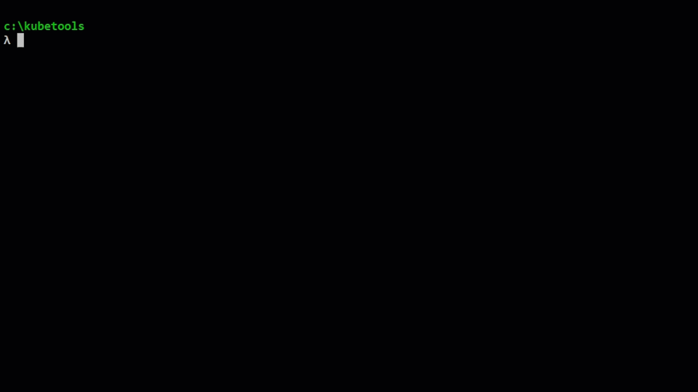
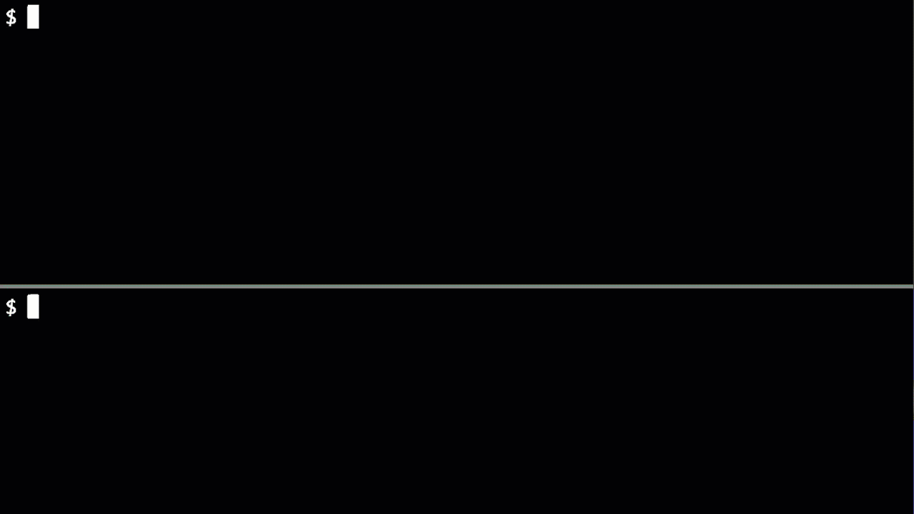
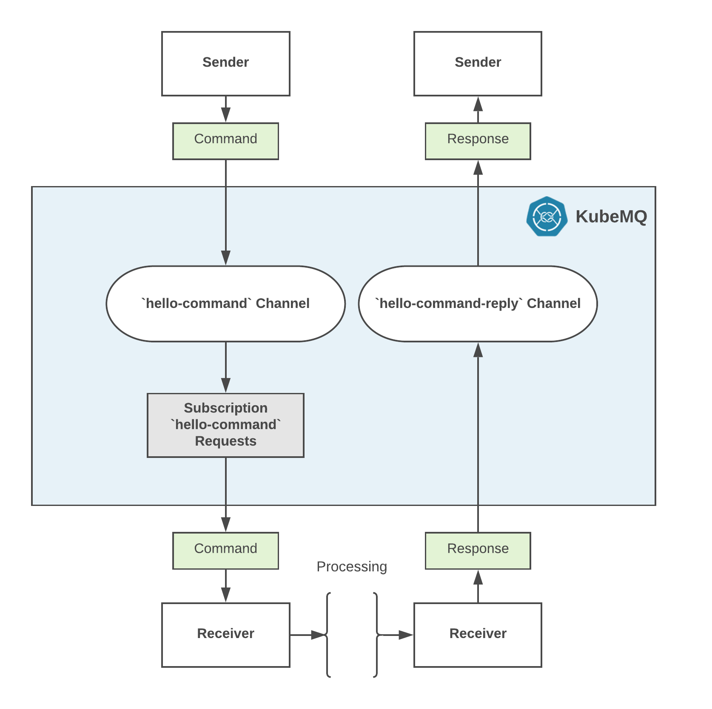

# Get Started with RPC <Badge text="v1.5.0+"/> <Badge text="stable"/>

## Table of Content
[[toc]]

## Deploy a KubeMQ
To start using KubeMQ with RPC, we first need to run a KubeMQ docker container either locally or on a remote node.

You can select one of the methods below:

<CodeSwitcher :languages="{kubetools:'kubetools',kubernetes:'kubernetes',docker:'docker',helm:`helm`,docker_compose:'docker-compose'}" :isolated="true">


<template v-slot:kubetools>

Run kubetools create cluster command:

``` bash
kubetools cluster create -t <YOUR_KUBEMQ_TOKEN>
```

For Example:



</template>


<template v-slot:docker>


Pull and run KubeMQ Docker container:

``` bash
docker run --name kubemq -d -p 8080:8080 -p 50000:50000 -p 9090:9090 \
-v $PWD:/store -e KUBEMQ_TOKEN=<YOUR_KUBEMQ_TOKEN> kubemq/kubemq

```

For Example:


</template>

<template v-slot:kubernetes>

Execute the following command:

``` bash
kubectl apply -f https://get.kubemq.io/deploy?token="YOUR_KUBEMQ_TOKEN"
```

For Example:


Use KubeCtl to forward KubeMQ cluster ports:

``` bash
kubectl port-forward svc/kubemq-cluster-ext 8080:8080 9090:9090 50000:50000
```


</template>

<template v-slot:helm>

Add KubeMQ Helm Repository:

``` bash
helm repo add kubemq-charts https://kubemq-io.github.io/charts
```

Verify KubeMQ helm repository charts is correctly configured by:
``` bash
helm repo list
```

Install KubeMQ Chart:

``` bash
helm install --name kubemq-cluster --set token=<YOUR_KUBEMQ_TOKEN> \
kubemq-charts/kubemq
```


Use KubeCtl to forward KubeMQ cluster ports:

``` bash
kubectl port-forward svc/kubemq-cluster-ext 8080:8080 9090:9090 50000:50000
```


</template>


<template v-slot:docker_compose>


Execute the following command:

``` bash
docker-compose -d up
```

With the following yaml file named docker-compose.yaml:

``` yaml
version: '3.7'
services:
  kubemq:
    image: kubemq/kubemq
    container_name: kubemq
    ports:
      - "8080:8080"
      - "9090:9090"
      - "50000:50000"
    environment:
      - KUBEMQ_HOST=kubemq
      - KUBEMQ_TOKEN="YOUR_KUBEMQ_TOKEN"
    networks:
      - backend
      - frontend
    volumes:
      - kubemq_vol:/store
networks:
  backend:
volumes:
  kubemq_vol:
```

</template>
</CodeSwitcher>


## Verify Deployment

Run kubetools cluster list command:


``` bash
kubetools cluster list
```

We will get this:


::: warning PROXY
If KubeMQ fails to load, probably there is a proxy server which prevents the validation of KubeMQ token.
To fix this, you can add -e KUBEMQ_PROXY="your-proxy-url" as an environment variable.
:::

## Next Steps

Now that you have KubeMQ installed and running, we will do the following steps:

1. Subscribe a receiver to `hello-command` command channel. When a command will be available a Response will be sent back to the sender.
2. Send a command in the channel and wait for a response.
3. Display the response in the console



As showed in the following diagram:




## Subscribe to a Channel

A receiver can subscribe to the `hello-command` channel with one of the following methods.

<CodeSwitcher :languages="{bash:'kubetools',curl:'cURL',csharp:'.Net',java:`Java`,go:`Go`,py:`Python`,node:`Node`,php:`PHP`,ruby:`Ruby`,jquery:`jQuery`}" :isolated="true">
<template v-slot:bash>

Run the following Kubetools command:
``` bash
 kubetools rpc rec command "hello-command"
```

When connected, the stream will block until receiving a command. Once a command will be received Kubetools automatically will send a Response.

::: tip Kubetools
Kubetools is KubeMQ Command-Line-Interface tool.

Installation instructions [here](../tutorials/kubetools.html#installation).
:::
</template>

<template v-slot:curl>

The following cURL command is using KubeMQ's REST interface:

``` bash
curl --location --request GET "{{host}}/subscribe/requests?client_id=some_client_id&channel=hello-command&group=some_group&subscribe_type=commands" \
  --header "Content-Type: application/json" \
  --data ""
```

Once a command is received a Send Response call should be invoked:

``` bash
curl --location --request POST "{{host}}/send/response" \
  --header "Content-Type: application/json" \
  --data "{
   \"RequestID\": \"some_id\",
   \"ClientID\":\"some_client_id\",
   \"ReplyChannel\": \"_INBOX.x8bxFotxDNG4c3zTp8scBQ.x8bxFotxDNG4c3zTp8scMq\",
   \"Metadata\" :\"some_metadata\",
   \"Body\": \"c29tZSBlbmNvZGVkIGJvZHk=\",
   \"Executed\": true,
   \"Error\":\"\"
}"
```

**Important** - The reply channel address is automatically generated by the KubeMQ and can be found in the command request `ReplyChannel` field.

::: warning
Subscribe to Commands in REST interface is using WebSocket for streaming (Push) commands to the receiver. You will need to implement a WebSocket receiver accordingly.
:::
</template>


<template v-slot:csharp>

The following .NET code snippet is using KubeMQ's .NET SDK with gRPC interface:

``` csharp
using System;

namespace RPC_Subscribe_to_a_Channel
{
    class Program
    {
        static void Main(string[] args)
        {

            var ChannelName = "testing_event_channel";
            var ClientID = "hello-world-subscriber";
            var KubeMQServerAddress = "localhost:50000";


            KubeMQ.SDK.csharp.CommandQuery.Responder responder = new KubeMQ.SDK.csharp.CommandQuery.Responder(KubeMQServerAddress);
            try
            {
                responder.SubscribeToRequests(new KubeMQ.SDK.csharp.Subscription.SubscribeRequest()
                {
                    Channel = ChannelName,
                    SubscribeType = KubeMQ.SDK.csharp.Subscription.SubscribeType.Commands,
                    ClientID = ClientID
                }, (commandReceive) => {
                    Console.WriteLine($"Command Received: Id:{commandReceive.RequestID} Channel:{commandReceive.Channel} Metadata:{commandReceive.Metadata} Body:{ KubeMQ.SDK.csharp.Tools.Converter.FromByteArray(commandReceive.Body)} ");
                    return new KubeMQ.SDK.csharp.CommandQuery.Response(commandReceive)
                    {
                        Body = new byte[0],
                        CacheHit = false,
                        Error = "None",
                        ClientID = ClientID,
                        Executed = true,
                        Metadata = string.Empty,
                        Timestamp = DateTime.UtcNow,
                    };

                }, (errorHandler) =>
                {
                    Console.WriteLine(errorHandler.Message);
                });
            }
            catch (Exception ex)
            {
                Console.WriteLine(ex.Message);
            }
            Console.WriteLine("press any key to close RPC_Subscribe_to_a_Channel");
            Console.ReadLine();
        }
    }
}

```

When executed, a stream of events messages will be shown in the console.

</template>
<template v-slot:java>

The following Java code snippet is using KubeMQ's Java SDK with gRPC interface:

``` java
Code snippet will available soon
```
When executed, a stream of events messages will be shown in the console.

</template>
<template v-slot:go>

The following Go code snippet is using KubeMQ's Go SDK with gRPC interface:
``` go
package main

import (
   "context"
   "github.com/kubemq-io/kubemq-go"
   "log"
   "time"
)

func main() {
   ctx, cancel := context.WithCancel(context.Background())
   defer cancel()
   client, err := kubemq.NewClient(ctx,
      kubemq.WithAddress("localhost", 50000),
      kubemq.WithClientId("test-command-client-id"),
      kubemq.WithTransportType(kubemq.TransportTypeGRPC))
   if err != nil {
      log.Fatal(err)
   }
   defer client.Close()
   channel := "hello-command"
   errCh := make(chan error)
   commandsCh, err := client.SubscribeToCommands(ctx, channel, "", errCh)
   if err != nil {
      log.Fatal(err)
   }
   for {
      select {
      case err := <-errCh:
         log.Fatal(err)
         return
      case command, more := <-commandsCh:
         if !more {
            log.Println("Command Received , done")
            return
         }
         log.Printf("Command Received:\nId %s\nChannel: %s\nMetadata: %s\nBody: %s\n", command.Id, command.Channel, command.Metadata, command.Body)
         err := client.R().
            SetRequestId(command.Id).
            SetResponseTo(command.ResponseTo).
            SetExecutedAt(time.Now()).
            Send(ctx)
         if err != nil {
            log.Fatal(err)
         }
      case <-ctx.Done():
         return
      }
   }

}

```
When connected, once a command will be received in the channel, we create a Response and send back to the sender.

</template>
<template v-slot:py>

The following Python code snippet is using KubeMQ's Python SDK with gRPC interface:

``` py
Code snippet will available soon
```
When executed, a stream of events messages will be shown in the console.

</template>

<template v-slot:node>

The following Node code snippet is using KubeMQ's REST interface:

``` js
var https = require('https');

var options = {
  'method': 'GET',
  'hostname': '{{host}}',
  'path': '/subscribe/requests?client_id=some_client_id&channel=hello-command&group=some_group&subscribe_type=commands',
  'headers': {
    'Content-Type': 'application/json'
  }
};

var req = https.request(options, function (res) {
  var chunks = [];

  res.on("data", function (chunk) {
    chunks.push(chunk);
  });

  res.on("end", function (chunk) {
    var body = Buffer.concat(chunks);
    console.log(body.toString());
  });

  res.on("error", function (error) {
    console.error(error);
  });
});

req.end();
```


Once a command is received a Send Response call should be invoked:

``` js
var https = require('https');

var options = {
  'method': 'POST',
  'hostname': '{{host}}',
  'path': '/send/response',
  'headers': {
    'Content-Type': 'application/json'
  }
};

var req = https.request(options, function (res) {
  var chunks = [];

  res.on("data", function (chunk) {
    chunks.push(chunk);
  });

  res.on("end", function (chunk) {
    var body = Buffer.concat(chunks);
    console.log(body.toString());
  });

  res.on("error", function (error) {
    console.error(error);
  });
});

var postData =  "{\n\t\"RequestID\": \"some_id\",\n\t\"ClientID\":\"some_client_id\",\n\t\"ReplyChannel\": \"_INBOX.x8bxFotxDNG4c3zTp8scBQ.x8bxFotxDNG4c3zTp8scMq\",\n\t\"Metadata\" :\"some_metadata2\",\n\t\"Body\": \"c29tZSBlbmNvZGVkIGJvZHk=\",\n\t\"Executed\": true,\n\t\"Error\":\"\"\n}";

req.write(postData);

req.end();
```

**Important** - The reply channel address is automatically generated by the KubeMQ and can be found in the command request `ReplyChannel` field.

::: warning
Subscribe to Commands in REST interface is using WebSocket for streaming (Push) commands to the receiver. You will need to implement a WebSocket receiver accordingly.
:::
</template>

<template v-slot:php>

The following PHP code snippet is using KubeMQ's REST interface:

``` php
<?php

$curl = curl_init();

curl_setopt_array($curl, array(
  CURLOPT_URL => "{{host}}/subscribe/requests?client_id=some_client_id&channel=hello-command&group=some_group&subscribe_type=commands",
  CURLOPT_RETURNTRANSFER => true,
  CURLOPT_ENCODING => "",
  CURLOPT_MAXREDIRS => 10,
  CURLOPT_TIMEOUT => 0,
  CURLOPT_FOLLOWLOCATION => false,
  CURLOPT_HTTP_VERSION => CURL_HTTP_VERSION_1_1,
  CURLOPT_CUSTOMREQUEST => "GET",
  CURLOPT_HTTPHEADER => array(
    "Content-Type: application/json"
  ),
));

$response = curl_exec($curl);
$err = curl_error($curl);

curl_close($curl);

if ($err) {
  echo "cURL Error #:" . $err;
} else {
  echo $response;
} ?>
```


Once a command is received a Send Response call should be invoked:

``` php
<?php

$curl = curl_init();

curl_setopt_array($curl, array(
  CURLOPT_URL => "{{host}}/send/response",
  CURLOPT_RETURNTRANSFER => true,
  CURLOPT_ENCODING => "",
  CURLOPT_MAXREDIRS => 10,
  CURLOPT_TIMEOUT => 0,
  CURLOPT_FOLLOWLOCATION => false,
  CURLOPT_HTTP_VERSION => CURL_HTTP_VERSION_1_1,
  CURLOPT_CUSTOMREQUEST => "POST",
  CURLOPT_POSTFIELDS =>"{\n\t\"RequestID\": \"some_id\",\n\t\"ClientID\":\"some_client_id\",\n\t\"ReplyChannel\": \"_INBOX.x8bxFotxDNG4c3zTp8scBQ.x8bxFotxDNG4c3zTp8scMq\",\n\t\"Metadata\" :\"some_metadata2\",\n\t\"Body\": \"c29tZSBlbmNvZGVkIGJvZHk=\",\n\t\"Executed\": true,\n\t\"Error\":\"\"\n}",
  CURLOPT_HTTPHEADER => array(
    "Content-Type: application/json"
  ),
));

$response = curl_exec($curl);
$err = curl_error($curl);

curl_close($curl);

if ($err) {
  echo "cURL Error #:" . $err;
} else {
  echo $response;
} ?>
```

**Important** - The reply channel address is automatically generated by the KubeMQ and can be found in the command request `ReplyChannel` field.

::: warning
Subscribe to Commands in REST interface is using WebSocket for streaming (Push) commands to the receiver. You will need to implement a WebSocket receiver accordingly.
:::

</template>


<template v-slot:ruby>

The following Ruby code snippet is using KubeMQ's REST interface:

``` ruby
require "uri"
require "net/http"

url = URI("{{host}}/subscribe/requests?client_id=some_client_id&channel=hello-command&group=some_group&subscribe_type=commands")
http = Net::HTTP.new(url.host, url.port)
request = Net::HTTP::Get.new(url)
request["Content-Type"] = "application/json"
response = http.request(request)
puts response.read_body
```


Once a command is received a Send Response call should be invoked:

``` ruby
require "uri"
require "net/http"

url = URI("{{host}}/send/response")

http = Net::HTTP.new(url.host, url.port)

request = Net::HTTP::Post.new(url)
request["Content-Type"] = "application/json"
request.body = "{\n\t\"RequestID\": \"some_id\",\n\t\"ClientID\":\"some_client_id\",\n\t\"ReplyChannel\": \"_INBOX.x8bxFotxDNG4c3zTp8scBQ.x8bxFotxDNG4c3zTp8scMq\",\n\t\"Metadata\" :\"some_metadata2\",\n\t\"Body\": \"c29tZSBlbmNvZGVkIGJvZHk=\",\n\t\"Executed\": true,\n\t\"Error\":\"\"\n}"
response = http.request(request)
puts response.read_body
```

**Important** - The reply channel address is automatically generated by the KubeMQ and can be found in the command request `ReplyChannel` field.

::: warning
Subscribe to Commands in REST interface is using WebSocket for streaming (Push) commands to the receiver. You will need to implement a WebSocket receiver accordingly.
:::
</template>


<template v-slot:jquery>

The following jQuery code snippet is using KubeMQ's REST interface:

``` js
var settings = {
  "url": "{{host}}/subscribe/requests?client_id=some_client_id&channel=hello-command&group=some_group&subscribe_type=commands",
  "method": "GET",
  "timeout": 0,
  "headers": {
    "Content-Type": "application/json"
  },
};

$.ajax(settings).done(function (response) {
  console.log(response);
});
```

Once a command is received a Send Response call should be invoked:

``` js
var settings = {
  "url": "{{host}}/send/response",
  "method": "POST",
  "timeout": 0,
  "headers": {
    "Content-Type": "application/json"
  },
  "data": "{\n\t\"RequestID\": \"some_id\",\n\t\"ClientID\":\"some_client_id\",\n\t\"ReplyChannel\": \"_INBOX.x8bxFotxDNG4c3zTp8scBQ.x8bxFotxDNG4c3zTp8scMq\",\n\t\"Metadata\" :\"some_metadata2\",\n\t\"Body\": \"c29tZSBlbmNvZGVkIGJvZHk=\",\n\t\"Executed\": true,\n\t\"Error\":\"\"\n}",
};

$.ajax(settings).done(function (response) {
  console.log(response);
});
```

**Important** - the reply channel address is automatically generated by the KubeMQ and can be found in the command request `ReplyChannel` field.

::: warning
Subscribe to Commands in REST interface is using WebSocket for streaming (Push) commands to the receiver. You will need to implement a WebSocket receiver accordingly.
:::
</template>


</CodeSwitcher>


## Send a Command Channel

After you have subscribed to a hello-command channel, you can send your command to it.


<CodeSwitcher :languages="{bash:'kubetools',curl:'cURL',csharp:'.Net',java:`Java`,go:`Go`,py:`Python`,node:`Node`,php:`PHP`,ruby:`Ruby`,jquery:`jQuery`}" :isolated="true">


<template v-slot:bash>

Run the following Kubetools command:

``` bash
kubetools rpc send command "hello-command" "some command"
```


::: tip Kubetools
Kubetools is KubeMQ Command-Line-Interface tool.

Installation instructions [here](../tutorials/kubetools.html#installation).
:::

</template>


<template v-slot:curl>

The following cURL command is using KubeMQ's REST interface:

``` bash
curl --location --request POST "{{host}}/send/request" \
  --header "Content-Type: application/json" \
  --data "{
   \"RequestID\": \"688daec3-7f3e-4766-87fa-4cd1f4f03a23\",
   \"RequestTypeData\":1, 
   \"ClientID\": \"some_clientID\",
   \"Channel\": \"hello-command\",
   \"Metadata\" :\"some_metadata\",
   \"Body\": \"c29tZSBlbmNvZGVkIGJvZHk=\",
   \"Timeout\": 10000
}"
```

</template>

<template v-slot:csharp>

The following .NET code snippet is using KubeMQ's .NET SDK with gRPC interface:

``` csharp
using System;

namespace RPC_Send_a_Command_Channel
{
    class Program
    {
        static void Main(string[] args)
        {
            var ChannelName = "testing_event_channel";
            var ClientID = "hello-world-sender";
            var KubeMQServerAddress = "localhost:50000";

            var channel = new KubeMQ.SDK.csharp.CommandQuery.Channel(new KubeMQ.SDK.csharp.CommandQuery.ChannelParameters
            {
                RequestsType = KubeMQ.SDK.csharp.CommandQuery.RequestType.Command,
                Timeout = 10000,
                ChannelName = ChannelName,
                ClientID = ClientID,
                KubeMQAddress = KubeMQServerAddress
            });
            try
            {

                var result = channel.SendRequest(new KubeMQ.SDK.csharp.CommandQuery.Request
                {
                    Body = KubeMQ.SDK.csharp.Tools.Converter.ToByteArray("hello kubemq - sending a command, please reply")
                });                    
             
                if (!result.Executed)
                {
                    Console.WriteLine($"Response error:{result.Error}");
                    return;
                }
                Console.WriteLine($"Response Received:{result.RequestID} ExecutedAt:{result.Timestamp}"); 
            }
            catch (Exception ex)
            {
                Console.WriteLine(ex.Message);
            }
        }
    }
}

```

</template>
<template v-slot:java>

The following Java code snippet is using KubeMQ's Java SDK with gRPC interface:

``` java
The code snippet will available soon
```

</template>
<template v-slot:go>

The following Go code snippet is using KubeMQ's Go SDK with gRPC interface:

``` go
package main

import (
   "context"
   "github.com/kubemq-io/kubemq-go"
   "log"
   "time"
)

func main() {
   ctx, cancel := context.WithCancel(context.Background())
   defer cancel()
   client, err := kubemq.NewClient(ctx,
      kubemq.WithAddress("localhost", 50000),
      kubemq.WithClientId("test-command-client-id"),
      kubemq.WithTransportType(kubemq.TransportTypeGRPC))
   if err != nil {
      log.Fatal(err)
   }
   defer client.Close()
   channel := "hello-command"
   response, err := client.C().
      SetId("some-command-id").
      SetChannel(channel).
      SetMetadata("some-metadata").
      SetBody([]byte("hello kubemq - sending a command, please reply")).
      SetTimeout(time.Second).
      Send(ctx)
   if err != nil {
      log.Fatal(err)
   }
   log.Printf("Response Received:\nCommandID: %s\nExecutedAt:%s\n", response.CommandId, response.ExecutedAt)
}

```

</template>
<template v-slot:py>

The following Python code snippet is using KubeMQ's Python SDK with gRPC interface:

``` py
The code snippet will available soon
```


</template>


<template v-slot:node>

The following node code snippet is using KubeMQ's REST interface:

``` js
var https = require('https');

var options = {
  'method': 'POST',
  'hostname': '{{host}}',
  'path': '/send/request',
  'headers': {
    'Content-Type': 'application/json'
  }
};

var req = https.request(options, function (res) {
  var chunks = [];

  res.on("data", function (chunk) {
    chunks.push(chunk);
  });

  res.on("end", function (chunk) {
    var body = Buffer.concat(chunks);
    console.log(body.toString());
  });

  res.on("error", function (error) {
    console.error(error);
  });
});

var postData =  "{\n\t\"RequestID\": \"688daec3-7f3e-4766-87fa-4cd1f4f03a23\",\n\t\"RequestTypeData\":1, \n\t\"ClientID\": \"some_clientID\",\n\t\"Channel\": \"hello-command\",\n\t\"Metadata\" :\"some_metadata\",\n\t\"Body\": \"c29tZSBlbmNvZGVkIGJvZHk=\",\n\t\"Timeout\": 1000000\n}";

req.write(postData);

req.end();
```

</template>

<template v-slot:php>

The following PHP code snippet is using KubeMQ's REST interface:

``` php
<?php

$curl = curl_init();

curl_setopt_array($curl, array(
  CURLOPT_URL => "{{host}}/send/request",
  CURLOPT_RETURNTRANSFER => true,
  CURLOPT_ENCODING => "",
  CURLOPT_MAXREDIRS => 10,
  CURLOPT_TIMEOUT => 0,
  CURLOPT_FOLLOWLOCATION => false,
  CURLOPT_HTTP_VERSION => CURL_HTTP_VERSION_1_1,
  CURLOPT_CUSTOMREQUEST => "POST",
  CURLOPT_POSTFIELDS =>"{\n\t\"RequestID\": \"688daec3-7f3e-4766-87fa-4cd1f4f03a23\",\n\t\"RequestTypeData\":1, \n\t\"ClientID\": \"some_clientID\",\n\t\"Channel\": \"hello-command\",\n\t\"Metadata\" :\"some_metadata\",\n\t\"Body\": \"c29tZSBlbmNvZGVkIGJvZHk=\",\n\t\"Timeout\": 1000000\n}",
  CURLOPT_HTTPHEADER => array(
    "Content-Type: application/json"
  ),
));

$response = curl_exec($curl);
$err = curl_error($curl);

curl_close($curl);

if ($err) {
  echo "cURL Error #:" . $err;
} else {
  echo $response;
} ?>
```

</template>


<template v-slot:ruby>

The following Ruby code snippet is using KubeMQ's REST interface:

``` ruby
require "uri"
require "net/http"

url = URI("{{host}}/send/request")
http = Net::HTTP.new(url.host, url.port)
request = Net::HTTP::Post.new(url)
request["Content-Type"] = "application/json"
request.body = "{\n\t\"RequestID\": \"688daec3-7f3e-4766-87fa-4cd1f4f03a23\",\n\t\"RequestTypeData\":1, \n\t\"ClientID\": \"some_clientID\",\n\t\"Channel\": \"hello-command\",\n\t\"Metadata\" :\"some_metadata2\",\n\t\"Body\": \"c29tZSBlbmNvZGVkIGJvZHk=\",\n\t\"Timeout\": 1000000\n}"
response = http.request(request)
puts response.read_body
```

</template>


<template v-slot:jquery>

The following jQuery code snippet is using KubeMQ's REST interface:

``` js
var settings = {
  "url": "{{host}}/send/request",
  "method": "POST",
  "timeout": 0,
  "headers": {
    "Content-Type": "application/json",
    "X-Kubemq-Server-Token": "\"your-kubemq-token\""
  },
  "data": "{\n\t\"RequestID\": \"688daec3-7f3e-4766-87fa-4cd1f4f03a23\",\n\t\"RequestTypeData\":1, \n\t\"ClientID\": \"some_clientID\",\n\t\"Channel\": \"hello-command\",\n\t\"Metadata\" :\"some_metadata2\",\n\t\"Body\": \"c29tZSBlbmNvZGVkIGJvZHk=\",\n\t\"Timeout\": 1000000\n}",
};

$.ajax(settings).done(function (response) {
  console.log(response);
});
```

</template>


</CodeSwitcher>

