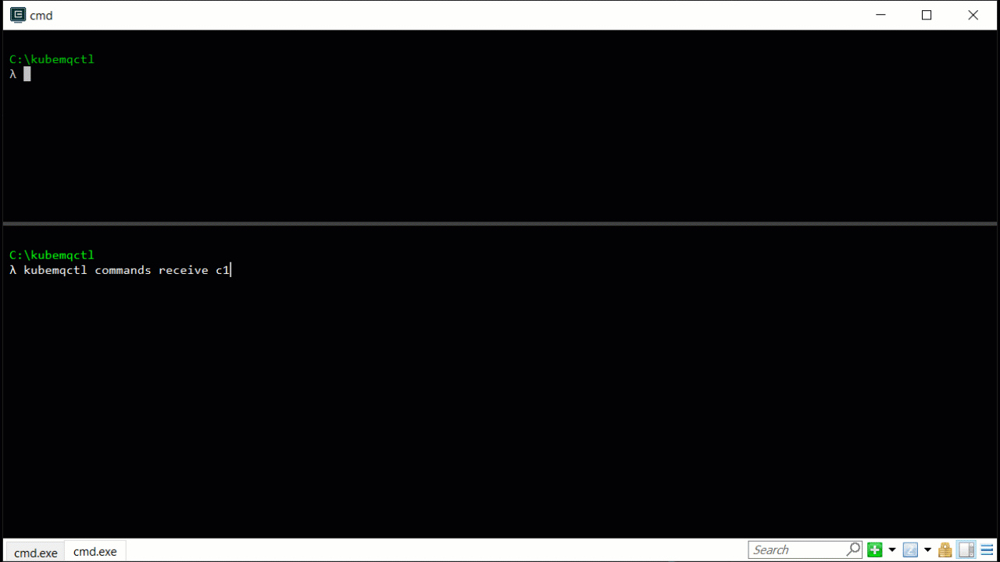

# Get Started with RPC <Badge text="v1.5.0+"/> <Badge text="stable"/>

## Table of Content
[[toc]]

## Get KubeMQ Token
Every installation method requires a KubeMQ token.

Please [register](https://account.kubemq.io/login/register?destination=docker) to obtain your KubeMQ token.


## Get KubeMQ CLI - kubemqctl

<CodeSwitcher :languages="{macOS:'macOS',linux64:'Linux 64 Bits',linux32:'Linux 32 Bits',windows:'Windows'}" :isolated="true">

<template v-slot:macOS>

Copy and paste the following lines:

```bash
curl -L https://github.com/kubemq-io/kubemqctl/releases/download/latest/kubemqctl_darwin_amd64 -o /usr/local/bin/kubemqctl 
chmod +x /usr/local/bin/kubemqctl

```

</template>


<template v-slot:linux64>

Copy and paste the following lines:

```bash
curl -L https://github.com/kubemq-io/kubemqctl/releases/download/latest/kubemqctl_linux_amd64 -o /usr/local/bin/kubemqctl
chmod +x /usr/local/bin/kubemqctl

```

</template>


<template v-slot:linux32>

Copy and paste the following lines:

```bash
curl -L https://github.com/kubemq-io/kubemqctl/releases/download/latest/kubemqctl_linux_386 -o /usr/local/bin/kubemqctl
chmod +x /usr/local/bin/kubemqctl

```

</template>


<template v-slot:windows>

##### Option 1:

- [Download the latest kubemqctl.exe](https://github.com/kubemq-io/kubemqctl/releases/download/latest/kubemqctl.exe).
- Place the file under e.g. `C:\Program Files\kubemqctl\kubemqctl.exe`
- Add that directory to your system path to access it from any command prompt

##### Option 2:
Run in PowerShell as administrator:

```powershell
New-Item -ItemType Directory 'C:\Program Files\kubemqctl'
Invoke-WebRequest https://github.com/kubemq-io/kubemqctl/releases/download/latest/kubemqctl.exe -OutFile 'C:\Program Files\kubemqctl\kubemqctl.exe'
[Environment]::SetEnvironmentVariable('Path', [Environment]::GetEnvironmentVariable('Path', [EnvironmentVariableTarget]::Machine) + ';C:\Program Files\kubemqctl', [EnvironmentVariableTarget]::Machine)
$env:Path += ';C:\Program Files\kubemqctl'
```

</template>

</CodeSwitcher>


## Create KubeMQ Cluster

Run kubemqctl create cluster command:

``` bash
kubemqctl cluster create -t <YOUR_KUBEMQ_TOKEN>
```

For Example:


## Connect Your KubeMQ Cluster

To be able to communicate with KubeMQ interface ports running in Kubernetes cluster, a Port Forward of KubeMQ's ports is needed.

kubemqctl has a handy command that will do it for you:

``` bash
kubemqctl cluster proxy
```


## Subscribe to Commands Channel

A receiver can subscribe to the `hello-command` channel with one of the following methods.

<CodeSwitcher :languages="{bash:'kubemqctl',curl:'cURL',csharp:'.Net',java:`Java`,go:`Go`,py:`Python`,node:`Node`,php:`PHP`,ruby:`Ruby`,jquery:`jQuery`}" :isolated="true">
<template v-slot:bash>

Run the following kubemqctl command:
``` bash
 kubemqctl commands rec "hello-command" -a
```

When connected, the stream will block until receiving a command. Once a command will be received, kubemqctl automatically will send a Response.

</template>

<template v-slot:curl>

The following cURL command is using KubeMQ's REST interface:

``` bash
curl --location --request GET "http://localhost:9090/subscribe/requests?client_id=some_client_id&channel=hello-command&subscribe_type=commands" \
  --header "Content-Type: application/json" \
  --data ""
```

Once a command is received a Send Response call should be invoked:

``` bash

  curl --location --request POST "http://localhost:9090/send/response" 
  --header "Content-Type: application/json" 
  --data '{"RequestID": "<put here request id from command request>","ClientID":"some_client_id","ReplyChannel": "put here the reply channel value from command request","Metadata" :"some_metadata", "Body": "c29tZSBlbmNvZGVkIGJvZHk=","Executed": true,"Error":""}'
```

**Important** - The reply channel address is automatically generated by the KubeMQ and can be found in the command request `ReplyChannel` field.

::: warning
Subscribe to Commands in REST interface is using WebSocket for streaming (Push) commands to the receiver. You will need to implement a WebSocket receiver accordingly.
:::

</template>


<template v-slot:csharp>

The following .NET code snippet is using KubeMQ's .NET SDK with gRPC interface:

``` csharp
using System;

namespace RPC_Subscribe_to_a_Channel
{
    class Program
    {
        static void Main(string[] args)
        {

            var ChannelName = "hello-command";
            var ClientID = "hello-world-subscriber";
            var KubeMQServerAddress = "localhost:50000";


            KubeMQ.SDK.csharp.CommandQuery.Responder responder = new KubeMQ.SDK.csharp.CommandQuery.Responder(KubeMQServerAddress);
            try
            {
                responder.SubscribeToRequests(new KubeMQ.SDK.csharp.Subscription.SubscribeRequest()
                {
                    Channel = ChannelName,
                    SubscribeType = KubeMQ.SDK.csharp.Subscription.SubscribeType.Commands,
                    ClientID = ClientID
                }, (commandReceive) => {
                    Console.WriteLine($"Command Received: Id:{commandReceive.RequestID} Channel:{commandReceive.Channel} Metadata:{commandReceive.Metadata} Body:{ KubeMQ.SDK.csharp.Tools.Converter.FromByteArray(commandReceive.Body)} ");
                    return new KubeMQ.SDK.csharp.CommandQuery.Response(commandReceive)
                    {
                        Body = new byte[0],
                        CacheHit = false,
                        Error = "None",
                        ClientID = ClientID,
                        Executed = true,
                        Metadata = string.Empty,
                        Timestamp = DateTime.UtcNow,
                    };

                }, (errorHandler) =>
                {
                    Console.WriteLine(errorHandler.Message);
                });
            }
            catch (Exception ex)
            {
                Console.WriteLine(ex.Message);
            }
            Console.WriteLine("press any key to close RPC_Subscribe_to_a_Channel");
            Console.ReadLine();
        }
    }
}

```

When executed, a stream of events messages will be shown in the console.

</template>
<template v-slot:java>

The following Java code snippet is using KubeMQ's Java SDK with gRPC interface:

``` java
package io.kubemq.sdk.examples.get_Started.rPC_Subscribe_to_a_Channel;

import java.io.IOException;
import java.time.LocalDateTime;

import javax.net.ssl.SSLException;

import io.kubemq.sdk.basic.ServerAddressNotSuppliedException;
import io.kubemq.sdk.commandquery.Responder;
import io.kubemq.sdk.commandquery.Response;
import io.kubemq.sdk.grpc.Kubemq.PingResult;
import io.kubemq.sdk.subscription.SubscribeRequest;
import io.kubemq.sdk.subscription.SubscribeType;

public class Program {

    public static void main(String[] args) throws IOException {
        String ChannelName = "hello-command", ClientID = "hello-world-sender",
                KubeMQServerAddress = "localhost:50000";
        Responder.RequestResponseObserver HandleIncomingRequests;
        Responder responder = new Responder(KubeMQServerAddress);
        HandleIncomingRequests = request -> {

            Response response = new Response(request);
            response.setCacheHit(false);
            response.setError("None");
            response.setClientID(ClientID);
            response.setBody("OK".getBytes());
            response.setExecuted(true);
            response.setMetadata("OK");
            response.setTimestamp(LocalDateTime.now());
            return response;
        };
        SubscribeRequest subscribeRequest = new SubscribeRequest();
        subscribeRequest.setChannel(ChannelName);
        subscribeRequest.setClientID(ClientID);
        subscribeRequest.setSubscribeType(SubscribeType.Commands);

        new Thread() {
            public void run() {

                try {
                    responder.SubscribeToRequests(subscribeRequest, HandleIncomingRequests);
                } catch (SSLException e) {
                    System.out.printf("SSLException:%s", e.getMessage());
                    e.printStackTrace();
                } catch (ServerAddressNotSuppliedException e) {
                    System.out.printf("ServerAddressNotSuppliedException:%s", e.getMessage());
                    e.printStackTrace();
                }
            }
        }.start();
    }
}
```
When executed, a stream of events messages will be shown in the console.

</template>
<template v-slot:go>

The following Go code snippet is using KubeMQ's Go SDK with gRPC interface:
``` go
package main

import (
   "context"
   "github.com/kubemq-io/kubemq-go"
   "log"
   "time"
)

func main() {
   ctx, cancel := context.WithCancel(context.Background())
   defer cancel()
   client, err := kubemq.NewClient(ctx,
      kubemq.WithAddress("localhost", 50000),
      kubemq.WithClientId("test-command-client-id"),
      kubemq.WithTransportType(kubemq.TransportTypeGRPC))
   if err != nil {
      log.Fatal(err)
   }
   defer client.Close()
   channel := "hello-command"
   errCh := make(chan error)
   commandsCh, err := client.SubscribeToCommands(ctx, channel, "", errCh)
   if err != nil {
      log.Fatal(err)
   }
   for {
      select {
      case err := <-errCh:
         log.Fatal(err)
         return
      case command, more := <-commandsCh:
         if !more {
            log.Println("Command Received , done")
            return
         }
         log.Printf("Command Received:\nId %s\nChannel: %s\nMetadata: %s\nBody: %s\n", command.Id, command.Channel, command.Metadata, command.Body)
         err := client.R().
            SetRequestId(command.Id).
            SetResponseTo(command.ResponseTo).
            SetExecutedAt(time.Now()).
            Send(ctx)
         if err != nil {
            log.Fatal(err)
         }
      case <-ctx.Done():
         return
      }
   }

}

```
When connected, once a command will be received in the channel, we create a Response and send back to the sender.

</template>
<template v-slot:py>

The following Python code snippet is using KubeMQ's Python SDK with gRPC interface:

``` py
The code snippet will available soon
```
When executed, a stream of events messages will be shown in the console.

</template>

<template v-slot:node>

The following Node code snippet is using KubeMQ's REST interface:

``` js
var http = require('http');

var options = {
  'method': 'GET',
  'hostname': 'localhost',
  'port': '9090',
  'path': '/subscribe/requests?client_id=some_client_id&channel=hello-command&subscribe_type=commands',
  'headers': {
    'Content-Type': 'application/json'
  }
};

var req = https.request(options, function (res) {
  var chunks = [];

  res.on("data", function (chunk) {
    chunks.push(chunk);
  });

  res.on("end", function (chunk) {
    var body = Buffer.concat(chunks);
    console.log(body.toString());
  });

  res.on("error", function (error) {
    console.error(error);
  });
});

req.end();
```


Once a command is received a Send Response call should be invoked:

``` js
var http = require('http');

var options = {
  'method': 'POST',
  'hostname': 'localhost',
  'port': '9090',
  'path': '/send/response',
  'headers': {
    'Content-Type': 'application/json'
  }
};

var req = http.request(options, function (res) {
  var chunks = [];

  res.on("data", function (chunk) {
    chunks.push(chunk);
  });

  res.on("end", function (chunk) {
    var body = Buffer.concat(chunks);
    console.log(body.toString());
  });

  res.on("error", function (error) {
    console.error(error);
  });
});

var postData =  "{\n\t\"RequestID\": \"<put here request id from command request>\",\n\t\"ClientID\":\"some_client_id\",\n\t\"ReplyChannel\": \"<put here the reply channel value from command request>\",\n\t\"Metadata\" :\"some_metadata2\",\n\t\"Body\": \"c29tZSBlbmNvZGVkIGJvZHk=\",\n\t\"Executed\": true,\n\t\"Error\":\"\"\n}";

req.write(postData);

req.end();
```

**Important** - The reply channel address is automatically generated by the KubeMQ and can be found in the command request `ReplyChannel` field.

::: warning
Subscribe to Commands in REST interface is using WebSocket for streaming (Push) commands to the receiver. You will need to implement a WebSocket receiver accordingly.
:::
</template>

<template v-slot:php>

The following PHP code snippet is using KubeMQ's REST interface:

``` php
<?php

$curl = curl_init();

curl_setopt_array($curl, array(
  CURLOPT_URL => "http://localhost:9090/subscribe/requests?client_id=some_client_id&channel=hello-command&subscribe_type=commands",
  CURLOPT_RETURNTRANSFER => true,
  CURLOPT_ENCODING => "",
  CURLOPT_MAXREDIRS => 10,
  CURLOPT_TIMEOUT => 0,
  CURLOPT_FOLLOWLOCATION => false,
  CURLOPT_HTTP_VERSION => CURL_HTTP_VERSION_1_1,
  CURLOPT_CUSTOMREQUEST => "GET",
  CURLOPT_HTTPHEADER => array(
    "Content-Type: application/json"
  ),
));

$response = curl_exec($curl);
$err = curl_error($curl);

curl_close($curl);

if ($err) {
  echo "cURL Error #:" . $err;
} else {
  echo $response;
} ?>
```


Once a command is received a Send Response call should be invoked:

``` php
<?php

$curl = curl_init();

curl_setopt_array($curl, array(
  CURLOPT_URL => "http://localhost:9090/send/response",
  CURLOPT_RETURNTRANSFER => true,
  CURLOPT_ENCODING => "",
  CURLOPT_MAXREDIRS => 10,
  CURLOPT_TIMEOUT => 0,
  CURLOPT_FOLLOWLOCATION => false,
  CURLOPT_HTTP_VERSION => CURL_HTTP_VERSION_1_1,
  CURLOPT_CUSTOMREQUEST => "POST",
  CURLOPT_POSTFIELDS =>"{\n\t\"RequestID\": \"<put here request id from command request>\",\n\t\"ClientID\":\"some_client_id\",\n\t\"ReplyChannel\": \"<put here the reply channel value from command request>\",\n\t\"Metadata\" :\"some_metadata2\",\n\t\"Body\": \"c29tZSBlbmNvZGVkIGJvZHk=\",\n\t\"Executed\": true,\n\t\"Error\":\"\"\n}",
  CURLOPT_HTTPHEADER => array(
    "Content-Type: application/json"
  ),
));

$response = curl_exec($curl);
$err = curl_error($curl);

curl_close($curl);

if ($err) {
  echo "cURL Error #:" . $err;
} else {
  echo $response;
} ?>
```

**Important** - The reply channel address is automatically generated by the KubeMQ and can be found in the command request `ReplyChannel` field.

::: warning
Subscribe to Commands in REST interface is using WebSocket for streaming (Push) commands to the receiver. You will need to implement a WebSocket receiver accordingly.
:::

</template>


<template v-slot:ruby>

The following Ruby code snippet is using KubeMQ's REST interface:

``` ruby
require "uri"
require "net/http"

url = URI("http://localhost:9090/subscribe/requests?client_id=some_client_id&channel=hello-command&subscribe_type=commands")
http = Net::HTTP.new(url.host, url.port)
request = Net::HTTP::Get.new(url)
request["Content-Type"] = "application/json"
response = http.request(request)
puts response.read_body
```


Once a command is received a Send Response call should be invoked:

``` ruby
require "uri"
require "net/http"

url = URI("http://localhost:9090/send/response")

http = Net::HTTP.new(url.host, url.port)

request = Net::HTTP::Post.new(url)
request["Content-Type"] = "application/json"
request.body = "{\n\t\"RequestID\": \"<put here request id from command request>\",\n\t\"ClientID\":\"some_client_id\",\n\t\"ReplyChannel\": \"<put here the reply channel value from command request>q\",\n\t\"Metadata\" :\"some_metadata2\",\n\t\"Body\": \"c29tZSBlbmNvZGVkIGJvZHk=\",\n\t\"Executed\": true,\n\t\"Error\":\"\"\n}"
response = http.request(request)
puts response.read_body
```

**Important** - The reply channel address is automatically generated by the KubeMQ and can be found in the command request `ReplyChannel` field.

::: warning
Subscribe to Commands in REST interface is using WebSocket for streaming (Push) commands to the receiver. You will need to implement a WebSocket receiver accordingly.
:::
</template>


<template v-slot:jquery>

The following jQuery code snippet is using KubeMQ's REST interface:

``` js
var settings = {
  "url": "http://localhost:9090/subscribe/requests?client_id=some_client_id&channel=hello-command&subscribe_type=commands",
  "method": "GET",
  "timeout": 0,
  "headers": {
    "Content-Type": "application/json"
  },
};

$.ajax(settings).done(function (response) {
  console.log(response);
});
```

Once a command is received a Send Response call should be invoked:

``` js
var settings = {
  "url": "http://localhost:9090/send/response",
  "method": "POST",
  "timeout": 0,
  "headers": {
    "Content-Type": "application/json"
  },
  "data": "{\n\t\"RequestID\": \"<put here request id from command request>\",\n\t\"ClientID\":\"some_client_id\",\n\t\"ReplyChannel\": \"<put here the reply channel value from command request>\",\n\t\"Metadata\" :\"some_metadata2\",\n\t\"Body\": \"c29tZSBlbmNvZGVkIGJvZHk=\",\n\t\"Executed\": true,\n\t\"Error\":\"\"\n}",
};

$.ajax(settings).done(function (response) {
  console.log(response);
});
```

**Important** - the reply channel address is automatically generated by the KubeMQ and can be found in the command request `ReplyChannel` field.

::: warning
Subscribe to Commands in REST interface is using WebSocket for streaming (Push) commands to the receiver. You will need to implement a WebSocket receiver accordingly.
:::
</template>


</CodeSwitcher>


## Send to Commands Channel

After you have subscribed to a hello-command channel, you can send your command to it.


<CodeSwitcher :languages="{bash:'kubemqctl',curl:'cURL',csharp:'.Net',java:`Java`,go:`Go`,py:`Python`,node:`Node`,php:`PHP`,ruby:`Ruby`,jquery:`jQuery`}" :isolated="true">


<template v-slot:bash>

Run the following kubemqctl command:

``` bash
kubemqctl commands send "hello-command" "some command"
```


</template>


<template v-slot:curl>

The following cURL command is using KubeMQ's REST interface:

``` bash
curl --location --request POST "http://localhost:9090/send/request" 
  --header "Content-Type: application/json" 
  --data '{"RequestID": "688daec3-7f3e-4766-87fa-4cd1f4f03a23","RequestTypeData":1, "ClientID": "some_clientID","Channel": "hello-command","Metadata" :"some_metadata","Body": "c29tZSBlbmNvZGVkIGJvZHk=","Timeout": 10000}'
```

</template>

<template v-slot:csharp>

The following .NET code snippet is using KubeMQ's .NET SDK with gRPC interface:

``` csharp
using System;

namespace RPC_Send_a_Command_Channel
{
    class Program
    {
        static void Main(string[] args)
        {
            var ChannelName = "hello-command";
            var ClientID = "hello-world-sender";
            var KubeMQServerAddress = "localhost:50000";

            var channel = new KubeMQ.SDK.csharp.CommandQuery.Channel(new KubeMQ.SDK.csharp.CommandQuery.ChannelParameters
            {
                RequestsType = KubeMQ.SDK.csharp.CommandQuery.RequestType.Command,
                Timeout = 10000,
                ChannelName = ChannelName,
                ClientID = ClientID,
                KubeMQAddress = KubeMQServerAddress
            });
            try
            {

                var result = channel.SendRequest(new KubeMQ.SDK.csharp.CommandQuery.Request
                {
                    Body = KubeMQ.SDK.csharp.Tools.Converter.ToByteArray("hello kubemq - sending a command, please reply")
                });                    
             
                if (!result.Executed)
                {
                    Console.WriteLine($"Response error:{result.Error}");
                    return;
                }
                Console.WriteLine($"Response Received:{result.RequestID} ExecutedAt:{result.Timestamp}"); 
            }
            catch (Exception ex)
            {
                Console.WriteLine(ex.Message);
            }
        }
    }
}

```

</template>
<template v-slot:java>

The following Java code snippet is using KubeMQ's Java SDK with gRPC interface:

``` java
package io.kubemq.sdk.examples.get_Started.rPC_Send_a_Command_Channel;

import java.io.IOException;

import io.kubemq.sdk.basic.ServerAddressNotSuppliedException;
import io.kubemq.sdk.commandquery.ChannelParameters;
import io.kubemq.sdk.commandquery.Request;
import io.kubemq.sdk.commandquery.RequestType;
import io.kubemq.sdk.commandquery.Response;
import io.kubemq.sdk.tools.Converter;

public class Program {

    public static void main(String[] args) throws IOException {

        String ChannelName = "hello-command", ClientID = "hello-world-sender",
                KubeMQServerAddress = "localhost:50000";
        ChannelParameters channelParameters = new ChannelParameters();
        channelParameters.setChannelName(ChannelName);
        channelParameters.setClientID(ClientID);
        channelParameters.setKubeMQAddress(KubeMQServerAddress);
        channelParameters.setRequestType(RequestType.Command);
        channelParameters.setTimeout(10000);
        io.kubemq.sdk.commandquery.Channel channel = new io.kubemq.sdk.commandquery.Channel(channelParameters);
        Request request = new Request();
        request.setBody(Converter.ToByteArray("hello kubemq - sending a command, please reply"));
        Response result;
        try {
            result = channel.SendRequest(request);
            if (!result.isExecuted()) {
                System.out.printf("Response error: %s", result.getError());
                return;
            }
            System.out.printf("Response Received: %s, ExecutedAt: %s", result.getRequestID(), result.getTimestamp().toString());
        } catch (ServerAddressNotSuppliedException e) {
            System.out.printf("ServerAddressNotSuppliedException: %s", e.toString());
            e.printStackTrace();
      }
        
    
    }
}
```

</template>
<template v-slot:go>

The following Go code snippet is using KubeMQ's Go SDK with gRPC interface:

``` go
package main

import (
   "context"
   "github.com/kubemq-io/kubemq-go"
   "log"
   "time"
)

func main() {
   ctx, cancel := context.WithCancel(context.Background())
   defer cancel()
   client, err := kubemq.NewClient(ctx,
      kubemq.WithAddress("localhost", 50000),
      kubemq.WithClientId("test-command-client-id"),
      kubemq.WithTransportType(kubemq.TransportTypeGRPC))
   if err != nil {
      log.Fatal(err)
   }
   defer client.Close()
   channel := "hello-command"
   response, err := client.C().
      SetId("some-command-id").
      SetChannel(channel).
      SetMetadata("some-metadata").
      SetBody([]byte("hello kubemq - sending a command, please reply")).
      SetTimeout(10 *time.Second).
      Send(ctx)
   if err != nil {
      log.Fatal(err)
   }
   log.Printf("Response Received:\nCommandID: %s\nExecutedAt:%s\n", response.CommandId, response.ExecutedAt)
}

```

</template>
<template v-slot:py>

The following Python code snippet is using KubeMQ's Python SDK with gRPC interface:

``` py
The code snippet will available soon
```


</template>


<template v-slot:node>

The following node code snippet is using KubeMQ's REST interface:

``` js
var http = require('http');

var options = {
  'method': 'POST',
  'hostname': 'localhost',
  'port': '9090',
  'path': '/send/request',
  'headers': {
    'Content-Type': 'application/json'
  }
};

var req = http.request(options, function (res) {
  var chunks = [];

  res.on("data", function (chunk) {
    chunks.push(chunk);
  });

  res.on("end", function (chunk) {
    var body = Buffer.concat(chunks);
    console.log(body.toString());
  });

  res.on("error", function (error) {
    console.error(error);
  });
});

var postData =  "{\n\t\"RequestID\": \"688daec3-7f3e-4766-87fa-4cd1f4f03a23\",\n\t\"RequestTypeData\":1, \n\t\"ClientID\": \"some_clientID\",\n\t\"Channel\": \"hello-command\",\n\t\"Metadata\" :\"some_metadata\",\n\t\"Body\": \"c29tZSBlbmNvZGVkIGJvZHk=\",\n\t\"Timeout\": 10000\n}";

req.write(postData);

req.end();
```

</template>

<template v-slot:php>

The following PHP code snippet is using KubeMQ's REST interface:

``` php
<?php

$curl = curl_init();

curl_setopt_array($curl, array(
  CURLOPT_URL => "http://localhost:9090/send/request",
  CURLOPT_RETURNTRANSFER => true,
  CURLOPT_ENCODING => "",
  CURLOPT_MAXREDIRS => 10,
  CURLOPT_TIMEOUT => 0,
  CURLOPT_FOLLOWLOCATION => false,
  CURLOPT_HTTP_VERSION => CURL_HTTP_VERSION_1_1,
  CURLOPT_CUSTOMREQUEST => "POST",
  CURLOPT_POSTFIELDS =>"{\n\t\"RequestID\": \"688daec3-7f3e-4766-87fa-4cd1f4f03a23\",\n\t\"RequestTypeData\":1, \n\t\"ClientID\": \"some_clientID\",\n\t\"Channel\": \"hello-command\",\n\t\"Metadata\" :\"some_metadata\",\n\t\"Body\": \"c29tZSBlbmNvZGVkIGJvZHk=\",\n\t\"Timeout\": 10000\n}",
  CURLOPT_HTTPHEADER => array(
    "Content-Type: application/json"
  ),
));

$response = curl_exec($curl);
$err = curl_error($curl);

curl_close($curl);

if ($err) {
  echo "cURL Error #:" . $err;
} else {
  echo $response;
} ?>
```

</template>


<template v-slot:ruby>

The following Ruby code snippet is using KubeMQ's REST interface:

``` ruby
require "uri"
require "net/http"

url = URI("http://localhost:9090/send/request")
http = Net::HTTP.new(url.host, url.port)
request = Net::HTTP::Post.new(url)
request["Content-Type"] = "application/json"
request.body = "{\n\t\"RequestID\": \"688daec3-7f3e-4766-87fa-4cd1f4f03a23\",\n\t\"RequestTypeData\":1, \n\t\"ClientID\": \"some_clientID\",\n\t\"Channel\": \"hello-command\",\n\t\"Metadata\" :\"some_metadata2\",\n\t\"Body\": \"c29tZSBlbmNvZGVkIGJvZHk=\",\n\t\"Timeout\": 10000\n}"
response = http.request(request)
puts response.read_body
```

</template>


<template v-slot:jquery>

The following jQuery code snippet is using KubeMQ's REST interface:

``` js
var settings = {
  "url": "http://localhost:9090/send/request",
  "method": "POST",
  "timeout": 0,
  "headers": {
    "Content-Type": "application/json",
  },
  "data": "{\n\t\"RequestID\": \"688daec3-7f3e-4766-87fa-4cd1f4f03a23\",\n\t\"RequestTypeData\":1, \n\t\"ClientID\": \"some_clientID\",\n\t\"Channel\": \"hello-command\",\n\t\"Metadata\" :\"some_metadata2\",\n\t\"Body\": \"c29tZSBlbmNvZGVkIGJvZHk=\",\n\t\"Timeout\": 10000\n}",
};

$.ajax(settings).done(function (response) {
  console.log(response);
});
```

</template>


</CodeSwitcher>

## Demo


