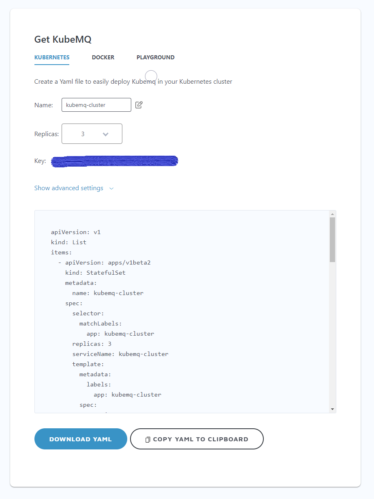

## Deploying a KubeMQ Cluster

A KubeMQ cluster can be deployed to a Kubernetes cluster as a stateful set or in the Docker environment using docker-compose.

### Kubernetes Deployment

Setting up a KubeMQ cluster can be done with a simple yaml configuration file.

#### Kubernetes Configuration Generator
A simple yaml configuration generator can used by login to your KubeMQ account: [here](https://account.kubemq.io/home/get-kubemq/kubernetes).


 


#### Manual Kubernetes Yaml Configuration

An example of a stateful set ymal configuration
```
apiVersion: v1
kind: List
items:
  - apiVersion: apps/v1beta2
    kind: StatefulSet
    metadata:
      name: kubemq-cluster
    spec:
      selector:
        matchLabels:
          app: kubemq-cluster
      replicas: 3
      serviceName: kubemq-cluster
      template:
        metadata:
          labels:
            app: kubemq-cluster
        spec:
          containers:
            - env:
                - name: KUBEMQ_TOKEN
                  value: 
                - name: CLUSTER_ROUTES
                  value: 'kubemq-cluster:5228'
                - name: CLUSTER_PORT
                  value: '5228'
                - name: CLUSTER_ENABLE
                  value: 'true'
                - name: KUBEMQ_LOG_LEVEL
                  value: '2'
                - name: GRPC_PORT
                  value: '50000'
                - name: REST_PORT
                  value: '9090'
                - name: KUBEMQ_PORT
                  value: '8080'
              image: 'kubemq/kubemq:latest'
              imagePullPolicy: IfNotPresent
              name: kubemq-cluster
              ports:
                - containerPort: 50000
                  name: grpc-port
                  protocol: TCP
                - containerPort: 8080
                  name: metrics-port
                  protocol: TCP
                - containerPort: 9090
                  name: rest-port
                  protocol: TCP
                - containerPort: 5228
                  name: cluster-port
                  protocol: TCP
          restartPolicy: Always
  - apiVersion: v1
    kind: Service
    metadata:
      name: kubemq-cluster
    spec:
      ports:
        - name: metrics-port
          port: 8080
          protocol: TCP
          targetPort: 8080
        - name: grpc-port
          port: 50000
          protocol: TCP
          targetPort: 50000
        - name: cluster-port
          port: 5228
          protocol: TCP
          targetPort: 5228
        - name: rest-port
          port: 9090
          protocol: TCP
          targetPort: 9090
      sessionAffinity: None
      type: NodePort
      selector:
        app: kubemq-cluster

```

### docker-compose Deployment

A KubeMQ cluster can be deployed with a docker-compose ymal file as described below:

```
version: '3'
services:
  kubemq-0:
    image: kubemq/kubemq:latest
    hostname: "kubemq-0"
    ports:
      - "8080:8080"
      - "9090:9090"
      - "5228:5228"
      - "50000:50000"
    environment:
      - KUBEMQ_HOST=kubemq-0
      - CLUSTER_IS_SEED=true
      - CLUSTER_ENABLE=true
      - CLUSTER_PORT=5228
      - CLUSTER_ROUTES=kubemq-1:5229,kubemq-2:5230
      - KUBEMQ_TOKEN=1167cbd8-9194-11e8-9eb6-529269fb1459
    networks:
      - kubemqnet
    volumes:
      - kubemq_vol1:/store
  kubemq-1:
    image: tradency/kubemq:latest
    hostname: "kubemq-1"
    ports:
      - "8081:8080"
      - "9091:9090"
      - "5229:5229"
      - "50001:50000"
    environment:
      - KUBEMQ_HOST=kubemq-1
      - CLUSTER_IS_SEED=false
      - CLUSTER_ENABLE=true
      - CLUSTER_PORT=5229
      - CLUSTER_ROUTES=kubemq-2:5230,kubemq-0:5228
      - KUBEMQ_TOKEN=1167cbd8-9194-11e8-9eb6-529269fb1459
    depends_on:
      - "kubemq-0"
    volumes:
      - kubemq_vol2:/store
    networks:
      - kubemqnet
  kubemq-2:
    image: tradency/kubemq:latest
    hostname: "kubemq-2"
    ports:
      - "8082:8080"
      - "9092:9090"
      - "5230:5230"
      - "50002:50000"
    environment:
      - KUBEMQ_HOST=kubemq-2
      - CLUSTER_IS_SEED=false
      - CLUSTER_ENABLE=true
      - CLUSTER_PORT=5230
      - CLUSTER_ROUTES=kubemq-1:5229,kubemq-0:5228
      - KUBEMQ_TOKEN=1167cbd8-9194-11e8-9eb6-529269fb1459
    depends_on:
      - "kubemq-0"
      - "kubemq-1"
    volumes:
      - kubemq_vol3:/store
    networks:
      - kubemqnet
networks:
  kubemqnet:
volumes:
  kubemq_vol1:
  kubemq_vol2:
  kubemq_vol3:
```

