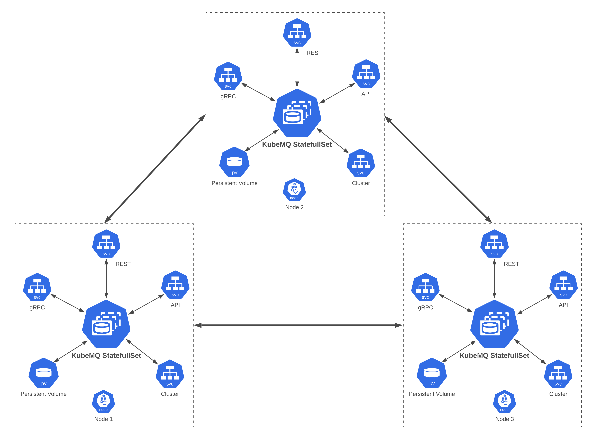
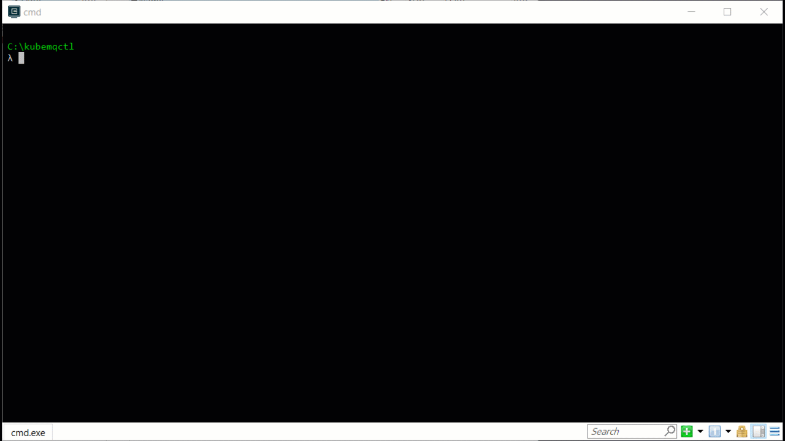
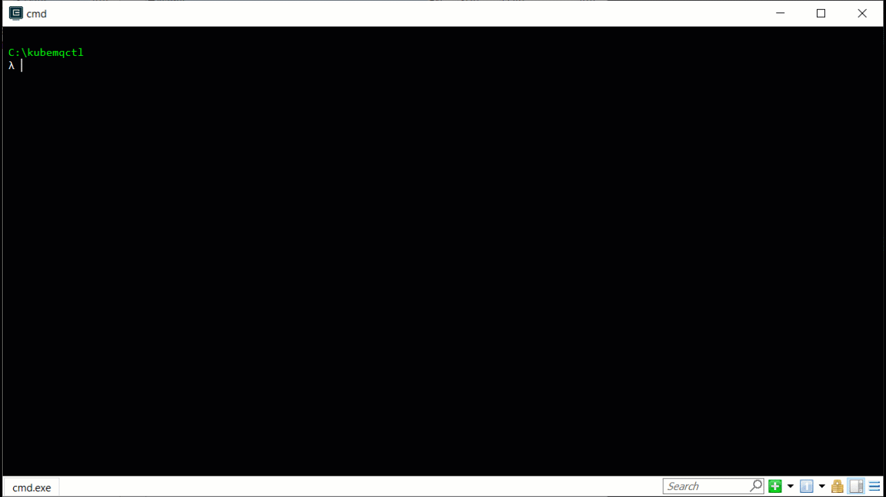

# Kubernetes Deployment
## Table of Content
[[toc]]
## General
KubeMQ can be deployed in a Kubernetes cluster as s StatefulSet either by a yaml config file or by helm chart.




::: tip KubeMQ Token
Every installation method requires a KubeMQ token.
Please [register](https://account.kubemq.io/login/register?destination=docker) to obtain your KubeMQ token.
:::

## kubemqctl

The easiest way to deploy KubeMQ cluster is via kubemqctl CLI tool.

You can select one of the following options:


<CodeSwitcher :languages="{default:'With Default Options',options:'With Expert Configuration',import:'With Yaml File'}" :isolated="true">

<template v-slot:default>

Run kubemqctl create cluster command:

``` bash
kubemqctl cluster create -t <YOUR_KUBEMQ_TOKEN>
```

For Example:




</template>


<template v-slot:options>


Run kubemqctl create cluster command:

``` bash
kubemqctl cluster create -t <YOUR_KUBEMQ_TOKEN> -o
```

For Example:




</template>


<template v-slot:import>

Run kubemqctl create cluster command:

``` bash
kubemqctl cluster create  -f kubemq-cluster.yaml
```


</template>

</CodeSwitcher>

::: tip kubemqctl Installation
Please visit [kubemqctl Installation](../kubemqctl/kubemqctl.md).
:::


## Helm Chart

Add KubeMQ Helm Repository:

``` bash
helm repo add kubemq-charts https://kubemq-io.github.io/charts
```

Verify KubeMQ helm repository charts is correctly configured by:
``` bash
helm repo list
```

Install KubeMQ Chart:

``` bash
helm install --name kubemq-cluster --set token=<YOUR_KUBEMQ_TOKEN> 
kubemq-charts/kubemq
```


### Configuration

The following table lists the configurable parameters of the KubeMQ chart and their default values.


| Parameter                           | Default           | Description                                                                                 |
|:-----------------------------------|:------------------|:--------------------------------------------------------------------------------------------|
| nameOverride                       | `kubemq-cluster`  | Sets deployment name                                                                        |
| token                              | ``                | Sets KubeMQ token                                                                           |
| replicaCount                       | `3`               | Number of KubeMQ nodes                                                                      |
| cluster.enable                     | `true`            | Enable/Disable cluster mode                                                                 |
| image.repository                   | `kubemq/kubemq`   | KubeMQ image name                                                                           |
| image.tag                          | `latest`          | KubeMQ image tag                                                                            |
| image.pullPolicy                   | `Always`          | Image pull policy                                                                           |
| service.type                       | `ClusterIP`       | Sets KubeMQ service type                                                                    |
| service.apiPort                    | `8080`            | Sets KubeMQ service Api Port                                                                |
| service.restPort                   | `9090`            | Sets KubeMQ service Rest Port                                                               |
| service.grpcPort                   | `5000`            | Sets KubeMQ service gRPC Port                                                               |
| service.clusterPort                | `5228`            | Sets KubeMQ service Cluster Port                                                            |
| livenessProbe.enabled              | `true`            | Enable/Disable liveness prob                                                                |
| livenessProbe.initialDelaySeconds  | `4`               | Delay before liveness probe is initiated                                                    |
| livenessProbe.periodSeconds        | `10`              | How often to perform the probe                                                              |
| livenessProbe.timeoutSeconds       | `5`               | When the probe times out                                                                    |
| livenessProbe.failureThreshold     | `6`               | Minimum consecutive successes for the probe to be considered successful after having failed |
| livenessProbe.successThreshold     | `1`               | Minimum consecutive failures for the probe to be considered failed after having succeeded   |
| readinessProbe.enabled             | `true`            | Enable/Disable readiness prob                                                               |
| readinessProbe.initialDelaySeconds | `1`               | Delay before readiness probe is initiated                                                   |
| readinessProbe.periodSeconds       | `10`              | How often to perform the probe                                                              |
| readinessProbe.timeoutSeconds      | `5`               | When the probe times out                                                                    |
| readinessProbe.failureThreshold    | `6`               | Minimum consecutive failures for the probe to be considered failed after having succeeded   |
| readinessProbe.successThreshold    | `1`               | Minimum consecutive successes for the probe to be considered successful after having failed |
| statefulset.updateStrategy         | `RollingUpdate`   | Statefulsets Update strategy                                                                |
| volume.enabled                     | `false`           | Enable/Disable Persistence Volume Claim template                                            |
| volume.size                        | `1Gi`             | Set volume size                                                                             |
| volume.mountPath                   | ` "/store" `      | Sets container mounting point                                                               |
| volume.accessMode                  | `"ReadWriteOnce"` | Sets Persistence access mode                                                                |

Specify each parameter using the `--set key=value[,key=value]` argument to helm install. For example,
``` bash
helm install --name kubemq-release --set token={your kubemq token}, \
nameOverride=my-kubemq-cluster kubemq-charts/kubemq 
```


Use KubeCtl to forward KubeMQ cluster ports:

``` bash
kubectl port-forward svc/kubemq-cluster-ext 8080:8080 9090:9090 50000:50000
```

::: warning PROXY
If KubeMQ fails to load, probably there is a proxy server which prevents the validation of KubeMQ token.
To fix this, you can add -e KUBEMQ_PROXY="your-proxy-url" as an environment variable.
:::
