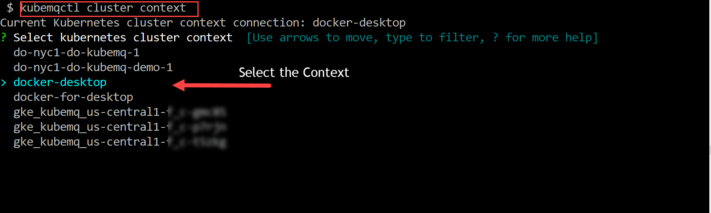

## Switch Kubernetes Context

kubemqctl allows to switch kubectl Kubernetes cluster context connection


### Use kubemqctl tool to switch Kubernetes cluster context

- Run the following command to select and switch Kubernetes context

```bash
kubemqctl cluster context
```


### Exmaple


