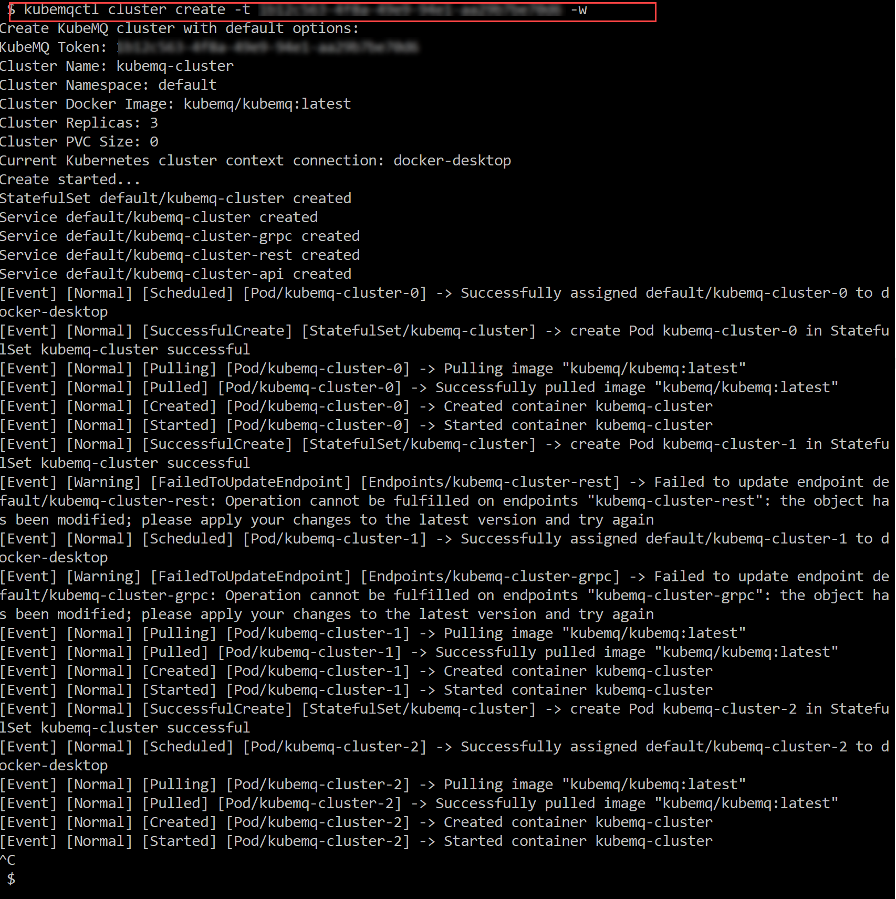
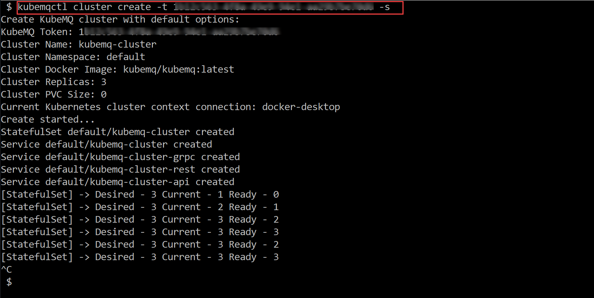
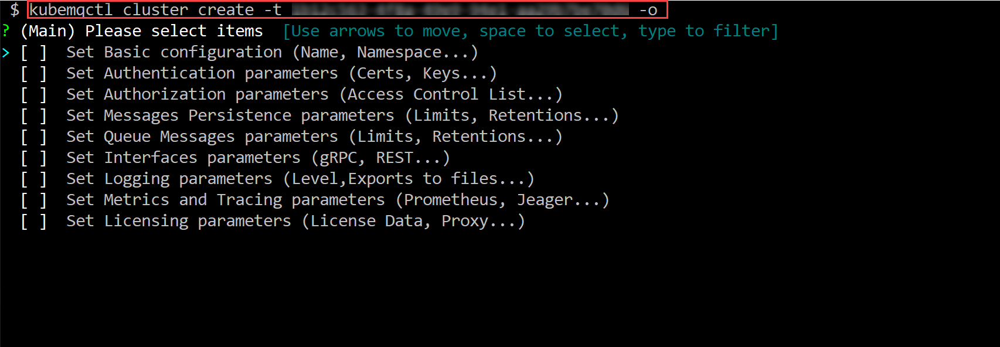
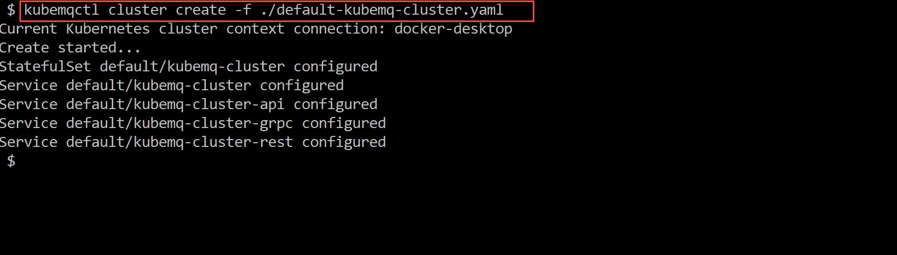

## Create KubeMQ Cluster

### Use kubemqctl tool to create KubeMQ cluster
Run the following commands

- Create KubeMQ cluster with default configuration

```bash
kubemqctl cluster create -t 1b124xxxxx6-4fra-49e9-94e1-aa29b7be70d6
```

- Create KubeMQ cluster with default configuration and watch for events

```bash
kubemqctl cluster create -t 1b124xxxxx6-4fra-49e9-94e1-aa29b7be70d6 -w
```


- Create KubeMQ cluster with default configuration and watch for status changes

```bash
kubemqctl cluster create -t 1b124xxxxx6-4fra-49e9-94e1-aa29b7be70d6 -s
```


- Create KubeMQ cluster with optional configuration

```bash
kubemqctl cluster create -t 1b124xxxxx6-4fra-49e9-94e1-aa29b7be70d6 -o
```



- Create KubeMQ cluster with import yaml configuration

```bash
kubemqctl cluster create -f ./kubemq-cluster.yaml
```


