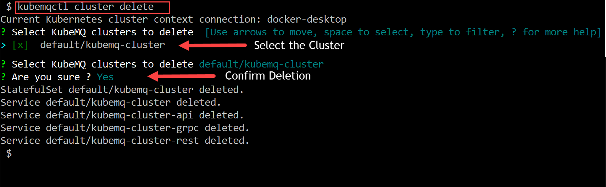

## Delete KubeMQ Cluster

### Use kubemqctl tool to delete KubeMQ cluster

- Run the following command
```bash
kubemqctl cluster delete
```
- Select the Cluster you wish to delete
- Confirm deletion

### Exmaple


