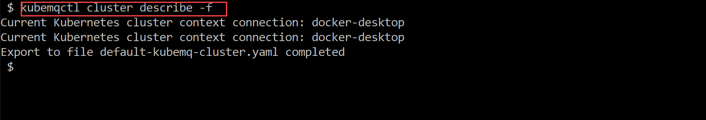

## Get KubeMQ Cluster Description

### Use kubemqctl tool to KubeMQ cluster description
- Run the following command with output to console
```bash
kubemqctl cluster describe
```

- Run the following command with output to a file
```bash
kubemqctl cluster describe -f
```


### Exmaple



An example of a file:

```
apiVersion: apps/v1
kind: StatefulSet
metadata:
  creationTimestamp: "2019-10-04T12:47:52Z"
  generation: 1
  name: kubemq-cluster
  namespace: default
  resourceVersion: "2912039"
  selfLink: /apis/apps/v1/namespaces/default/statefulsets/kubemq-cluster
  uid: 2e1687d0-e6a5-11e9-b78a-00155d00113f
spec:
  podManagementPolicy: OrderedReady
  replicas: 3
  revisionHistoryLimit: 10
  selector:
    matchLabels:
      app: kubemq-cluster
  serviceName: kubemq-cluster
  template:
    metadata:
      annotations:
        prometheus.io/path: /metrics
        prometheus.io/port: "9102"
        prometheus.io/scrape: "true"
      creationTimestamp: null
      labels:
        app: kubemq-cluster
    spec:
      containers:
      - env:
        - name: KUBEMQ_TOKEN
          value: 1s1ecd6r-4e8eeea-49e9-94e1-aa29b7be70d6ee
        - name: CLUSTER_ROUTES
          value: kubemq-cluster:5228
        - name: CLUSTER_PORT
          value: "5228"
        - name: CLUSTER_ENABLE
          value: "true"
        - name: GRPC_PORT
          value: "50000"
        - name: REST_PORT
          value: "9090"
        - name: KUBEMQ_PORT
          value: "8080"
        - name: STORE_DIR
          value: /store
        image: kubemq/kubemq:latest
        imagePullPolicy: Always
        name: kubemq-cluster
        ports:
        - containerPort: 50000
          name: grpc-port
          protocol: TCP
        - containerPort: 8080
          name: api-port
          protocol: TCP
        - containerPort: 9090
          name: rest-port
          protocol: TCP
        - containerPort: 5228
          name: cluster-port
          protocol: TCP
        resources: {}
        terminationMessagePath: /dev/termination-log
        terminationMessagePolicy: File
      dnsPolicy: ClusterFirst
      restartPolicy: Always
      schedulerName: default-scheduler
      securityContext: {}
      terminationGracePeriodSeconds: 30
  updateStrategy:
    rollingUpdate:
      partition: 0
    type: RollingUpdate
status:
  collisionCount: 0
  currentReplicas: 3
  currentRevision: kubemq-cluster-86494746d8
  observedGeneration: 1
  readyReplicas: 3
  replicas: 3
  updateRevision: kubemq-cluster-86494746d8
  updatedReplicas: 3
---
apiVersion: v1
kind: Service
metadata:
  creationTimestamp: "2019-10-04T12:47:52Z"
  name: kubemq-cluster
  namespace: default
  resourceVersion: "2911971"
  selfLink: /api/v1/namespaces/default/services/kubemq-cluster
  uid: 2e1a3123-e6a5-11e9-b78a-00155d00113f
spec:
  clusterIP: 10.111.56.22
  ports:
  - name: cluster-port
    port: 5228
    protocol: TCP
    targetPort: 5228
  selector:
    app: kubemq-cluster
  sessionAffinity: None
  type: ClusterIP
status:
  loadBalancer: {}
---
apiVersion: v1
kind: Service
metadata:
  creationTimestamp: "2019-10-04T12:47:52Z"
  name: kubemq-cluster-api
  namespace: default
  resourceVersion: "2911981"
  selfLink: /api/v1/namespaces/default/services/kubemq-cluster-api
  uid: 2e21a2b6-e6a5-11e9-b78a-00155d00113f
spec:
  clusterIP: 10.100.39.75
  ports:
  - name: api-port
    port: 8080
    protocol: TCP
    targetPort: 8080
  selector:
    app: kubemq-cluster
  sessionAffinity: None
  type: ClusterIP
status:
  loadBalancer: {}
---
apiVersion: v1
kind: Service
metadata:
  creationTimestamp: "2019-10-04T12:47:52Z"
  name: kubemq-cluster-grpc
  namespace: default
  resourceVersion: "2911975"
  selfLink: /api/v1/namespaces/default/services/kubemq-cluster-grpc
  uid: 2e1cf0e8-e6a5-11e9-b78a-00155d00113f
spec:
  clusterIP: 10.98.57.254
  ports:
  - name: grpc-port
    port: 50000
    protocol: TCP
    targetPort: 50000
  selector:
    app: kubemq-cluster
  sessionAffinity: None
  type: ClusterIP
status:
  loadBalancer: {}
---
apiVersion: v1
kind: Service
metadata:
  creationTimestamp: "2019-10-04T12:47:52Z"
  name: kubemq-cluster-rest
  namespace: default
  resourceVersion: "2911978"
  selfLink: /api/v1/namespaces/default/services/kubemq-cluster-rest
  uid: 2e1f41ad-e6a5-11e9-b78a-00155d00113f
spec:
  clusterIP: 10.106.153.85
  ports:
  - name: rest-port
    port: 9090
    protocol: TCP
    targetPort: 9090
  selector:
    app: kubemq-cluster
  sessionAffinity: None
  type: ClusterIP
status:
  loadBalancer: {}
---
```


