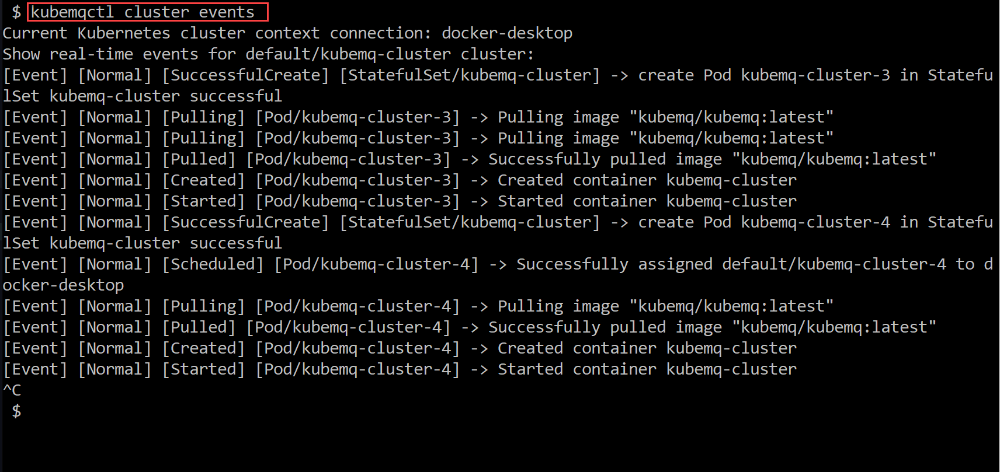

## Show Cluster Events

### Use kubemqctl tool to show KubeMQ cluster events

- In a case of a need to show real-time cluster events of all KubeMQ cluster pods, run the following command:
```bash
kubemqctl cluster events
```


### Exmaple
Show events during scaling:


