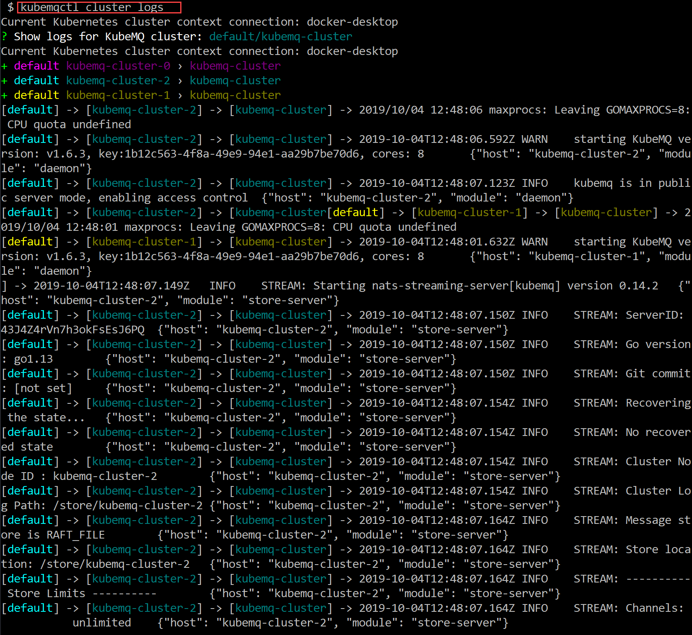

## Show KubeMQ Cluster Logs

### Use kubemqctl tool to show KubeMQ cluster logs

- In a case of a need to show real-time logs of all KubeMQ cluster pods, run the following command:
```bash
kubemqctl cluster logs
```

- Show KubeMQ logs lines since 1 min back

```bash
kubemqctl cluster logs -s 1m
```

- Show KubeMQ logs lines only includes the word 'queue'

```bash
kubemqctl cluster logs -i queue
```


- Show KubeMQ logs lines excludes the word 'command'

```bash
kubemqctl cluster logs -e command
```

### Exmaple


