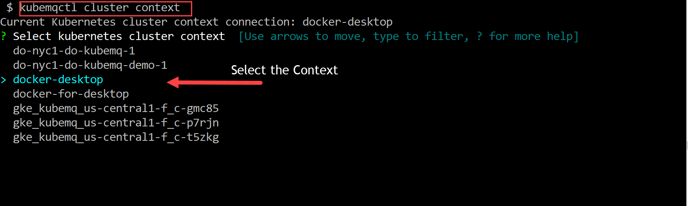

## Set Cluster Proxy

In case there is a need for a Port Forwarding of all KubeMQ ports such as during development interaction with KubeMQ, set cluster proxy command will select a pod in the cluster and will forward all the ports to localhost.

### Use kubemqctl tool to Proxy all KubeMQ ports to localhost
- Run the following command
```bash
kubemqctl cluster proxy
```

- Press CTRL C when KubeMQ's Port forward is not needed any more

### Exmaple

