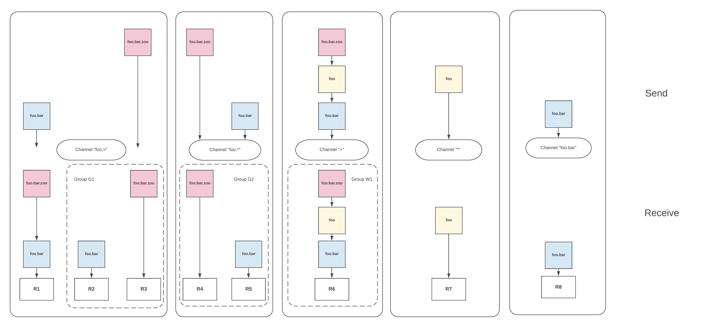
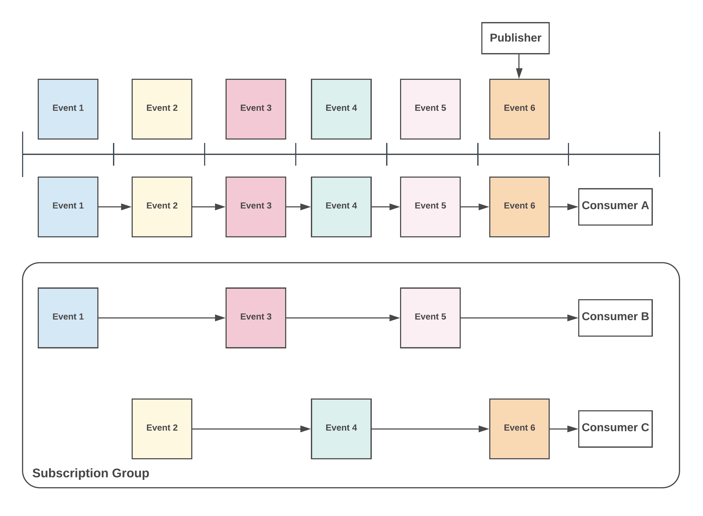

# Concepts
## Table of Content
[[toc]]

## Channels

KubeMQ Channel (Topic/Subject/Address/Destination) is a string-based representation of an endpoint or a target of a message.
KubeMQ supports [NATS.IO](https://nats.io/documentation/writing_applications/subjects/) Subject-based Messaging patterns for hierarchies, wildcards, and tokens.

## Senders and Receivers
The core functionality of KubeMQ messaging is sending and receiving messages.

**Senders** (publishers) can send one or many messages (stream) to one specific destination (Channel).
Sending a message does not require the set up of any pre-defined destination.

**Receiver** (subscribers/listeners) can receive messages from one or more senders on the same channel or a wildcards channel.
Before a Receiver can receive any messages, a Subscription function is needed to register his interest in receiving messages from a senders designation.

## Format
A channel string can be formed from any UTF-8 characters with the following attributes:
   - Case sensitive, FOO and foo are different channel names
   - No white spaces allowed
   - Cannot be Blank (`""`)
   - `.`, `*`, `>` are special characters for token hierarchies.
   - Cannot start with `.`
   - Can start with `>` or `*` (for subscription receivers only)
   - Unlimited hierarchies

## Hierarchies
Channels names can be separated by the `.` symbol to create messaging stream hierarchies.

One level hierarchy:

`foo`, `USA`, `org` are valid one level hierarchies.

Two-level hierarchies:

`foo.bar`, `USA.NewYork`, `org.department` are valid two-level hierarchies.

N level hierarchies:

`foo.bar.A.B.C.>` is valid n (n=6) level hierarchies.

## Wildcards
KubeMQ supports two wildcards, `*` and `>`. Wildcards are used to subscribe to a group of channels’ strings.

##### Asterisk `*`
Matching a single token in any hierarchy

##### Greater `>`
Matching one or more tokens at the tail of a channel

Examples:

Here some examples of channel subscription patterns and which types of messages with channels are accepted and ignored.

| Channel Pattern | Messages Accepted   | Messages Ignored    |
|:----------------|:--------------------|:--------------------|
| `foo`           | `foo`               | `bar`,`zoo`         |
| `foo.*`         | `foo.bar`,`foo.ZOO` | `foo`,`foo.bar.zoo` |
| `foo.>`         | `foo.bar.zoo`       | `foo`               |
| `foo.*.*.bar`   | `foo.a.b.bar`       | `foo.bar.zoo`       |
| `foo*.>`        | `foo.bar`,foo1.bar` | `foo`               |
| `>`             | any message         | none                |

## Grouping (Load Balancing)

KubeMQ supports grouping receivers with the same subscription channel patterns to form a load balancing group. The group pattern is a useful pattern for sharing message load handling between services and for redundancy functionality too.

During a Subscription request, the receiver can set the group name to join or not. Based on the Group value setting KubeMQ will deliver messages to the receiver as follows:
- Any receiver without a group setting (group="", blank)
- Only one receiver for each group he belongs to

Example:

In the table below we have 8 receivers which subscribe to different channels and groups:

| Receiver Name | Channel   | Group |
|:--------------|:----------|:------|
| R1            | `foo.>`   | `""`  |
| R2            | `foo.>`   | `g1`  |
| R3            | `foo.>`   | `g1`  |
| R4            | `foo.*`   | `g2`  |
| R5            | `foo.*`   | `g2`  |
| R6            | `>`       | `w1`  |
| R7            | `*`       | `""`  |
| R8            | `foo.bar` | `""`  |

In the table below, we explore several message channels and which receiver will get them:

| Sending Message to Channel | Receivers|
|:---------------------------|:---------|
| `foo`                      | R6,R7|
| `foo.bar`                  |R1, R2 or R3, R4 or R5, R6,R8|
| `foo.bar.zoo`               |R1, R2 or R3, R6,R8|

## Endpoints
KubeMQ has 3 exported endpoints, gRPC, Rest/Websocket, and API.

### gRPC
KubeMQ’s main endpoint is gRPC server.

The KubeMQ gRPC server is enabled by default and can be disabled by setting environment variable `GRPC_ENABLE=false`.

The KubeMQ gRPC embedded server exposes port 50000 by default and can be set via environment variable `GRPC_PORT`.

kubeMQ gRPC can secured by providing TLS certification and key.

Setting the gRPC TLS secured server via the following environment variables:

 - `GRPC_SECURITY_TLS_MODE=tls`
 - `GRPC_SECURITY_CERT_FILE=cert_file_location`
 - `GRPC_SECURITY_KEY_FILE=key_file_location`

**Note:** The gRPC endpoint has additional configuration settings. Please refer to the Configuration section.

### Rest/WebSocket

The KubeMQ secondary endpoint is the Rest/Websocket server.

The KubeMQ Rest/Websocket server is enabled by default and can be disabled by setting environment variable `REST_ENABLE=false`.

The KubeMQ Rest/Websocket server exposes port 9090 by default and can be set via environment variable `REST_PORT`.

The kubeMQ Rest/Websocket can be secured by providing the TLS certification and key.

Setting the Rest/Websocket TLS secured server via the following environment variables:

 - `REST_SECURITY_TLS_MODE=tls`
 - `REST_SECURITY_CERT_FILE=cert_file_location`
 - `REST_SECURITY_KEY_FILE=key_file_location`

**Note:** The Rest/Websocket endpoint has additional configuration settings. Please refer to the Configuration section.

### API

KubeMQ exposes the API endpoint at port 8080. This port can be changed by setting the environment variable `KUBEMQ_PORT`

