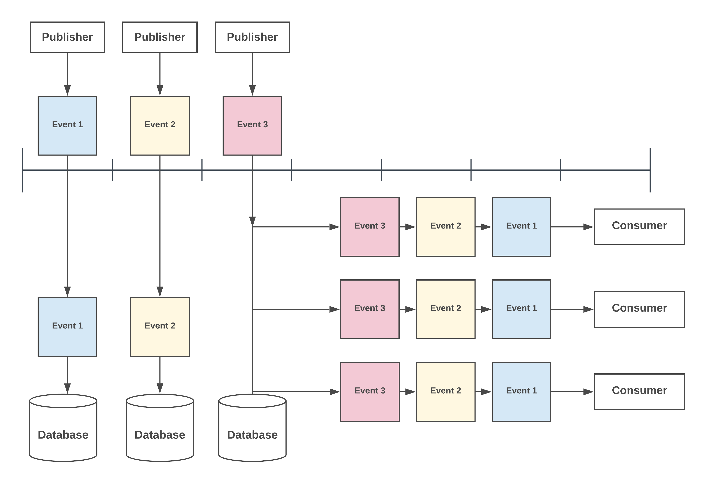
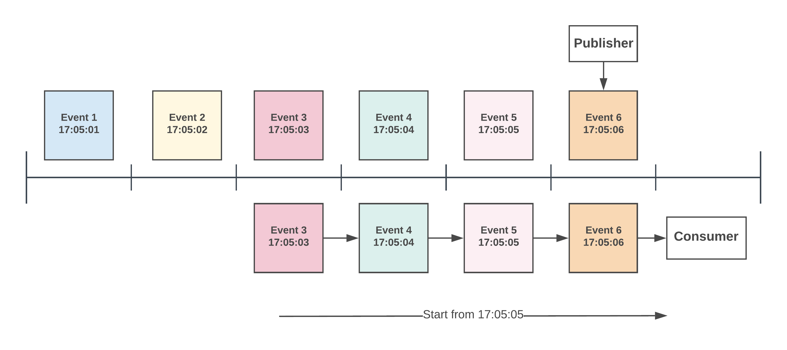

# Pub/Sub (Publish-Subscribe)
The publish-subscribe pattern (or pub/sub, for short) is a messaging pattern where senders of messages (publishers), do not program the messages to be sent directly to specific receivers (subscribers). Instead, the programmer “publishes” messages (events), without any knowledge of any subscribers there may be.

Similarly, subscribers express interest in one or more events and only receive messages that are of interest, without any knowledge of any publishers.

## Table of Content
[[toc]]

## Core Features
KubeMQ supports Publish-Subscribe messages patterns with the following core features:

- **Event** -  An asynchronous real-time Pub/Sub pattern.
- **Event Store** -An asynchronous Pub/Sub pattern with persistence.
- **Grouping** - Load balancing of events between subscribers

## Events
Events is an asynchronous real-time Pub/Sub pattern.
In Events, multiple senders can send real-time messages to various receivers, however, only if they are currently connected to KubeMQ; there is no message persistence available in this pattern.

**Use Cases**

‘Events’ pattern is suitable for cases such as publishing streaming data, logs, notifications, etc.

## Events Store
Events Store’ is an asynchronous Pub/Sub pattern with persistence.
In Events Store, multiple senders can send messages to various receivers even if they are not currently. Any receiver can connect to KubeMQ and replay one, any, or all of the messages stored for a specific channel.

### Events Store Replay Messages Types

KubeMQ supports six types of Events Store subscriptions and replay:

| Type            | Description                                                                                                  |
|:----------------|:-------------------------------------------------------------------------------------------------------------|
| New Events      | KubeMQ will send only new events                                                                             |
| First Event     | KubeMQ will replay all events from the first stored events, as well as send new events                          |
| Last Event      | KubeMQ will replay the last event and continue to send new events                                            |
| From Sequence   | KubeMQ will replay events from a specific sequence and continue to send new events                             |
| From Time       | KubeMQ will replay events from a specific time in the past and continue to send new events                     |
| From Time Delta | KubeMQ will replay events from the specific delta of time back (i.e. 5 min back) and continue to send new events |

#### Start From New Events

#### Start From First Event

#### Start From Last Event

#### Start From Sequence

#### Start From Time

#### Start From Time Delta

### Unique Client ID

The uniqueness of a client ID is essential when using Events Store.  At any given time, only one receiver can connect with a unique Client ID. If two receivers try to connect to KubeMQ with the same Client ID, one of them will be rejected.

**Client ID and Subscription Types Relations**

For each unique Client ID, KubeMQ saves the subscription type in which the client connected; messages can only be replayed once per Client ID and Subscription type.

For example, Receiver with Client ID `client-foo-1` subscribes to a channel `foo.bar` in `First Event` mode. They will get all the messages stored in KubeMQ for `foo.bar` channel from the first message, and then continue to get new events as they come.
If this receiver will disconnect from KubeMQ and re-connect again with any subscription type, only new events in `foo.bar` will be delivered for this specific receiver with Client ID `client-foo-1`.

If a Receiver wishes to receive messages on `foo.bar` again, they should subscribe again with a different Client ID than `client-foo-1` such `client-foo-1-retry`.

**Use Cases**

Events Store pattern is suitable for cases in which events are important, such as worker’s pool, chats, and inbox related applications.
