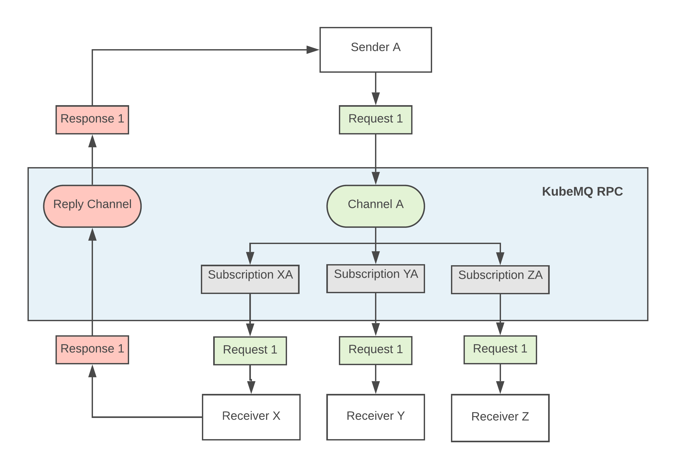
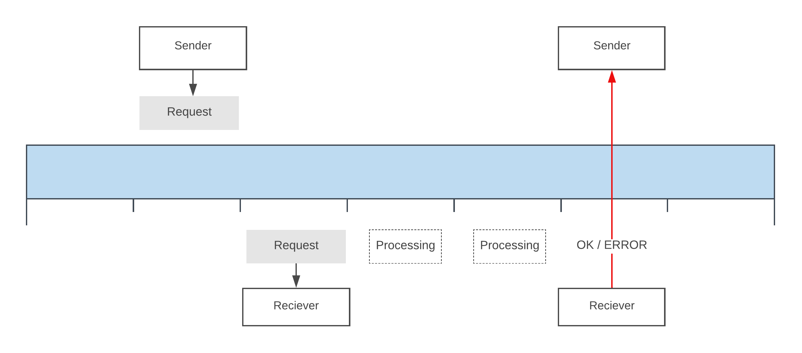
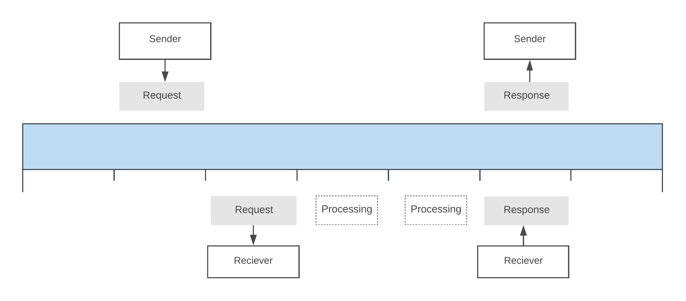
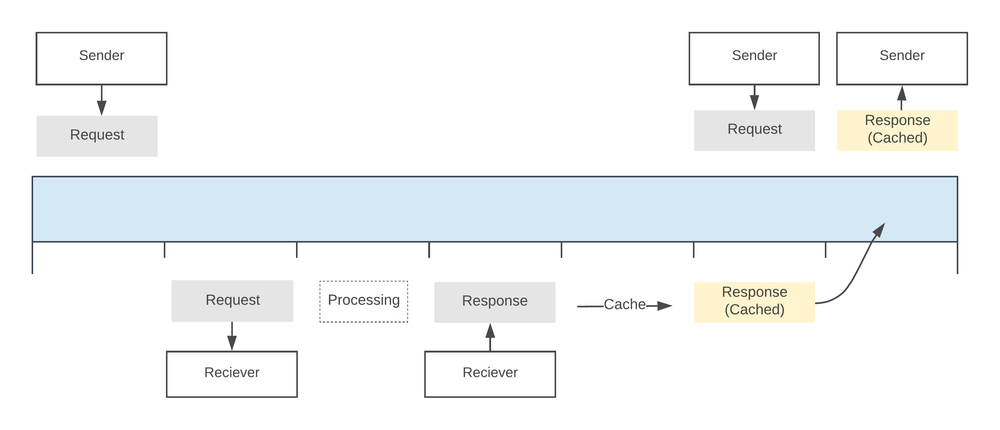

# RPC (Remote Procedure Call) <Badge text="v1.5.0+"/> <Badge text="stable"/>
Remote Procedure Call (RPC) is a protocol that one program can use to request a service from a program located in another computer on a network without having to understand the network's details.

A procedure call is also sometimes known as a function call or a subroutine call.

## Table of Content
[[toc]]

## Core Features
KubeMQ supports  CQRS[^cqrs_footnote]) based flows with the following core features:

- **Commands** -  A synchronous two ways Command pattern for  CQRS[^cqrs_footnote]) types of system architecture.
- **Query** - A synchronous two ways Query pattern for  CQRS[^cqrs_footnote]) types of system architecture.
- **Response** - An answer for a Query type RPC call
- **Timeout** - Timeout interval is set for each RPC call. Once no response is received within the Timeout interval, RPC call returns an error
- **Grouping** - Load balancing of RPC calls between receivers
- **Caching** - RPC response can be cached for future requests without the need to process again by a receiver

## Commands

Commands is a synchronous two ways RPC (Request and Response) pattern for CQRS[^cqrs_footnote]) types of system architecture.

This pattern implements the ‘Command’ part of CQRS[^cqrs_footnote] as follows:

1. A Sender will submit a request to a channel with a specific Timeout for getting a Response.
2. A Receiver will subscribe to a Channel (and Group if needed), will receive the Sender request together with unique ‘ReplyTo’ channel address. KubeMQ generates this address.
3. A Responder, which can be either the Receiver service or a different service, will process the request and respond only if the Request was successful or not. in case of unsuccessful response, the responder can add an ‘Error’ description into the response message.
4. The Sender will get the response from the Responder.
5. If no response is received within the Timeout that was set by the Request, an error message will be returned (‘Timeout’).

**Use Cases**

Commands pattern is suitable for use cases, such as sending updates to a DB, WebHooks, or any request without the need of response by a specific time.

### Demo

<iframe src="https://player.vimeo.com/video/372196128" width="640" height="360" frameborder="0" allow="autoplay; fullscreen" allowfullscreen></iframe>

## Queries

Queries’ is a synchronous two ways RPC (Request and Response) pattern for [CQRS](https://martinfowler.com/bliki/CQRS.html) types of system architecture.

This pattern implements the Query part of CQRS[^cqrs_footnote] as follows:

1. A Sender will send a Request to a channel with a specific set timeout for getting a Response.
2. A Receiver will subscribe to a Channel (and Group if needed), will receive the Sender request together with unique ‘ReplyTo’ channel address. KubeMQ generates this address.
3. A Responder, which can be either the Receiver service or a different service, will process the request and respond with the query results (data), along with the execution result and appropriate Error string in the event of unsuccessful query processing.
4. The Sender will get the response from the Responder.
5. If no response is received within the timeout that was set by the Request, an error will be returned (‘Timeout’).

[^cqrs_footnote]: [Martin Fowler - CQRS](https://martinfowler.com/bliki/CQRS.html)

**Use Cases**

Queries pattern is suitable for use cases, primarily for database queries.

### Demo

<iframe src="https://player.vimeo.com/video/372196137" width="640" height="360" frameborder="0" allow="autoplay; fullscreen" allowfullscreen></iframe>

## Caching
KubeMQ supports caching of query results as follows:

1. A Sender will send a Request to a channel with a specific set timeout, Cache key (string) and Cache TTL (Time To Live) value in seconds for getting a Response.
2. KubeMQ will attempt to get the response results from Cache base on the Cache key.
3. If a Response is stored in Cache, then the sender will get the response from the Cache.
4. If a Response is NOT stored in Cache, KubeMQ will send the Request to an available Receiver (as above).
5. Once a valid response is received from a Responder, KubeMQ will store the Response in the Cache, along with the Cache key provided by the Sender, for the time set by Cache TTL.
6. A new Request within the Cache TTL time-frame, and with the same Cache key, will get the same Response as stored in KubeMQ from the previous Sender Request.

## Commands vs. Queries
Commands and Queries are very similar patterns. However, there are two differences:

1. Commands Response returns only if the request is successful or not, while Query returns with data in the Response.
2. Queries support Caching, while Commands does not.
